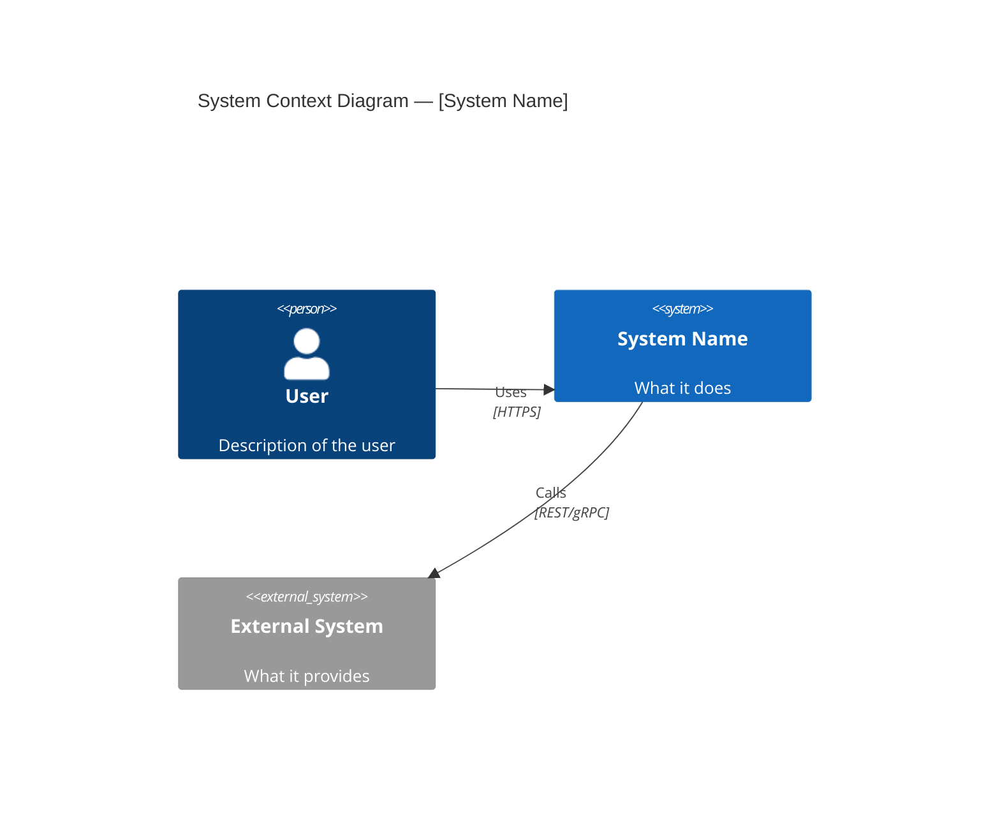
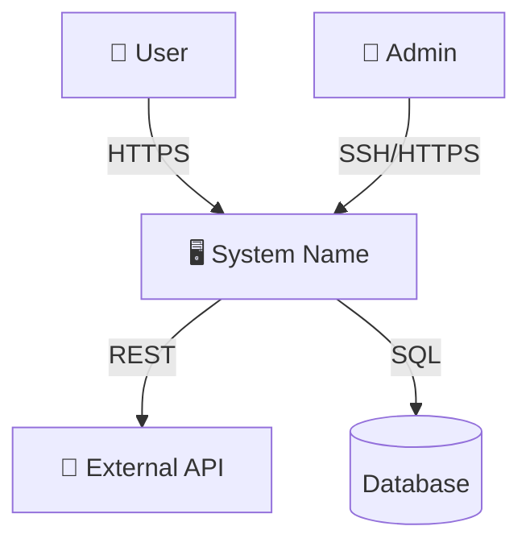
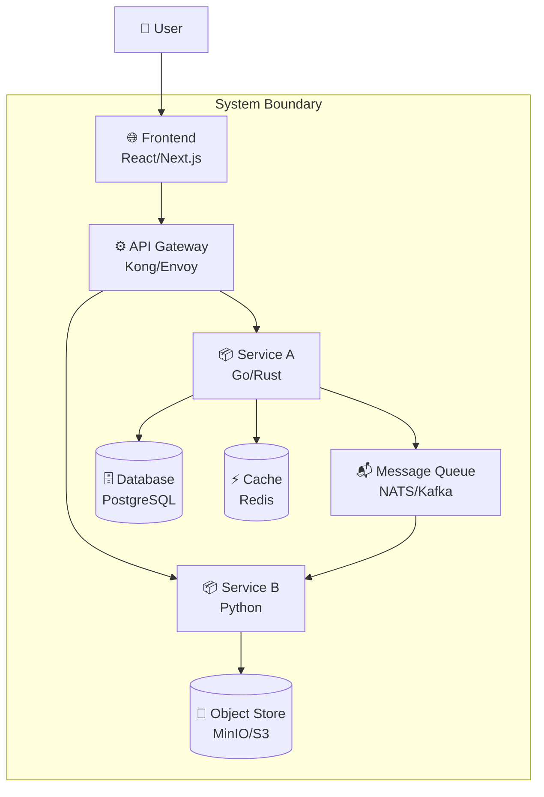
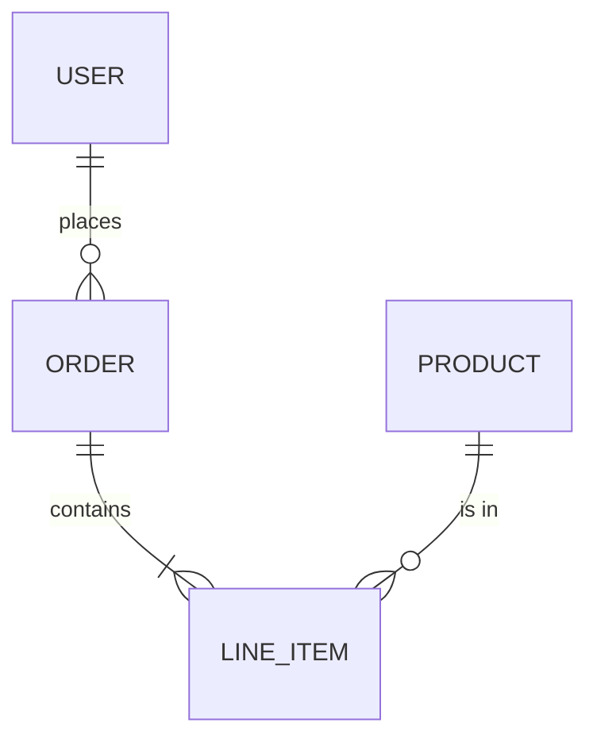
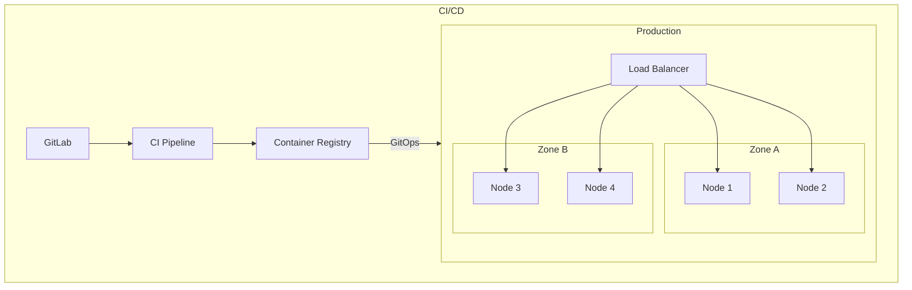

# HLD Template Reference

Use this template when producing a High-Level Design document. Adapt sections to the project scope — not every section is mandatory for every project, but consider each one.

---

## Document Structure

```
# [System Name] — High-Level Design

## 1. Executive Summary
## 2. Goals and Non-Goals
## 3. Context and Scope
## 4. System Architecture (C4 Level 1 & 2)
## 5. Capacity Estimations
## 6. Data Architecture
## 7. API Design (High-Level)
## 8. Security Architecture
## 9. Deployment Architecture
## 10. Observability
## 11. Failure Modes and Mitigation
## 12. Architecture Decision Records (ADRs)
## 13. Open Questions and Risks
## 14. Appendix
```

---

## Section Guidelines

### 1. Executive Summary
2-3 paragraphs max. Cover:
- What problem does this system solve?
- What is the proposed approach?
- What are the key tradeoffs?

Write this LAST, after completing all other sections.

### 2. Goals and Non-Goals

Format as two lists:

**Goals:**
- G1: [Specific, measurable goal]
- G2: ...

**Non-Goals (explicitly out of scope):**
- NG1: [What this design intentionally does NOT address]
- NG2: ...

Non-goals are as important as goals — they prevent scope creep and set expectations.

### 3. Context and Scope

Include a C4 Level 1 Context Diagram:



If Mermaid C4 syntax is not supported, use a standard flowchart:



Describe:
- Who uses the system (actors)
- What external systems it integrates with
- What the system boundary is (what's in scope vs out)

### 4. System Architecture (C4 Level 2 — Container Diagram)



For each container, document:

| Container | Technology | Responsibility | Scaling Strategy |
|-----------|-----------|---------------|-----------------|
| API Gateway | Kong | Routing, rate limiting, auth | Horizontal, stateless |
| Service A | Go | Core business logic | Horizontal behind LB |
| Database | PostgreSQL | Persistent storage | Primary-replica |
| Cache | Redis | Hot data, sessions | Redis Cluster |
| Message Queue | NATS | Async processing | Clustered |

### 5. Capacity Estimations

Read `estimation-cheatsheet.md` for formulas. Present results as:

| Metric | Value | Formula |
|--------|-------|---------|
| DAU | X | Given/estimated |
| Avg QPS | X | DAU × req/user/day ÷ 86400 |
| Peak QPS | X | Avg QPS × 3 |
| Write QPS | X | Based on read:write ratio |
| Storage/day | X GB | objects/day × avg size |
| Storage/year | X TB | storage/day × 365 |
| Bandwidth | X Gbps | Peak QPS × avg response size |
| Cache size | X GB | hot data % × total data |
| Min servers | X | Peak QPS ÷ QPS/server × 1.3 |

### 6. Data Architecture

Cover:
- **Data model** (high-level ER diagram in Mermaid)
- **Storage strategy**: which data in SQL vs NoSQL vs object store vs cache
- **Data flow**: how data moves through the system (write path, read path)
- **Partitioning/sharding strategy** (if applicable)
- **Retention and lifecycle**: how long is data kept, archival strategy
- **Backup and recovery**: RPO/RTO targets



### 7. API Design (High-Level)

List the main API surfaces:

| Endpoint | Method | Purpose | Auth |
|----------|--------|---------|------|
| /api/v1/users | GET | List users | JWT |
| /api/v1/orders | POST | Create order | JWT |
| /api/v1/health | GET | Health check | None |

For each critical API, specify:
- Rate limits
- Pagination strategy
- Versioning strategy (URL path, header, etc.)

### 8. Security Architecture

Cover:
- **Authentication**: mechanism (JWT, mTLS, OIDC, etc.)
- **Authorization**: model (RBAC, ABAC, policy engine)
- **Encryption**: at rest (algorithm, key management) and in transit (TLS version, cert management)
- **Network security**: segmentation, firewalls, zero-trust
- **Secrets management**: vault/HSM, rotation policy
- **Compliance**: relevant standards (ANSSI, DISA STIG, ISO 27001, PCI-DSS, etc.)
- **Supply chain**: image signing, SBOM, vulnerability scanning

### 9. Deployment Architecture



Cover:
- **Infrastructure**: bare metal, VMs, K8s, cloud provider
- **GitOps/IaC**: Terraform, FluxCD, ArgoCD
- **CI/CD pipeline**: stages, gates, rollback strategy
- **Environments**: dev, staging, prod, air-gapped specifics
- **Scaling**: horizontal/vertical, autoscaling policies

### 10. Observability

The three pillars:
- **Metrics**: what's collected, where (Prometheus, VictoriaMetrics), key dashboards
- **Logs**: centralized logging (Loki, ELK), log levels, retention
- **Traces**: distributed tracing (Jaeger, Tempo), critical paths instrumented

Define SLIs and SLOs:

| SLI | SLO | Error Budget |
|-----|-----|-------------|
| Request latency p99 | < 500ms | 0.1% of requests can exceed |
| Availability | 99.9% | 8.76h downtime/year |
| Error rate | < 0.1% | — |

### 11. Failure Modes and Mitigation

| Failure Mode | Impact | Probability | Mitigation | Detection |
|-------------|--------|-------------|-----------|-----------|
| DB primary down | Write unavailable | Low | Auto-failover to replica | Health check + alert |
| Cache failure | Increased latency | Medium | Fallback to DB, circuit breaker | Latency spike alert |
| Network partition | Partial outage | Low | Multi-AZ, retry with backoff | Connectivity monitoring |

### 12. Architecture Decision Records (ADRs)

For each major decision, use this format:

```markdown
### ADR-NNN: [Title]

**Status:** Proposed | Accepted | Deprecated | Superseded by ADR-XXX

**Context:**
What is the problem or situation that requires a decision?

**Decision:**
What is the chosen approach?

**Alternatives Considered:**
| Option | Pros | Cons |
|--------|------|------|
| Option A (chosen) | ... | ... |
| Option B | ... | ... |
| Option C | ... | ... |

**Consequences:**
- Positive: ...
- Negative: ...
- Risks: ...

**Quality Attributes Affected:**
Performance | Security | Scalability | Maintainability | Cost
```

Typical ADRs in an HLD:
- ADR-001: Choice of architecture style (monolith vs microservices vs modular monolith)
- ADR-002: Choice of primary database
- ADR-003: Choice of communication pattern (sync REST vs async messaging)
- ADR-004: Choice of deployment platform
- ADR-005: Choice of authentication mechanism

### 13. Open Questions and Risks

| # | Question/Risk | Owner | Deadline | Status |
|---|--------------|-------|----------|--------|
| 1 | How will we handle data migration from legacy? | @architect | Sprint 3 | Open |
| 2 | Performance of X under load Y not validated | @lead | Before Gate 2 | Open |

### 14. Appendix

- Glossary of terms
- References (RFCs, internal docs, external standards)
- Related documents (LLD, ADRs, runbooks)
