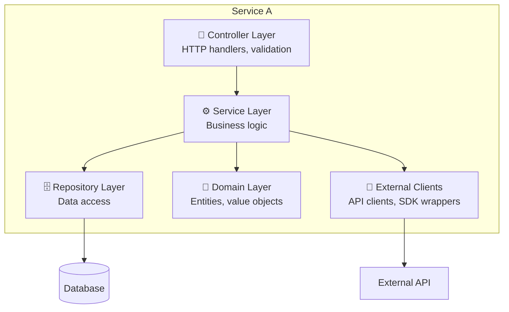
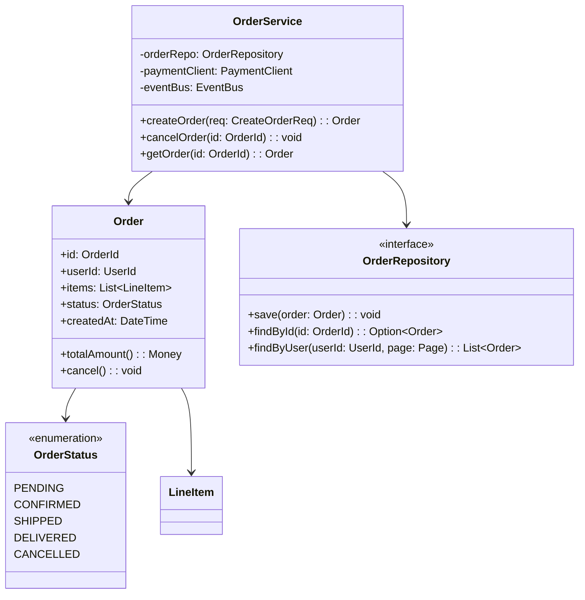
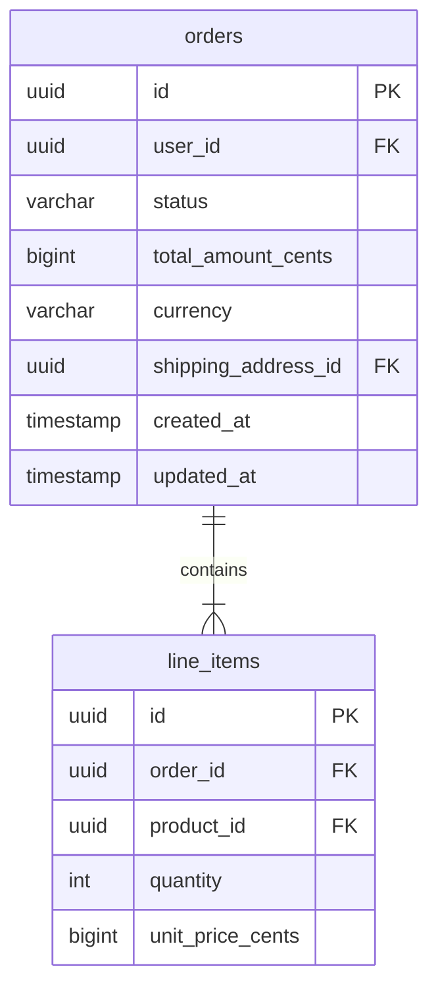
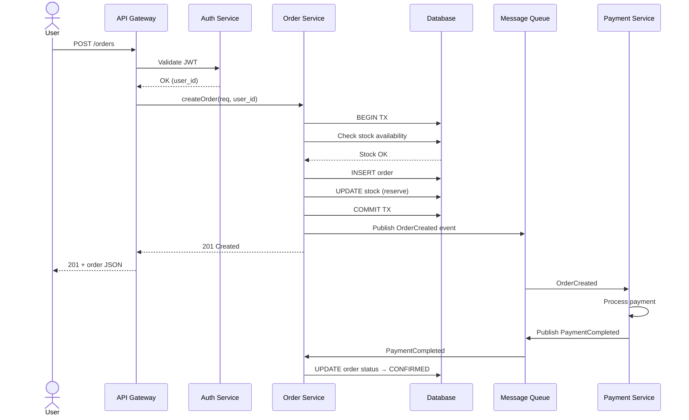
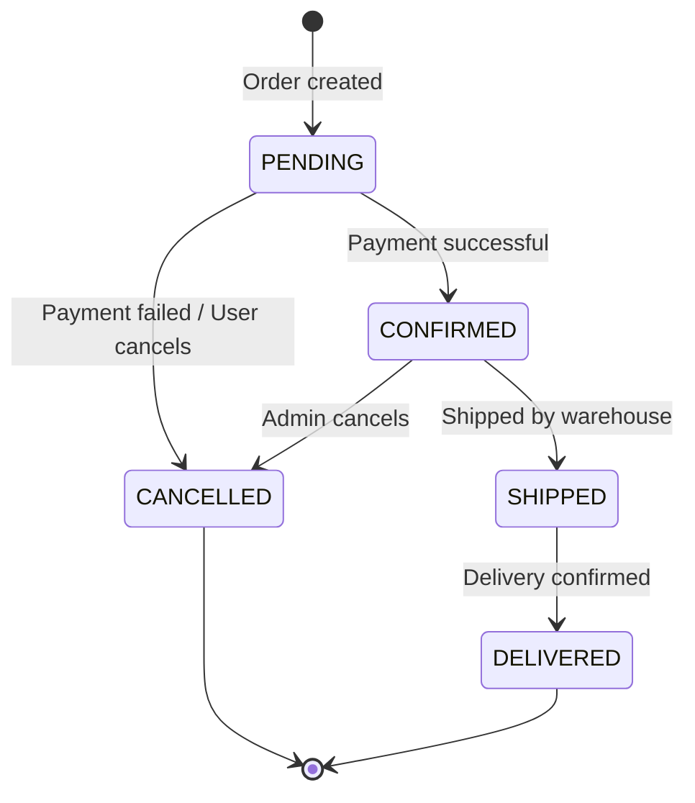

# LLD Template Reference

Use this template when producing a Low-Level Design document. The LLD translates the HLD's "what" into the "how" — detailed enough that a developer can implement without ambiguity.

---

## Document Structure

```
# [Component/Service Name] — Low-Level Design

## 1. Overview and Scope
## 2. Component Architecture (C4 Level 3)
## 3. Class/Module Design
## 4. API Specification
## 5. Database Schema
## 6. Sequence Diagrams (Critical Flows)
## 7. State Machines
## 8. Error Handling and Resilience
## 9. Caching Strategy
## 10. Configuration and Feature Flags
## 11. Testing Strategy
## 12. Migration Plan
```

---

## Section Guidelines

### 1. Overview and Scope

- Reference the parent HLD document
- Identify which HLD container(s) this LLD covers
- List the specific functional requirements this component implements

### 2. Component Architecture (C4 Level 3)

Break the container into its internal components:



For each component:

| Component | Responsibility | Dependencies | Interface |
|-----------|---------------|-------------|-----------|
| Controller | HTTP routing, input validation, response mapping | Service | REST endpoints |
| Service | Business rules, orchestration, transactions | Repository, Client, Domain | Internal methods |
| Repository | CRUD, queries, data mapping | Database driver | Data access interface |
| Domain | Entities, value objects, domain events | None (pure) | Types and methods |

### 3. Class/Module Design

Use Mermaid class diagrams. Follow SOLID and relevant design patterns.



**Design patterns to consider and document when used:**
- **Repository**: data access abstraction
- **Strategy**: swappable algorithms (e.g., pricing, notification channels)
- **Factory**: complex object creation
- **Observer/Event**: decoupled notifications
- **Circuit Breaker**: resilience to external failures
- **Retry with backoff**: transient error handling
- **Builder**: complex configuration objects

### 4. API Specification

For each endpoint, provide full detail:

```
### POST /api/v1/orders

**Purpose:** Create a new order

**Authentication:** Bearer JWT (role: user)

**Rate limit:** 10 req/min per user

**Request:**
```json
{
  "items": [
    {
      "product_id": "string (UUID)",
      "quantity": "integer (min: 1, max: 100)"
    }
  ],
  "shipping_address_id": "string (UUID)",
  "payment_method_id": "string (UUID)"
}
```

**Response 201:**
```json
{
  "id": "string (UUID)",
  "status": "PENDING",
  "items": [...],
  "total_amount": { "value": 4999, "currency": "EUR" },
  "created_at": "2025-01-15T10:30:00Z"
}
```

**Error responses:**

| Code | Condition | Body |
|------|-----------|------|
| 400 | Invalid input | `{"error": "INVALID_INPUT", "details": [...]}` |
| 401 | Missing/invalid token | `{"error": "UNAUTHORIZED"}` |
| 404 | Product/address not found | `{"error": "NOT_FOUND", "resource": "product"}` |
| 409 | Insufficient stock | `{"error": "CONFLICT", "reason": "INSUFFICIENT_STOCK"}` |
| 429 | Rate limited | `{"error": "RATE_LIMITED", "retry_after": 30}` |
| 500 | Internal error | `{"error": "INTERNAL_ERROR", "trace_id": "..."}` |
```

**Idempotency:** Support `Idempotency-Key` header for safe retries.

**Pagination pattern** (for list endpoints):
```
GET /api/v1/orders?cursor=abc123&limit=20

Response includes:
{
  "data": [...],
  "pagination": {
    "next_cursor": "def456",
    "has_more": true
  }
}
```

### 5. Database Schema



For each table, document:

| Column | Type | Constraints | Index | Notes |
|--------|------|------------|-------|-------|
| id | UUID | PK, NOT NULL | btree (PK) | Generated by app |
| user_id | UUID | FK → users.id, NOT NULL | btree | Frequent query filter |
| status | VARCHAR(20) | NOT NULL, CHECK IN (...) | btree | State machine values |
| created_at | TIMESTAMPTZ | NOT NULL, DEFAULT now() | btree | For cursor pagination |

**Index strategy:**
```sql
-- Primary lookup
CREATE INDEX idx_orders_user_status ON orders(user_id, status);

-- Pagination
CREATE INDEX idx_orders_created ON orders(created_at DESC);

-- Admin queries
CREATE INDEX idx_orders_status ON orders(status) WHERE status IN ('PENDING', 'CONFIRMED');
```

**Migration strategy:**
- All schema changes via versioned migrations (Flyway, golang-migrate, etc.)
- Backward-compatible changes only (additive columns, new tables)
- Breaking changes require multi-phase migration (add new → backfill → switch → drop old)

### 6. Sequence Diagrams (Critical Flows)

For each critical user flow, provide a sequence diagram:



Provide sequence diagrams for:
- Happy path (main flow)
- Key error paths (payment failure, timeout, conflict)
- Async flows (background jobs, event processing)

### 7. State Machines

For entities with lifecycle states:



Document transitions:

| From | To | Trigger | Side Effects |
|------|----|---------|-------------|
| PENDING | CONFIRMED | PaymentCompleted event | Send confirmation email, notify warehouse |
| PENDING | CANCELLED | PaymentFailed event or user action | Release stock, refund if partial |
| CONFIRMED | SHIPPED | Warehouse scan | Send tracking email |

### 8. Error Handling and Resilience

**Error classification:**

| Category | Examples | Strategy |
|----------|----------|----------|
| Transient | Network timeout, 503 | Retry with exponential backoff (base: 100ms, max: 10s, jitter: ±50%) |
| Client error | 400, 404, 422 | Return error immediately, no retry |
| Dependency down | External API unavailable | Circuit breaker (threshold: 5 failures in 30s, recovery: 60s) |
| Data inconsistency | Partial write | Saga pattern with compensating transactions |
| Rate limited | 429 | Respect Retry-After header, queue and replay |

**Circuit breaker configuration:**
```
failure_threshold: 5
success_threshold: 3
timeout: 30s
half_open_max_calls: 3
```

**Retry policy:**
```
max_retries: 3
initial_interval: 100ms
multiplier: 2
max_interval: 10s
jitter: 0.5
retryable_codes: [408, 429, 500, 502, 503, 504]
```

**Dead letter queue (DLQ):** Messages that fail N times go to DLQ for manual inspection. Alert on DLQ depth > 0.

### 9. Caching Strategy

| Data | Cache | TTL | Invalidation | Justification |
|------|-------|-----|-------------|---------------|
| User profile | Redis | 15min | On update (write-through) | High read:write ratio |
| Product catalog | Redis | 5min | TTL expiry | Eventual consistency OK |
| Session | Redis | 30min (sliding) | On logout | Must be fast |
| Static assets | CDN | 1 year | Cache-bust via hash in URL | Immutable content |

**Cache patterns used:**
- **Cache-aside** (default): app checks cache, on miss reads DB and populates cache
- **Write-through**: for data that must always be fresh in cache
- **Write-behind**: for high-write scenarios where eventual consistency is OK

### 10. Configuration and Feature Flags

```yaml
# Example config structure
service:
  port: 8080
  read_timeout: 30s
  write_timeout: 30s

database:
  host: ${DB_HOST}
  port: 5432
  max_connections: 20
  idle_timeout: 5m

cache:
  host: ${REDIS_HOST}
  pool_size: 10

feature_flags:
  new_pricing_engine: false
  async_notifications: true
```

Configuration hierarchy: env vars > config file > defaults. Secrets always via vault/env, never in config files.

### 11. Testing Strategy

| Level | Scope | Tools | Coverage Target |
|-------|-------|-------|----------------|
| Unit | Business logic, domain | Go test / pytest / cargo test | > 80% |
| Integration | DB queries, cache, external clients | Testcontainers | Critical paths |
| Contract | API compatibility | Pact / Schemathesis | All public APIs |
| E2E | Full user flows | Playwright / k6 | Happy + key error paths |
| Load | Performance under stress | k6, Locust | Validate capacity estimates |

### 12. Migration Plan

If this LLD modifies an existing system:

| Phase | Action | Rollback | Duration |
|-------|--------|----------|----------|
| 1 | Deploy new schema (additive) | Drop new columns | 1 sprint |
| 2 | Deploy dual-write code | Revert to old code | 1 sprint |
| 3 | Backfill historical data | Re-run from backup | 1-2 days |
| 4 | Switch reads to new schema | Revert read path | 1 sprint |
| 5 | Drop old columns/tables | Restore from backup | After validation |
