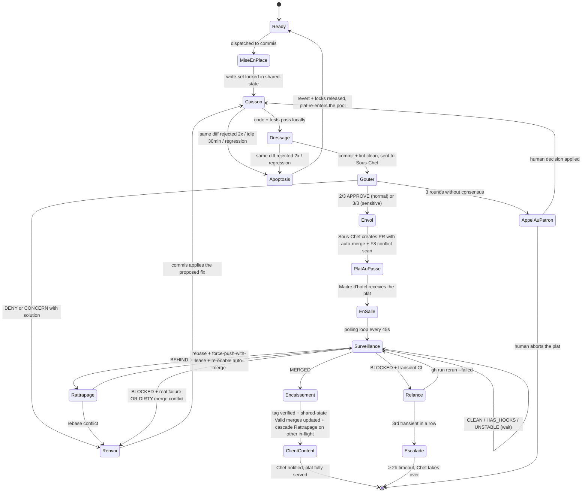

> **Optimization:** Heavy content lives in `references/`. Load on demand.

> **Language rule:** Skill instructions are written in English. When generating user-facing files (prompts, shared-state, tmuxinator comments, reports), detect the project's primary language (from README, comments, docs, commit messages) and produce those files in that language. If the project is bilingual, ask the user which language to use before proceeding. The Brigade vocabulary (Menu, Commis, Sous-Chef, Chef, Plat, Mise en place, etc.) stays in French regardless — it's the pattern's canonical terminology, not prose.

> **Gotchas:** Read `../../gotchas.md` AND `references/gotchas-chef.md` before producing output.

# CLI Forge Boss — Brigade de Cuisine

> *"On ne cuisine pas seul. On cuisine en brigade."* — Auguste Escoffier
> (*"You don't cook alone. You cook in a brigade."*)

## The Brigade

```
┌─────────────────────────────────────────────────────┐
│                      CLIENT                          │
│  (user, ticket, roadmap)                             │
│                                                      │
│  Orders plats via the MENU (PERT)                    │
│  "I want: decision tokens + E2E + sokolsky"          │
└──────────────────────┬──────────────────────────────┘
                       │ order
┌──────────────────────▼──────────────────────────────┐
│                  CHEF DE CUISINE                     │
│  (plans, decides, orchestrates)                      │
│                                                      │
│  - Reads the menu (PERT / roadmap)                   │
│  - Assigns plats to the commis                       │
│  - Decides the order in which to send them out       │
│  - Asks the Sous-Chef to taste before sending        │
│  - Calls "Envoyez !" when it's ready                 │
│  - NEVER COOKS                                       │
└──────────────────────┬──────────────────────────────┘
                       │ SendMessage
┌──────────────────────▼──────────────────────────────┐
│              3 VOTING SOUS-CHEFS                     │
│  (taste, judge — quorum 2/3)                         │
│                                                      │
│  sous-chef-scope   : is the plat in your station?    │
│  sous-chef-secu    : any broken glass in the plat?   │
│  sous-chef-qualite : does it taste right?            │
│                                                      │
│  2/3 APPROVE → passes                                │
│  1 DENY → sent back to the kitchen                   │
│  1 ESCALATE → call the patron (human, ~5% of cases)  │
├──────────────────────────────────────────────────────┤
│              SOUS-CHEF MERGE                         │
│  (plates up, sends to the pass)                      │
│                                                      │
│  - Quality gates (/cli-audit-*)                      │
│  - Merge + CI (tmux send-keys gate)                  │
│  - Updates the carnet (shared-state.md)              │
│  - Runs in bypassPermissions                         │
│  - CWD = {project}-wt-gate                           │
│    (push + PR allowed, apply DENIED)                 │
├──────────────────────────────────────────────────────┤
│              APPLY PANE (only if infra present)      │
│  (executes tofu/helm/kubectl after 3/3 quorum)       │
│                                                      │
│  - Receives APPLY_REQUEST from any agent             │
│  - Runs the plan (tofu plan, helm diff, kubectl diff)│
│  - Submits plan to 3 voting sous-chefs — 3/3 needed  │
│  - Executes only after unanimous APPROVE             │
│  - Prod target → extra PATRON ACK                    │
│  - CWD = {project}-wt-apply                          │
│    (tofu/helm/kubectl allowed, git push DENIED)      │
│  - See references/apply-quorum.md                    │
└──────────────────────┬──────────────────────────────┘
                       │ SendMessage
┌──────────────────────▼──────────────────────────────┐
│              COMMIS (x N)                            │
│  (cook, prep, plate)                                 │
│                                                      │
│  - Each has their own station (worktree / project)   │
│  - Prepare their plat (code, test, commit)           │
│  - Announce "Pret !" to the sous-chef                │
│  - DO NOT DECIDE when to send out                    │
└──────────────────────┬──────────────────────────────┘
                       │ "Plat au passe"
┌──────────────────────▼──────────────────────────────┐
│              MAITRE D'HOTEL                          │
│  (pass → client, landing watchdog)                   │
│                                                      │
│  - Receives PRs once auto-merge is enabled           │
│  - Polls until MERGED (not just "auto-merge on")     │
│  - Rattrapage: rebase BEHIND branches when main moves│
│  - Relance: rerun transient CI failures (max 2x)     │
│  - Renvoi: real failures go back to the Sous-Chef    │
│  - Encaissement: tag verified + shared-state updated │
│  - Reports "Client content" only when all 6 done     │
│                                                      │
│  Read references/maitre-dhotel.md for the full role  │
└──────────────────────┬──────────────────────────────┘
                       │ "Client content + tag"
┌──────────────────────▼──────────────────────────────┐
│                   CLIENT (happy)                     │
│  Release tag cut, prod deploy green, sprint done     │
└─────────────────────────────────────────────────────┘
```

### When the patron (human) steps in

**~5% of cases.** The human is called only when a Sous-Chef votes ESCALATE:

| Case | Who escalates | Why |
|---|---|---|
| Edit on `.github/workflows/` | sous-chef-scope | CI = global impact |
| New dep in Cargo.toml | sous-chef-secu | Supply chain risk |
| Test removal | sous-chef-secu | Never auto-approve |
| Diff > 200 lines | sous-chef-qualite | Too big to judge quickly |
| File from another worker | sous-chef-scope | Potential conflict |

Everything else passes without human intervention.

### Brigade vocabulary

| Brigade term | Meaning | Example |
|---|---|---|
| **Carte du jour** | Review of sensitive zones (sprint start) | "ci.yml moves to 3/3, log_backend stays 2/3" |
| **Marche** | Project inventory (git log, PRs, incidents) | "3 DENYs on ci.yml during sprint S3" |
| **Produit frais** | Normal zone (2/3) with no incidents | "src/features/ : 0 DENY in 3 sprints" |
| **Produit sensible** | 3/3 unanimity required | "Cargo.toml: rustls-pemfile advisory" |
| **Produit retire** | Past hallucination → now a test case | "Blind auto-approve → G16" |
| **Nouvelle recette** | New module to classify | "log_backend → normal, self_tuning → sensitive" |
| Menu | PERT (dependency DAG of plats with durations) | "Sprint S3: 4 plats, critical path A→C→D" |
| Commande | Ticket / task | "feat/hit-decision-tokens" |
| Plat | Feature merged + CI green | PR #88 merged |
| Mise en place | shared-state.md "In progress" | Worker writes its target files |
| Cuisson | Coding + tests | Worker codes in its worktree |
| Dressage | Commit + cleanup | cargo fmt, clippy clean |
| Gouter | Quorum vote by the Sous-Chefs | "2/3 APPROVE (normal) or 3/3 (sensitive)" |
| Pass | CI pipeline | gh run watch |
| Envoi | Merge + green light | "Envoyez! feat/x merged." |
| Plat au passe | Sous-Chef hands a PR to the Maître d'hôtel with auto-merge on | "Plat au passe: #201, auto-merge squash" |
| Rattrapage | Maître d'hôtel rebases a BEHIND branch | "Rattrapage #201: main moved after #200 landed" |
| Relance | Maître d'hôtel reruns a transient CI failure (max 2x per cause) | "Relance #202: CodeQL rate-limit" |
| Encaissement | Maître d'hôtel confirms MERGED + tag cut + shared-state updated | "Encaissement #201 → v0.36.17" |
| Client content | Maître d'hôtel signals full landing to the Chef | "Client content: 3 plats, 2 tags, 0 orphans" |
| Renvoi | Gate failed or quorum DENY, or real failure from Maître d'hôtel | "Renvoie! Sous-Chef Secu proposes: ..." |
| Appel au patron | ESCALATE (< 2%) | "Patron, edit on ci.yml, 3 rounds without consensus" |
| Coup de feu | Parallel phase | 4 commis at the same time |
| Service | Full sprint | Phase 0 → Phase N → report |

### Plat lifecycle (state machine)

A plat moves through a fixed sequence of states between `Ready` and `Envoye`. A DENY from a sous-chef loops back to `Cuisson`; a critical failure (same diff rejected twice, regression, 30-min idle) triggers `Apoptosis` and the plat re-enters the pool.



This is the authoritative plat lifecycle — if prose anywhere else disagrees, fix the prose.

### Communication flow

```
Commis edits a file
  → Chef sends the diff to the 3 voting Sous-Chefs (parallel)
  → 2/3 APPROVE → passes automatically (zero human)
  → 1 DENY → sent back to the commis with a reason
  → 1 ESCALATE → Chef notifies the patron (human)

Commis finishes cooking
  → "Pret !" to the Sous-Chef (SendMessage)
  → Sous-Chef tastes (quality gates)
  → IF good:
      → Sous-Chef plates up and sends (merge + CI)
      → Sous-Chef to Chef: "Plat sent, table served"
      → Chef to dependent commis: "Envoyez the next one!"
  → IF not good:
      → Sous-Chef to Commis: "Renvoi! Too much salt in fn X"
      → Sous-Chef to Chef: "Renvoi on plat Y, commis is fixing it"
```

## Input

`$ARGUMENTS` is the target project path or name.

- If a path: analyze the project, generate config for it
- If a name: create a new project directory and generate config
- If empty: use the current working directory

## Phase 0 — Mise en place

**First, check whether a sprint is currently running or paused:**

Read `references/sprint-persistence.md`. Check `.claude/sprint-history/current/`:
- If a sprint is **PAUSED** → offer: Resume / Rewind / Fresh / Abandon
- If a sprint is **DONE** → read the gotchas-learned and sensitive zones for the new sprint
- If no history → fresh sprint

Before generating anything, understand the project:

### 0.1 — Detect project type

| Signal | Type | Build tools | Test command | Lint command |
|--------|------|-------------|--------------|--------------|
| `Cargo.toml` | Rust | `cargo` | `cargo test` | `cargo fmt && cargo clippy` |
| `go.mod` | Go | `go` | `go test ./...` | `golangci-lint run` |
| `package.json` | JS/TS | `npm`, `npx` | `npm test` | `npm run lint` |
| `pyproject.toml` / `setup.py` | Python | `python3`, `pip`, `uv` | `pytest` | `ruff check` |
| `*.tf` / `terragrunt.hcl` | Terraform | `terraform`, `tofu` | `terraform plan` | `terraform validate` |
| `Chart.yaml` / `helmfile.yaml` | Helm | `helm` | `helm template` | `helm lint` |
| `docker-compose*.yml` | Docker | `docker`, `podman` | N/A | `docker compose config` |
| `flake.nix` | Nix | `nix` | `nix flake check` | `nix flake check` |
| Multiple of above | Monorepo | union | per-workspace | per-workspace |

If no manifest found → ask the user: "What type of project is this? (Rust, Go, JS/TS, Python, Infra, Other)"

Use the detected type to:
- Filter build tool permissions in `settings.local.json` (only include relevant tools)
- Set correct build/test/lint commands in commis prompts
- Choose appropriate quality gates

### 0.2 — Read the project

1. **Read the project** — README, CONTRIBUTING.md, docs/explanation/architecture.md, manifest file, src/ structure
2. **Read git state** — branches, worktrees, CI config
3. **Identify the menu** — what needs to be done? Check issues, roadmap, design docs

### 0.3 — Check prerequisites

#### Tools

| Tool | Check | Install (Fedora/RHEL) | Install (macOS) | Install (Debian/Ubuntu) | Fallback |
|------|-------|-----------------------|-----------------|-------------------------|----------|
| tmux | `which tmux` | `sudo dnf install tmux` | `brew install tmux` | `sudo apt install tmux` | None — required |
| tmuxinator | `which tmuxinator` | `brew install tmuxinator` (preferred) or `gem install tmuxinator` | `brew install tmuxinator` | `gem install tmuxinator` | **Raw tmux script** — see `references/raw-tmux-fallback.md` |
| claude | `which claude` | `npm i -g @anthropic-ai/claude-code` | `npm i -g @anthropic-ai/claude-code` | `npm i -g @anthropic-ai/claude-code` | None — required |
| gh | `which gh` | `sudo dnf install gh` | `brew install gh` | `sudo apt install gh` | Manual CI checks |

```bash
# Check all prerequisites
for tool in tmux tmuxinator claude gh; do
  which "$tool" >/dev/null 2>&1 || echo "MISSING: $tool"
done
grep -q "CLAUDE_CODE_EXPERIMENTAL_AGENT_TEAMS" ~/.claude/settings.json 2>/dev/null || echo "AGENT_TEAMS_NOT_ENABLED"
```

If a tool is missing → **show the install command for the detected OS** and stop.

#### VCS — git or jj

The project MUST be a version-controlled repository. Check:

```bash
# Detect VCS type
if [ -d .jj ]; then
  VCS="jj"
elif git rev-parse --git-dir >/dev/null 2>&1; then
  VCS="git"
else
  echo "FATAL: not a git or jj repository. Initialize with 'git init' or 'jj git init' first."
  exit 1
fi
```

If not a repo → **stop and ask the user to init**. The Chef never creates a repo — that's a user decision.

#### Branching model detection

Auto-detect the project's branching model. **Never assume Git Flow.**

```bash
# Detect GitHub repo
REPO=$(gh repo view --json nameWithOwner,defaultBranchRef -q '.nameWithOwner' 2>/dev/null)
DEFAULT_BRANCH=$(gh repo view --json defaultBranchRef -q '.defaultBranchRef.name' 2>/dev/null)

# Detect branching model by examining existing branches
HAS_DEVELOP=$(git branch -r 2>/dev/null | grep -c 'origin/develop')
HAS_RELEASE_BRANCHES=$(git branch -r 2>/dev/null | grep -c 'origin/release/')
HAS_RELEASE_PLZ=$(test -f release-plz.toml && echo 1 || echo 0)

if [ "$HAS_DEVELOP" -gt 0 ] && [ "$HAS_RELEASE_BRANCHES" -gt 0 ]; then
  BRANCH_MODEL="gitflow"
  BASE_BRANCH="develop"
  RELEASE_BRANCH="main"
elif [ "$HAS_DEVELOP" -gt 0 ]; then
  BRANCH_MODEL="github-flow-develop"
  BASE_BRANCH="develop"
  RELEASE_BRANCH="main"
elif [ "$DEFAULT_BRANCH" = "main" ] || [ "$DEFAULT_BRANCH" = "master" ]; then
  BRANCH_MODEL="github-flow"
  BASE_BRANCH="${DEFAULT_BRANCH}"
  RELEASE_BRANCH="${DEFAULT_BRANCH}"
else
  BRANCH_MODEL="trunk"
  BASE_BRANCH="${DEFAULT_BRANCH:-main}"
  RELEASE_BRANCH="${BASE_BRANCH}"
fi
```

| Detected model | Base branch | Release branch | Commis branch from | PR target | Sync-main needed? |
|---|---|---|---|---|---|
| **github-flow** | main | main | main | main | No |
| **github-flow-develop** | develop | main | develop | develop | Yes |
| **gitflow** | develop | main | develop | develop | Yes (via release branches) |
| **trunk** | main/master | same | main | main | No |

**Impact on the brigade:**
- **github-flow / trunk**: commis branch from main, PRs target main, no sync-main needed, release-plz (if used) targets main directly
- **github-flow-develop**: commis branch from develop, PRs target develop, sync-main needed after each release tag
- **gitflow**: same as above, plus release branches for stabilization

#### GitHub repo & branch protection (G26)

```bash
if [ -z "$REPO" ]; then
  echo "WARNING: not a GitHub repo or gh not authenticated. PR mode unavailable."
  MERGE_MODE="direct"
else
  # Detect if base branch requires PRs (G26)
  PROTECTED=$(gh api repos/${REPO}/rulesets 2>/dev/null | grep -c 'pull_request')
  if [ "$PROTECTED" -gt 0 ]; then
    MERGE_MODE="pr"
    echo "DETECTED: branch protection requires PRs → Sous-Chef will use PR mode"
    
    # Check auto-merge is enabled in repo settings
    AUTO_MERGE=$(gh api repos/${REPO} --jq '.allow_auto_merge' 2>/dev/null)
    if [ "$AUTO_MERGE" != "true" ]; then
      echo "FIX: enabling auto-merge on the repo (required for PR mode)"
      gh api repos/${REPO} --method PATCH -f allow_auto_merge=true 2>/dev/null
    fi
  else
    MERGE_MODE="direct"
  fi
fi
```

Record ALL detected config in shared-state.md so the Sous-Chef and commis know at runtime:

```markdown
## Sprint config
| Key | Value |
|-----|-------|
| VCS | {git or jj} |
| Branch model | {github-flow / github-flow-develop / gitflow / trunk} |
| Base branch | {main / develop / master} |
| Release branch | {main / master} |
| Merge mode | {direct or pr} |
| Repo | {owner/repo} |
| Default branch | {from GitHub API} |
| Sync-main needed | {yes or no} |
```

#### gh auth scopes

```bash
# Check gh has the required scopes
gh auth status 2>&1 | grep -q "repo" || echo "MISSING: gh scope 'repo'"
```

If the project has CI workflow files that may need editing, warn:
```
NOTE: pushing .github/workflows/ changes requires the 'workflow' scope.
If needed during the sprint: gh auth refresh -s workflow
After the push: gh auth refresh (to remove it)
```

#### Agent isolation model (CRITICAL — G26 + industry best practice 2026)

**Every commis MUST work in an isolated worktree with its own branch. Never on the base branch directly.**

```
RULE: 1 commis = 1 worktree = 1 branch = 1 PR

Base branch (develop or main) is NEVER modified directly by a commis.
All work flows through: worktree → branch → push → PR → auto-merge.
```

This is the pattern used in production by teams running 4-7 parallel agents (incident.io, 2026). It prevents:
- Commis stepping on each other's files
- Push rejected by branch protection (G26)
- Merge conflicts discovered too late
- Work stranded locally when push fails

**Worktree setup per commis:**

```bash
# Chef creates worktrees in Phase 0 (in on_project_start or manually)
git worktree add ../{project}-wt-{commis_name} -b {branch_name} 2>/dev/null || true
```

**Conflict pre-detection (optional but recommended for 3+ commis):**

If `clash` is installed (`which clash`), add to the ccheck or Sous-Chef loop:
```bash
clash status  # shows conflict matrix across all worktrees
clash check {file}  # check before writing a specific file
```

If not installed, the coupling matrix from Phase 0.5 (`/cli-audit-tangle`) serves as the static conflict prevention.

**Merge sequencing:**

When multiple commis are done:
1. The Sous-Chef merges PR 1 first (oldest or least coupled)
2. Waits for auto-merge to complete
3. Remaining commis rebase their branches: `git rebase origin/{base_branch}`
4. Sous-Chef merges PR 2, and so on

**Never merge all PRs simultaneously** — sequential merge with rebase between each avoids the quadratic conflict explosion.

**Exception: missing tmuxinator is NOT a blocker.** If Ruby/gem is not available (air-gapped env, immutable OS like Bluefin/Silverblue), generate the raw-tmux fallback instead:
- Read `references/raw-tmux-fallback.md`
- Generate `{project}/.claude/scripts/boss-{session}.sh` (chmod +x)
- Document in the Phase 4 report: "tmuxinator missing → raw-tmux fallback generated"
- Launch with `bash {project}/.claude/scripts/boss-{session}.sh` instead of `tmuxinator start {session}`

**Auto-fix configuration (G19, G20, G22) — do ALL of these automatically, don't ask:**

1. `~/.claude/settings.json`: ensure `CLAUDE_CODE_EXPERIMENTAL_AGENT_TEAMS=1` + `skipDangerousModePermissionPrompt=true`
2. `~/.claude.json`: ensure `"teammateMode": "tmux"`
3. `{project}/.claude/settings.local.json`: ensure all permissions (build tools, shared-state, external repos, Obsidian vault, Team tools)
4. Tmuxinator `on_project_start`: ensure auto-kick message with `sleep 12 && tmux send-keys ... &` (G20)
5. If project has an Obsidian vault: add Edit/Read permissions for the vault path (G22)
6. Warn user: **do NOT run `brew upgrade claude-code` while the session is running** (G18)

### 0.4 — Choose model and brigade size (Mitosis)

Read `references/simplified-model.md`. Two models exist — pick based on tier:

| Signal | Tier | Model | Agents | Quality gates |
|--------|------|--------|--------|---------------|
| 1-2 tasks, single repo | **S** | No brigade | 1 commis alone | Auto-check (proofreading) |
| 3-4 tasks, single repo | **M** | **Stigmergy** | 1 sous-chef (3 lenses) + N commis | Adaptive (DNA repair) |
| 5+ tasks or multi-repo | **L** | **Stigmergy** | 1 sous-chef (3 lenses) + N commis | Adaptive (DNA repair) |
| 10+ tasks, monorepo, regulated | **XL** | **Full brigade** | Chef + sous-chef clusters + N commis | Full (vote, audit trail) |

**Tiers S/M/L**: the Chef generates files in Phase 0 and then disappears. Commis self-organize via shared-state.md (Boids + stigmergy). The single Sous-Chef reviews with 3 lenses. Commis that fail self-terminate (apoptosis).

**Tier XL**: the full brigade is kept for regulatory compliance (vote audit trail, decision traceability).

For tier **S**: skip tmuxinator entirely. Use a single `claude` invocation with `--append-system-prompt` and one worktree.

### Tier XL — Sous-Chef clusters (Brigades de parties)

For large projects (monorepos, multi-domain, regulated), each domain has its own cluster of 3 sous-chefs. Each cluster votes internally (2/3), then the clusters vote among themselves (2/3 normal, 3/3 sensitive).

```
Chef de Cuisine
  │
  ├── SECURITY cluster (3 sous-chefs) — internal vote 2/3
  │   ├── sous-chef-secrets     (DLP, credentials, env vars)
  │   ├── sous-chef-deps        (supply chain, advisories, licenses)
  │   └── sous-chef-perimeter   (scope, access, file permissions)
  │   → Produces 1 consolidated verdict: APPROVE / DENY+solution
  │
  ├── QUALITY cluster (3 sous-chefs) — internal vote 2/3
  │   ├── sous-chef-coherence   (mission, design, architecture)
  │   ├── sous-chef-tests       (coverage, pyramid, regression)
  │   └── sous-chef-proprete    (code smells, dead code, naming)
  │   → Produces 1 consolidated verdict
  │
  └── OPS cluster (3 sous-chefs) — internal vote 2/3
      ├── sous-chef-ci          (pipelines, workflows, matrix)
      ├── sous-chef-deploy      (infra, docker, helm)
      └── sous-chef-perf        (benchmarks, timeouts, resources)
      → Produces 1 consolidated verdict

Inter-cluster vote:
  Normal zone: 2/3 clusters APPROVE → passes
  Sensitive zone: 3/3 clusters APPROVE → passes
  DENY: the cluster that DENYs proposes a solution
  Resolution rounds: identical to tier M
```

Tier XL means **9 sous-chefs + 1 merge = 10 validation agents**. Use it only when the cost of errors justifies the cost of the agents (regulated, defense, finance).

**Selection logic (the Chef decides in Phase 0):**

```
The Chef detects the tier at startup:
  - Number of tasks → S/M/L
  - Multi-repo → L minimum
  - CONTRACTS.md file or compliance/ → XL
  - Mention of "regulated", "defense", "finance" in README/CONTRIBUTING.md → XL
  - User can force: /cli-forge-chef --tier XL
```

**Cost confirmation for tier XL (MANDATORY — auto-detect or flag):**

Tier XL costs roughly **5-8x** the tier L token spend (10 validation agents instead of ~2, each diff voted on by 9 sous-chefs instead of 3, audit trail generated every round).

Before spawning the XL brigade, **always** display and ask for confirmation:

```
=== TIER XL DETECTED ===
Reason: {detection_reason}  # e.g., "CONTRACTS.md present" or "--tier XL flag"
Brigade: Chef + 9 Sous-Chefs (3 clusters) + 1 Sous-Chef + N Commis
Estimated cost: ~5-8x tier L (each diff voted on by 9 agents instead of 3)
Estimated duration: ~2-3x tier L (inter-cluster resolution rounds)

Recommended justification:
  - Regulated project (defense, finance, healthcare)
  - Legal audit trail required
  - Cost of errors > cost of agents

Continue with XL? [y/N/downgrade-to-L]
```

If the user answers `downgrade-to-L`, switch to tier L and note in the Phase 4 report: "Tier XL detected but downgraded to L at user request".

**This confirmation is as mandatory as the Phase 0.6 confirmation for EXPLORATION.**

### 0.5 — Build coupling matrix

Read `references/conflict-resolution.md`. Before assigning tasks:

1. Run `/cli-audit-tangle` on the project
2. Build the coupling matrix (file × task: R/W)
3. If W/W conflict on the same file → assign to the same commis OR sequence in the PERT
4. Mark "hot files" (Cargo.toml, ci.yml, mod.rs) → managed by the Sous-Chef only

### 0.6 — Identify exploration candidates

Read `references/parallel-exploration.md`. For each task, the Chef asks:

- Is there a non-trivial architecture choice? → mark as EXPLORATION
- Is there a complex bug with unknown root cause? → mark as HYPOTHESES
- Did the user ask to "compare approaches"? → mark as EXPLORATION

EXPLORATION tasks use 2-3 commis on the same problem with different approaches. The Sous-Chef runs the comparison grid and the Chef picks the winner. **Confirm with user before launching** (2-3x token cost).

## Phase 1 — The menu (auto-detection, DO NOT ASK)

**LANGUAGE RULE: run `git log --oneline -10` + `head -20 README.md`. If the project is in French → ALL generated files (prompts, shared-state, tmuxinator comments, reports) are in French. If English → English. The Brigade vocabulary (Menu, Commis, Sous-Chef) stays in French regardless of the project language.**

**COMMITS RULE: commis and the Sous-Chef use `cli-git-conventional` for ALL commits. Ghostwriter style, zero AI marker, project language.**

**RULE: do NOT ask any question if the answer is in the project.**
Read EVERYTHING before asking anything:

1. **Which plats?** → Read in this order until found:
   - `{project}/.claude/shared-state.md` "Backlog" section (work from the previous sprint)
   - Obsidian roadmap (if vault is specified in shared-state)
   - `gh issue list` (open issues)
   - `git log --oneline -20` (recent work, what's missing)
   - README.md TODO/roadmap section
   - CONTRIBUTING.md roadmap/next steps section
   Only if NOTHING found → ask

2. **How many commis?** → Count the tasks found in step 1, apply the tier (S/M/L/XL). Don't ask.

3. **Sending order?** → Compute the PERT. Read `references/pert-computation.md` end-to-end. Summary:
   - **First, check for `.claude/tangle-partition.json`** (exported by `cli-audit-tangle`). If present, each plat is matched to its Fiedler cluster and **one commis owns one cluster** for the sprint — file-exclusion becomes structural, not a runtime filter. Boundary functions become mandatory fan-in barriers in the PERT. If absent, run `/cli-audit-tangle` first on any sprint with > 5 plats; otherwise fall back to file-level coupling detection.
   - Edges: Fiedler boundaries (if artefact present) + `cli-audit-tangle` couplings + explicit semantic dependencies. W on a file created by A → depends on A. Otherwise → parallel.
   - For each plat, estimate O/M/P from the tier table (XS/S/M/L/XL based on file count + LOC + sensitive zone). Compute `E=(O+4M+P)/6` and `σ=(P-O)/6`.
   - Forward/backward pass → ES, LS, slack per plat. Critical path = slack 0.
   - Dispatch priority = longest path from the plat to `done` (not readiness alone). Critical-path plats go to the first free commis.
   - File-exclusion filter: never dispatch two plats whose write-sets intersect. With a Fiedler partition, this check is already satisfied by the cluster-based assignment and becomes a sanity check only.
   - Write the PERT (Mermaid `flowchart LR` with `:::critical`, see `pert-computation.md` §5) + the companion text table to `shared-state.md` under `## PERT`. This is the scheduling contract for the whole sprint.
   Don't ask.

4. **Plats off-menu?** → Scan:
   - `ls {workspace}/` for neighbouring repos
   - shared-state.md "Shared context" section (links to other repos)
   - README.md / CONTRIBUTING.md (references to other projects)
   Don't ask.

5. **What tasting level?** → Derive from the tier:
   - S → `/cli-audit-code` only
   - M → minimum viable (code + drift)
   - L → standard (code + drift + test + sync)
   - XL → complete
   Don't ask.

6. **Service branch?** → `git branch -a | head` + CONTRIBUTING.md. It's always written down. Don't ask.

**Only ask the user if:**
- No source contains the information (no roadmap, no issues, no backlog)
- There is a critical ambiguity (2 contradictory roadmaps)
- Tier XL is detected (token cost confirmation)

Present the deduced menu and ask for confirmation: "Here's what I'm going to launch. OK?"

## Phase 2 — The brigade sets up

Read `references/templates.md` for templates. Generate:

### 2.1 — The carnet de cuisine (`{project}/.claude/shared-state.md`)

Read `references/shared-state-template.md` and customize.

### 2.2 — The Chef's instructions (`{project}/.claude/prompts/chef-{session}.md`)

**ABSOLUTE REQUIREMENT: read `references/chef-prompt-template.md` BEFORE generating the prompt.**
**The generated prompt MUST contain the 3 voting Sous-Chefs + the Sous-Chef.**
**If the prompt does not contain "sous-chef-scope", "sous-chef-secu", "sous-chef-qualite", "sous-chef" → the prompt is INVALID.**

The Chef prompt MUST include, in this order:
1. TeamCreate
2. **Spawn the 3 voting Sous-Chefs** (scope, secu, qualite) — copy VERBATIM from the template
3. **Spawn the Sous-Chef** — copy VERBATIM from the template
4. **Voting protocol with resolution rounds** — copy VERBATIM from the template
5. Spawn the N Commis
6. PERT
7. Shutdown protocol (with sensitive-zone review)

The Chef:
- Creates the team (TeamCreate)
- Spawns 3 voting Sous-Chefs + 1 Sous-Chef + N Commis
- Commis permissions flow through the 3 Sous-Chefs (quorum 2/3 normal, 3/3 sensitive)
- The Sous-Chef handles quality gates, merges, CI
- Produces the service report

### 2.3 — The 3 voting Sous-Chefs (MANDATORY — embedded in the Chef prompt)

**COPY the prompts of the 3 sous-chefs from `references/chef-prompt-template.md` section "Spawn the 3 Sous-Chefs".**

Each votes independently: APPROVE / DENY+solution / CONCERN+solution.
Resolution rounds if no consensus. Human escalation < 2%.

### 2.4 — The Sous-Chef (MANDATORY — embedded in the Chef prompt)

**COPY the prompt from `references/chef-prompt-template.md` section "Spawn the Sous-Chef".**

Handles quality gates, merges, CI. Does not vote on permissions. On PR creation, runs the F8 parallel conflict scan (cli-forge-github), enables auto-merge, and hands off to the Maître d'hôtel — the Sous-Chef does NOT wait for the PR to land.

### 2.4b — The Maître d'hôtel (MANDATORY when tier ≥ M, release-plz present, or branch protection active)

**COPY the prompt from `references/chef-prompt-template.md` section "Spawn the Maître d'hôtel".**
**Read `references/maitre-dhotel.md` for the full role specification.**

The Maître d'hôtel is the brigade's post-merge landing watchdog. He receives every PR the Sous-Chef hands off (with auto-merge already enabled), polls the GitHub merge queue every 45 s, and stays on the plat until it is `MERGED`, the release tag is cut (if applicable), cascading `BEHIND` rebases are done on every other in-flight PR, shared-state.md "Valid merges" is updated, and the Chef has received the "Client content" signal.

**Why mandatory at tier ≥ M:** without a Maître d'hôtel, "auto-merge enabled" is mistaken for "merged". The operator ends up rebasing PRs by hand every time release-plz bumps a version, exactly what this brigade pattern is designed to avoid. One Maître d'hôtel per brigade, centralized polling, cheap (Sonnet, no judgement).

Scale rule (from `maitre-dhotel.md` §7):

| Signal | Spawn M'H? |
|---|---|
| 1 plat in the sprint | No — Sous-Chef inline |
| 2-3 plats, no release automation | No — Sous-Chef inline |
| ≥ 4 plats OR release-plz present OR branch protection active | **Yes, mandatory** |
| Critical-path sprint (any failure = sprint slip) | **Yes, mandatory** |
| Project uses GitHub merge queue | **Yes, mandatory** |

### 2.5 — Commis station sheets (embedded)

Each commis prompt includes:
- Shared state path (absolute)
- Mission (the plat to prepare)
- Steps (the recipe)
- SendMessage to the Sous-Chef when ready (NOT to the Chef)
- Permissions go through the quorum of the 3 Sous-Chefs (the commis does not know this)

### 2.5 — Tmuxinator (`~/.config/tmuxinator/{session}.yml`)

Read `references/tmuxinator-template.md`.

```yaml
# Chef — ALL these flags required (see gotchas)
- claude --dangerously-skip-permissions --permission-mode bypassPermissions --teammate-mode tmux --append-system-prompt "$(cat {project}/.claude/prompts/chef-{session}.md)"
```

### 2.6 — The contre-chef / ccheck (MANDATORY — G24)

**Generate `{project}/.claude/prompts/ccheck-{session}.md`.**

Read `references/ccheck-prompt-template.md` and customize with the project paths.

The ccheck is a dedicated Claude instance in its own tmux window that watches the Chef pane and auto-approves **UI keyboard permissions** in normal zones. **Without it, the Chef blocks on every worker edit and the brigade stalls.**

The ccheck:
- **APPROVES** edits in normal zones (src/, tests/, shared-state.md, docs/)
- **SKIPS** edits in sensitive zones (CI, deps, auth, secrets) — the Chef stays blocked, the user decides later
- **LOGS** every decision to `/tmp/{session}-ccheck.log`
- **Re-reads** the sensitive zone list every iteration (so the Chef can add zones mid-sprint)

**This replaces the Phase 5 `/loop` approach** which was fragile (depended on the user's session staying open) and optional (it should never have been optional).

### 2.6b — The contre-chef-inter (MANDATORY at tier ≥ M — G29)

**Why this exists** : `ccheck` handles only **UI keyboard prompts** (`Do you want to make this edit?`). In Agent Teams mode (tier ≥ M), **commis** request permissions through the **team protocol** — these appear as `Permission request sent to team "<team>" leader` cards that **cannot be approved via keyboard**. The Chef (team leader) must approve via `SendMessage` tool call. If the Chef is in a thinking loop or busy, these requests queue up for 30+ min and block commis. Observed on grob-s5 (2026-04-17) : commis-2 waited 45 min for a shared-state.md edit on normal zone.

**Generate `{project}/.claude/prompts/contre-chef-inter-{session}.md`.**

Read `references/contre-chef-inter-prompt-template.md` and customize with the project paths.

The contre-chef-inter is a **Haiku-powered team member** in its own tmux window that:
- Scans the Chef pane every 20s for Agent Teams permission cards
- Extracts `(commis, tool, file)` tuple from each pending card
- Classifies zone (normal / sensitive) via shared-state BOSS_SENSITIVE_PATHS
- Sends a `SendMessage` to the Chef with pre-chewed `APPROVE` or `HOLD` recommendation
- Escalates to user after 100s+ of persistent stall despite nudges
- Logs every decision to `/tmp/{session}-inter.log`

**Scale rule:**

| Tier | Spawn contre-chef-inter? |
|---|---|
| S (1 commis, no Agent Teams) | No |
| M (2-5 commis via TeamCreate) | **Yes, mandatory** |
| L+ (parallel Agent Teams) | **Yes, mandatory** |

**Cost:** ~$0.05 per 6h sprint (Haiku 4.5, ~50 iterations × ~2k input tokens).

**Why different from ccheck:** ccheck sends `tmux send-keys Enter` (keyboard); contre-chef-inter sends `SendMessage` (team protocol). They handle **orthogonal** permission pathways. Both are needed at tier ≥ M.

### 2.7 — Permissions (one `settings.local.json` per worktree)

Read `references/permissions-template.md`.

**Every role gets its own `.claude/settings.local.json`** inside its own
worktree. Claude Code resolves permissions from the agent's CWD, so when the
Chef spawns each agent with `cwd: "{project}-wt-<role>"`, each agent reads its
own file. The deny lists are then filesystem-enforced, not just prose in the
prompt.

Generate the following files (see the template for exact contents):

| File | Role | Key allow | Key deny |
|---|---|---|---|
| `{project}/.claude/settings.local.json` | Chef root | SendMessage, read-only git, Skill(cli-*) | all `git push`, `tofu`, `helm upgrade`, `gh release` |
| `{project}-wt-gate/.claude/settings.local.json` | Sous-Chef Merge | `git push`, `gh pr merge` | `tofu apply`, `helm upgrade`, `git push --force*` |
| `{project}-wt-maitre/.claude/settings.local.json` | Maître d'hôtel | `git rebase`, `git push --force-with-lease` (feature only) | force-push on main/master/develop/trunk, `tofu`, `kubectl apply` |
| `{project}-wt-apply/.claude/settings.local.json` | Apply pane | `tofu:*`, `helm:*`, `kubectl:*`, `ansible:*` | `git push`, `git commit`, `gh pr` |
| `{project}-wt-vote-{scope,secu,qualite}/.claude/settings.local.json` | 3 voters | Read, SendMessage | all Write/Edit, all mutating Bash |
| `{project}-wt-commis-N/.claude/settings.local.json` | Commis N | build tools, local git (no push), plan/diff variants | `git push`, `tofu apply`, `helm upgrade`, `kubectl apply`, PR merge |

**Apply quorum** (read `references/apply-quorum.md`): `tofu apply`,
`helm upgrade`, `kubectl apply`, `gh release create`, and feature-branch
force-push all go through the **apply pane** AFTER a 3/3 unanimous vote on
the plan by the 3 sous-chefs. The permissions above deny these commands to
every other role; the apply quorum protocol gates the apply pane itself.

### 2.7b — Gotchas

**ALWAYS** include gotchas from `references/gotchas-chef.md` in the chef prompt.

## Phase 3 — Check before service

1. Check tmuxinator syntax: `tmuxinator doctor`
2. Verify all paths exist
3. Verify branches don't conflict
4. Verify permissions cover all operations
5. Count commis — warn if > 5
6. **MANDATORY — ccheck validation (G24):**
   - `grep -q 'ccheck' ~/.config/tmuxinator/{session}.yml` — if missing, **STOP and add the ccheck window**
   - `test -f {project}/.claude/prompts/ccheck-{session}.md` — if missing, **STOP and generate the ccheck prompt**
   - If either check fails, do NOT proceed to Phase 4. Fix the generation first.
   - This is a hard gate, not a warning. The brigade WILL stall without the ccheck.
7. **MANDATORY at tier ≥ M — contre-chef-inter validation (G29):**
   - `grep -q 'inter' ~/.config/tmuxinator/{session}.yml` — if tier ≥ M and missing, **STOP and add the inter window**
   - `test -f {project}/.claude/prompts/contre-chef-inter-{session}.md` — if missing, **STOP and generate**
   - Verify the Chef prompt contains `Agent { name: "contre-chef-inter"` in the TeamCreate spawn block
   - Hard gate. Without contre-chef-inter at tier M+, the team-leader approval bottleneck will stall the brigade (observed grob-s5 2026-04-17, 45 min wait on normal-zone edit).

## Phase 4 — Bon appétit

Present to the user:
1. The brigade (diagram)
2. The menu (PERT)
3. Files generated
4. How to launch: `tmuxinator start {session}`
5. Gotchas to watch for

## Phase 5 — The ccheck runs automatically

The ccheck (contre-chef) window is part of the tmuxinator config — it starts automatically with `tmuxinator start {session}`. **No manual `/loop` setup needed.** The user does not need to do anything.

The ccheck watches the Chef pane every 30 seconds and:
- **APPROVES** edits in normal zones (src/, tests/, shared-state.md, docs/)
- **SKIPS** edits in sensitive zones (CI, deps, auth, security) — the Chef stays blocked, the user decides when they return
- **LOGS** every decision to `/tmp/{session}-ccheck.log` for traceability
- **Re-reads** the sensitive zone list from shared-state.md on every iteration — so the Chef or the user can add zones mid-sprint

The user can leave. The ccheck keeps watch.

**Why this replaced the old `/loop` approach:**
- The `/loop` ran in the user's session, not in tmux → closing the terminal killed it
- The `/loop` was described as optional ("Phase 5") → but without it the Chef blocks
- The `/loop` prompt was frozen at creation → zones added mid-sprint were ignored
- The ccheck is a dedicated window that starts and stops with the tmux session (`tmuxinator start/stop`), reads fresh state every tick, and cannot be accidentally closed

To stop: `CronDelete {job_id}`

## Reference files

| File | Content |
|------|---------|
| `references/gotchas-chef.md` | 17 known pitfalls (G24 ccheck, G25 trust guard, G26 protected branch) |
| `references/templates.md` | Index of all templates |
| `references/shared-state-template.md` | The carnet de cuisine |
| `references/chef-prompt-template.md` | Chef + Sous-Chef + Commis instructions |
| `references/tmuxinator-template.md` | Tmuxinator YAML |
| `references/permissions-template.md` | settings.local.json |
| `references/quality-gates.md` | The tasting card (audit skills) |
| `references/conflict-resolution.md` | Decision tree, coupling matrix, file locking, escalation, stigmergy, patch bankruptcy, divergence, convergence, sprint health |
| `references/anti-patterns-chef.md` | 10 named brigade anti-patterns (Ping-Pong, Ghost Commis, God Commis, etc.) |
| `references/sprint-persistence.md` | Checkpoint, resume, rewind, fresh restart, sprint history (inspired by jj operation log) |
| `references/simplified-model.md` | Stigmergy model for tiers S/M/L — Boids, quorum sensing, DNA repair, reaction-diffusion, apoptosis |
| `references/pert-computation.md` | O/M/P estimates, critical path, list scheduling with file-exclusion, precedence patterns, triage quadrant — "aller vite sans s'emmêler les pinceaux" |
| `references/maitre-dhotel.md` | Post-merge landing watchdog — receives PRs from the Sous-Chef and polls until MERGED + tag cut + shared-state updated. Handles BEHIND/BLOCKED/DIRTY/transient without waking the operator |
| `references/sprint-report-template.md` | Post-sprint report — gitGraph (branch topology), sankey (commis-hours flow), radar (quality), xyChart (Amdahl) |
| `references/parallel-exploration.md` | Competing hypotheses, parallel approaches, comparison grid |
| `references/ccheck-prompt-template.md` | Contre-chef prompt (permission auto-approver) |
| `references/raw-tmux-fallback.md` | POSIX bash script equivalent to the tmuxinator YAML (for Ruby-less environments) |
| `references/apply-quorum.md` | Plan-then-apply 3/3 quorum protocol for `tofu apply`, `helm upgrade`, `kubectl apply`, `gh release create`, feature-branch force-push |

## Integration with other cli-* skills

| Skill | Relation |
|-------|----------|
| `/cli-audit-tangle` | Phase 0 — identify couplings to assign modules to commis without conflicts |
| `/cli-audit-code` | Quality gate per merge — the sous-chef runs it before each merge |
| `/cli-audit-drift` | Quality gate per merge — checks that code honours the contracts |
| `/cli-audit-test` | Quality gate per merge — checks the test pyramid |
| `/cli-audit-sync` | Post-merge quality gate — checks doc/code coherence |
| `/cli-cycle` | End of service — global sprint scorecard |
| `/cli-forge-pipeline` | Optimize the CI pipeline the commis will trigger |
| `/cli-forge-tree` | Validate the project structure before assigning worktrees |
| `/cli-git-conventional` | **ALWAYS** — every commit from the commis and Sous-Chef goes through ghostwriter. Zero AI markers |
| `/cli-forge-doc` | If a quality gate detects missing docs — the Sous-Chef triggers generation |
| `/cli-forge-schema` | If a quality gate detects a missing diagram — Mermaid generation |
| `/cli-forge-github` | Post-sprint — clean orphan branches, check rulesets vs CI alignment, close stale PRs |
