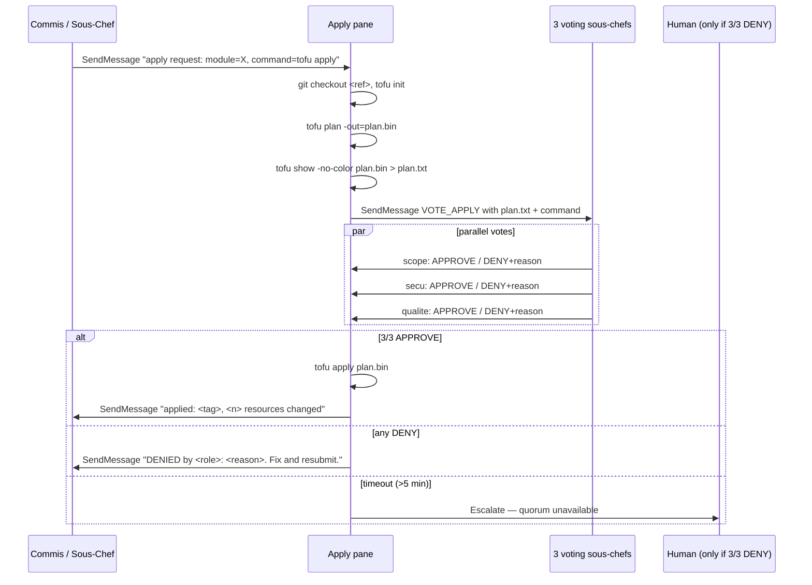

# Reference — Apply Quorum (plan-then-apply protocol)

> Every irreversible shell command goes through a quorum vote on its plan before it executes.
> The file-diff quorum protects code. This protocol protects infrastructure and releases.

## Why this exists

`permissions-template.md` already denies dangerous commands to every role except
the apply pane. But the apply pane's *own* permission is unconditional — once an
agent is in `{project}-wt-apply`, it can run `tofu apply` whenever it wants.

That's the same failure mode the file-diff quorum solves for code: a single agent
decides alone and can be wrong. The fix is the same: the 3 voting sous-chefs
must see the plan and approve 3/3 before the apply pane executes.

## Gated commands

| Command | Why gated |
|---|---|
| `tofu apply` / `terraform apply` | Mutates cloud infra — irreversible without state surgery |
| `tofu destroy` / `terraform destroy` | Deletes resources |
| `helm upgrade --install` / `helm install` | Deploys / reconfigures workloads |
| `helm uninstall` / `helm rollback` | Removes / reverts workloads |
| `kubectl apply` (when targeting prod or shared) | Mutates cluster state |
| `kubectl delete` | Removes resources |
| `kubectl rollout restart` | Service interruption |
| `ansible-playbook` on mutating plays | System-level mutation |
| `git push --force` / `--force-with-lease` on feature branches | History rewrite (maître d'hôtel only, base branches never) |
| `gh release create` | Public release — cannot be cleanly unpublished |
| `gh api -X DELETE` / `-X PATCH` on repo settings | Repo-level mutation |

Dev-loop variants are **not** gated: `tofu plan`, `helm template`, `helm diff`,
`kubectl diff`, `ansible-playbook --check`, `git push` to feature branches without
`--force`.

## The protocol



## Quorum rule

Apply commands are **always sensitive zone → 3/3 unanimity**. No 2/3 fallback.

Reason: the blast radius of an apply is by construction non-local. Even a
"routine" `kubectl apply -f deployment.yaml` can cascade — a ConfigMap change
restarts pods, a CRD change breaks controllers. The cost of false-negative
(apply blocked, re-vote) is minutes. The cost of false-positive (bad apply
merged) is an incident.

## Plan artefact format

Each voter must see:

1. **The command** — full command line the apply pane will execute
2. **The target** — cluster / cloud account / namespace / workspace
3. **The ref** — git SHA and branch the plan was produced from
4. **The plan text** — `tofu show plan.bin`, `helm diff upgrade`,
   `kubectl diff -f`, or equivalent. Truncate to ~500 lines with head + tail if
   larger; the full plan stays in `{project}/.claude/plans/{timestamp}.txt` for
   audit.
5. **The justification** — the requesting agent's one-line reason
   ("feat: add RDS read replica", "fix: bump helm chart to 2.4.1")

## Voter checklists

### sous-chef-scope
- Does this match a plat in the PERT?
- Does the target (cluster / account / namespace) match the plat's intended scope?
- Any resource outside the plat's declared write-set? → DENY
- Dev / staging / prod — which one, and is it expected?

### sous-chef-secu
- Any new public ingress, open port, public bucket, IAM policy widening? → DENY unless justified
- Any secret materialized in plan output (unredacted)? → DENY, request re-plan with sensitive-value masking
- Any destroy / replace of stateful resource (DB, volume, bucket)? → DENY unless backup confirmed
- Any IAM role with `*:*` or `Administrator`? → DENY

### sous-chef-qualite
- Diff size proportionate to the justification? A one-line fix should not touch 40 resources
- Naming consistent with existing resources? Drift from naming convention?
- Any "replace" (destroy + create) where an "update-in-place" was possible?
- For Helm: `.Values` change vs chart version bump — is the change mechanism the right one?
- For kubectl: is this really a `kubectl apply` moment, or should it go through Helm / Kustomize?

## Implementation sketch

In the apply pane prompt:

```
You are the APPLY PANE for {session_name}. Your sole job is to execute
infrastructure mutations after the quorum approves the plan.

WHEN YOU RECEIVE AN APPLY REQUEST:
  1. cd to the correct checkout (your worktree root)
  2. git fetch && git checkout <ref>
  3. Run the PLAN step for the requested command:
       tofu apply        → tofu init && tofu plan -out=plan.bin && tofu show -no-color plan.bin
       helm upgrade      → helm diff upgrade <release> <chart> -f <values>
       kubectl apply     → kubectl diff -f <manifest>
  4. Save the plan to /{project}/.claude/plans/{timestamp}-{requester}.txt
  5. Send VOTE_APPLY in parallel to sous-chef-scope, sous-chef-secu, sous-chef-qualite:
       VOTE_APPLY {
         command: <full command>,
         target: <cluster/account/namespace>,
         ref: <sha>,
         plan_head: <first 200 lines>,
         plan_tail: <last 100 lines>,
         plan_full_path: /{project}/.claude/plans/...,
         justification: <requester's reason>
       }
  6. Wait up to 5 min for 3 votes
  7. Decision:
       3/3 APPROVE        → execute the command, report to requester
       any DENY           → forward DENY + reason to requester, DO NOT execute
       timeout / missing  → escalate to human (SendMessage to chef with "QUORUM TIMEOUT")
  8. After execution:
       - log the result to /{project}/.claude/plans/{timestamp}-result.txt
       - update shared-state.md "Applied changes" section
       - SendMessage to the requester AND to the Chef

NEVER:
  - Execute without a 3/3 APPROVE
  - Skip the plan step
  - Run apply on ref that is not on origin (prevents "apply from local uncommitted state")
  - Hide errors — forward them verbatim
```

In the 3 voting sous-chef prompts (extension to the existing file-diff vote
handler):

```
WHEN YOU RECEIVE A VOTE_APPLY REQUEST:
  Apply the checklist for your role (see apply-quorum.md §Voter checklists).
  Vote strictly: unanimity required. If uncertain → DENY with reason.

  Response format:
    APPROVE
    or
    DENY — <specific reason> — SUGGESTION: <what the requester should change>
```

## Audit trail

Every apply request produces, under `{project}/.claude/plans/`:

- `{timestamp}-{requester}.txt` — the plan submitted for vote
- `{timestamp}-votes.json` — the 3 votes + reasons
- `{timestamp}-result.txt` — stdout/stderr of the executed command (or "DENIED")
- `{timestamp}-meta.json` — `{command, target, ref, approvers, result, duration}`

These are committed to the sprint-history at shutdown so the sprint report has
a complete trace of every mutation.

## Scale rule

| Signal | Protocol active? |
|---|---|
| No infra in the repo | Not applicable — skip this reference |
| Infra present but dev-only (local k3s, kind, Minikube) | Optional — default off, enable with `--apply-quorum` |
| Infra targets staging | **Yes** — 3/3 mandatory |
| Infra targets prod | **Yes, with human ACK** — 3/3 + require "PATRON: ACK apply on prod" before executing |
| Release tags (`gh release create`) | **Yes** — 3/3 mandatory |
| Force-push on feature branches | Maître d'hôtel only, no vote needed (already scoped to feature) |

## Interaction with the file-diff quorum

The two quorums run on the same 3 voters but on different inputs:

| Quorum | Input | Trigger | Latency budget |
|---|---|---|---|
| File diff | `{file, diff}` | Commis edit | 30 s |
| Apply | `{command, plan.txt}` | Apply request from any role | 5 min |

A single sprint can fire both — a commis edits `terraform/vpc.tf` (file-diff
quorum on the diff), then asks the apply pane to apply it (apply quorum on the
plan). Both must pass.

## When the apply quorum should be SKIPPED

- **Dry runs** — `tofu plan`, `helm diff`, `kubectl diff`. These never mutate,
  vote not needed.
- **Local dev loops** — single-developer laptop targeting `kind` / `k3d` /
  Minikube, no prod credentials in env. The apply pane prompt should check
  `kubectl config current-context` against a user-declared `LOCAL_ALLOWLIST` and
  skip the vote only for that allowlist.
- **Rollback under incident** — if the Chef declares `INCIDENT_ROLLBACK` in
  shared-state, one voter + requester is enough (2/1 fast path). Log loudly and
  review post-incident.

Everything else goes through the full 3/3.
