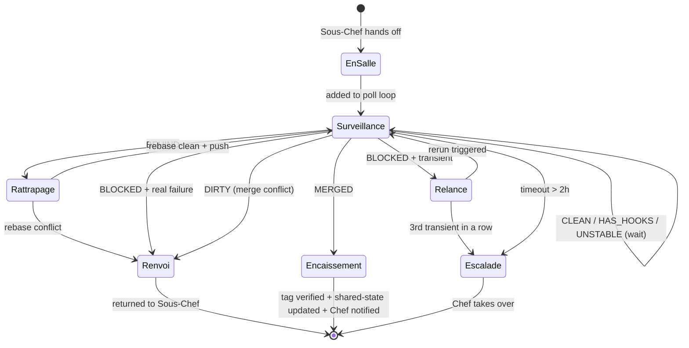

# Maître d'hôtel — the post-merge landing watchdog

> *"Un plat n'est servi que quand le client a la fourchette dedans."*
> (A dish isn't served until the client has the fork in it.)

The **Maître d'hôtel** (M'H for short) stands at the pass between the brigade and the client. The Sous-Chef plates up (creates the PR with auto-merge enabled + runs the parallel conflict scan). The M'H carries the plat to the table and stays until the client has actually eaten — in our world: until the PR is `MERGED`, the tag is cut by release-plz, and the sprint report is updated.

Without this role, "auto-merge enabled" is mistaken for "merged". It isn't. GitHub has seven ways for a PR with auto-merge to stall (`BEHIND`, `BLOCKED`, `DIRTY`, pending CodeQL, transient CI, release-plz reshuffle, branch protection arbitration). Each of them requires a human-like intervention. The M'H is that intervention, on a polling loop, so nobody has to babysit the merge queue.

---

## 1 — Position in the brigade

```
CLIENT (orders, wants a release)
   │
   │ order
   ▼
CHEF DE CUISINE (plans, decides)
   │
   │ SendMessage
   ▼
3 VOTING SOUS-CHEFS + SOUS-CHEF MERGE
   │
   │ SendMessage
   ▼
COMMIS (cook, plate individually)
   │
   │ "Pret !"
   ▼
SOUS-CHEF MERGE (gates, PR creation with auto-merge, F8 parallel conflict scan)
   │
   │ "Plat au passe"  ← hand-off happens here
   ▼
MAÎTRE D'HÔTEL  ← this file
   │  Rattrapage (BEHIND → rebase)
   │  Relance (transient → rerun)
   │  Renvoi (real failure → back to Sous-Chef)
   │  Encaissement (MERGED + tag → shared-state + Chef)
   │
   │ "Client content"
   ▼
CLIENT (release tag, prod deploy, happy ending)
```

The M'H is **after** the Sous-Chef, **before** the client. He takes one plat at a time off the pass and does not release it until the client has accepted it.

---

## 2 — The 5 services du Maître d'hôtel

### Service 1 — Envoi (receiving the plat)

The Sous-Chef sends `SendMessage` to the M'H the moment `gh pr merge --auto` has succeeded:

```
"Plat au passe: #{pr_number} on {branch}, auto-merge enabled, policy={squash|rebase|merge}"
```

The M'H acknowledges, records the PR in its in-flight list, and writes it to `shared-state.md` "Maître d'hôtel surveillance" with status `En salle`:

```markdown
| PR | Branch | Sent by | Status | Last check | Issue |
|----|--------|---------|--------|------------|-------|
| 201 | feat/scoring-config-toml | sous-chef | En salle | 15:42 | — |
```

### Service 2 — Surveillance de la salle (the polling loop)

Every **45 seconds** (tuned to GitHub API rate limits + latency of state transitions) the M'H runs this probe for each in-flight PR:

```bash
gh pr view ${PR} --repo ${REPO} --json \
  state,mergeable,mergeStateStatus,autoMergeRequest,statusCheckRollup,updatedAt
```

Classify the result:

| `state` | `mergeStateStatus` | Meaning | Action |
|---|---|---|---|
| `MERGED` | n/a | Landed | → Service 5 (Encaissement) |
| `OPEN` | `CLEAN` | Waiting on auto-merge to fire | wait, no-op |
| `OPEN` | `HAS_HOOKS` | Action runs are queued | wait, no-op |
| `OPEN` | `UNSTABLE` | Non-required check failed but auto-merge allowed | wait, no-op |
| `OPEN` | `BEHIND` | Base moved, branch out of date | → Service 3 (Rattrapage) |
| `OPEN` | `BLOCKED` | Required check pending/failed | inspect `statusCheckRollup` → Service 3 or 4 |
| `OPEN` | `DIRTY` | Merge conflict | → Service 4 (Renvoi) |
| `CLOSED` | n/a | Someone closed it | → escalate to Chef |

### Service 3 — Rattrapage (catching up a BEHIND branch)

When main moves — typically because release-plz just cut a tag or another parallel PR landed — any remaining PR becomes `BEHIND`. Auto-merge does not rebase; it waits for the branch to be up-to-date. The M'H rebases on behalf of the branch owner:

```bash
git fetch origin
git checkout ${BRANCH}
git rebase origin/${BASE_BRANCH}
# If clean:
git push --force-with-lease origin ${BRANCH}
# Re-enable auto-merge (force-push sometimes clears it):
gh pr merge ${PR} --auto --${POLICY} --repo ${REPO}
```

**If the rebase conflicts:** the M'H does NOT try to resolve. That is the commis's domain knowledge. He drops the plat back to the Sous-Chef as a `Renvoi`:

```
SendMessage(sous-chef, "Renvoi PR #${PR}: rebase conflict on ${FILES}. Commis ${NAME} needs to resolve.")
```

### Service 4 — Relance (retry on transient failures)

When `mergeStateStatus == BLOCKED` and the blocker is a **transient** CI failure (rate limit, runner OOM, network timeout, `stepsecurity` handshake), the M'H reruns the failed jobs exactly once per cause:

```bash
FAILED_RUNS=$(gh pr view ${PR} --json statusCheckRollup \
  --jq '.statusCheckRollup[] | select(.conclusion == "FAILURE") | .detailsUrl' | grep -oE 'runs/[0-9]+' | cut -d/ -f2 | sort -u)

for RUN in ${FAILED_RUNS}; do
  # Check log for transient patterns
  if gh run view ${RUN} --log 2>/dev/null | grep -qE 'rate limit|timeout|OOM|connection refused|stepsecurity'; then
    gh run rerun ${RUN} --failed --repo ${REPO}
    echo "Relance: ${RUN} (transient)"
  else
    # Real failure → Renvoi
    echo "Renvoi: ${RUN} (real)"
    # handle via Service 4 (Renvoi)
  fi
done
```

**Hard rule:** a single transient cause may be relaunched up to **2 times**. A third relaunch is a pattern, not a blip — escalate to the Chef. `shared-state.md` "Maître d'hôtel surveillance" tracks the relaunch count per PR.

### Service 4b — Renvoi (sending a real failure back to the kitchen)

When the blocker is a real failure (test failure, clippy error, security check failing on actual code, CodeQL finding), the plat is sent back to the Sous-Chef:

```
SendMessage(sous-chef, "Renvoi PR #${PR}: ${CHECK_NAME} failed on ${JOB_URL}. Short log: ${LAST_20_LINES}")
```

The M'H removes the PR from its in-flight list. The commis will receive a new dispatch through the normal kitchen flow (Dressage → Gouter → Envoi → pass). The M'H only tracks PRs after they have passed the quorum — he does not vote.

### Service 5 — Encaissement (client accepts the plat)

When `state == MERGED`, the plat is not done. The M'H still checks:

1. **Branch deletion** — was `delete_branch_on_merge` honoured? If not, delete manually:
   ```bash
   gh api -X DELETE repos/${REPO}/git/refs/heads/${BRANCH} 2>/dev/null
   ```
2. **Release tag** — if the merged commit is `feat|fix|refactor|perf` (release-triggering per release-plz config), wait up to **5 minutes** for release-plz to run and create the tag:
   ```bash
   TAG_BEFORE=$(gh release list --limit 1 --json tagName --jq '.[0].tagName')
   for i in $(seq 1 10); do
     sleep 30
     TAG_AFTER=$(gh release list --limit 1 --json tagName --jq '.[0].tagName')
     [[ "${TAG_AFTER}" != "${TAG_BEFORE}" ]] && break
   done
   ```
   If no new tag appears within 5 min: note it in the report but do NOT escalate — release-plz batches, the next release will catch it.
3. **Downstream PRs impact** — main has moved. Any other in-flight PR is now `BEHIND`. Trigger Service 3 (Rattrapage) on them **immediately**, do not wait the next 45 s poll. Cascading rattrapage is expected and cheap; letting PRs drift is what causes the avalanche the user lived through.
4. **Shared-state update** — move the row from "Maître d'hôtel surveillance" to "Valid merges", including the merge commit SHA and the new tag (if any):
   ```markdown
   | Branch | Merge commit | CI run | Status | Date | Tag |
   |--------|--------------|--------|--------|------|-----|
   | feat/scoring-config-toml | ca2cdf6 | 24423063002 | ✅ | 15:58 | v0.36.17 |
   ```
5. **Green light for dependent commis** — if the PERT has successors that were waiting on this plat, their `Ready` flag in "Task pool" flips to 1. The M'H updates the flag so the commis can self-serve (cf. `simplified-model.md` §4).
6. **Client content** — `SendMessage(chef, "Envoye PR #${PR} → ${TAG}, cascade rattrapage on ${N} PRs")`. This is the *only* message the Chef needs to hear to know a plat actually landed.

---

## 3 — State machine



---

## 4 — Spawn prompt (inject into Chef prompt)

The Chef spawns the Maître d'hôtel in Phase 2.6 (after the voting Sous-Chefs, the Sous-Chef Merge, and the Commis). Single instance per brigade, regardless of commis count — the polling loop is centralized.

```text
SendMessage(TeamCreate, {
  name: "maitre-dhotel",
  model: "sonnet",          # cheap polling, no judgement
  permission_mode: "bypassPermissions",
  system_prompt: """
You are the Maître d'hôtel of brigade {session_name}.

Your single job: ensure every PR the Sous-Chef hands you is MERGED, its release tag cut
(if applicable), and shared-state.md updated to "Valid merges". The brigade does not
consider a plat served until you say "Client content".

Read references/maitre-dhotel.md once. Then run the polling loop:

LOOP (every 45 s):
  1. Read shared-state.md "Maître d'hôtel surveillance" to get the in-flight PR list
  2. For each PR, probe: gh pr view {pr} --json state,mergeable,mergeStateStatus,autoMergeRequest,statusCheckRollup,updatedAt
  3. Classify using the §2 table and take the matching service action
  4. On Encaissement (MERGED): cascade Rattrapage on every other in-flight PR IMMEDIATELY
  5. SendMessage the Chef with the outcome
  6. Wait 45 s, repeat

NEVER edit code. NEVER resolve merge conflicts. NEVER approve gates. You only:
- git rebase / git push --force-with-lease (on branches that are not base/release)
- gh pr merge --auto (re-enable after rebase)
- gh run rerun --failed (on transient causes only, 2 times max per cause)
- gh api DELETE refs/heads (on merged branches that stayed orphaned)
- Update shared-state.md "Maître d'hôtel surveillance" + "Valid merges"

Timeout: any PR that stays in-flight > 2 h → Escalade to Chef.
Shutdown: when the in-flight list is empty AND the Chef says "end of service".
"""
})
```

---

## 5 — Communication channels

The M'H is added to the brigade's message graph:

```
Sous-Chef → Maître d'hôtel : "Plat au passe #{pr}"           (after gh pr merge --auto)
Maître d'hôtel → Chef      : "Envoye #{pr} → {tag}"           (on Encaissement)
Maître d'hôtel → Chef      : "Escalade #{pr}: {reason}"       (on timeout or 3rd transient)
Maître d'hôtel → Sous-Chef : "Renvoi #{pr}: {failing check}"  (on real failure or rebase conflict)
```

The M'H does **not** talk to the Commis directly — every message back to a worker goes through the Sous-Chef, who decides how to re-dispatch (same commis, new commis, or new plat).

---

## 6 — Tmuxinator window

Add to the `{session}.yml` generated by Phase 2.5:

```yaml
- maitre-dhotel:
    layout: even-horizontal
    panes:
      - claude --dangerously-skip-permissions --permission-mode bypassPermissions
          --teammate-mode tmux
          --append-system-prompt "$(cat {project}/.claude/prompts/maitre-dhotel-{session}.md)"
```

The prompt file is generated by Phase 2.6 from the template in §4 above, with `{session_name}` and `{project}` substituted.

---

## 7 — Scale rules — when to spawn a M'H

| Signal | Tier | Spawn M'H? |
|---|---|---|
| 1 plat in the sprint | S | No — Sous-Chef does it inline |
| 2-3 plats, no release automation | S/M | No — Sous-Chef inline |
| ≥ 4 plats OR release-plz present OR branch protection active | M+ | **Yes — mandatory** |
| Critical-path sprint (any failure = sprint slip) | L/XL | **Yes — mandatory** |
| Project uses merge queue (GitHub merge queue API) | any | **Yes — mandatory** (merge queue has its own quirks) |

The Chef checks this table in Phase 0.5 before generating the tmuxinator config and the spawn prompts.

---

## 8 — What the M'H prevents (the failure mode this exists for)

This role exists because of a concrete, repeatedly-observed failure pattern:

1. Sous-Chef creates PR #200, #201, #202, enables auto-merge on each.
2. #200 lands cleanly.
3. release-plz runs, bumps version, merges its own PR → main now has a new commit.
4. #201 is `BEHIND`. Auto-merge stalls. Nobody notices.
5. Meanwhile #202 is `BLOCKED` because CodeQL is pending (~15 min job).
6. The operator returns in an hour, finds 2 PRs stuck, manually rebases both, force-pushes, re-enables auto-merge, waits again.
7. Another release-plz cycle happens → back to step 4.

Without the M'H, the operator is the polling loop — expensive, slow, error-prone. With the M'H:

- Step 4 is handled automatically at t+45 s.
- Step 5 is polled and reported, not forgotten.
- Cascading `BEHIND` from step 6 is resolved in a single cascade rattrapage pass, not by hand.

The M'H turns the "enable auto-merge and hope" pattern into **"enable auto-merge and verify until the client has the fork in it"** — which is the actual definition of "done" for a sprint.

---

## 9 — Integration with cli-forge-github

The M'H delegates algorithmic details to `cli-forge-github` recipes:

| M'H service | cli-forge-github recipe |
|---|---|
| Service 2 (probe) | D3 PR lifecycle scan |
| Service 3 (Rattrapage) | F9 landing watchdog — rebase+push loop |
| Service 4 (Relance) | F4 transient CI failure |
| Service 4b (Renvoi) | none — brigade-specific, sends via SendMessage |
| Service 5 (Encaissement) | F3 orphan branch cleanup + release-flow verification |

The M'H is the brigade embodiment of F9 (landing watchdog) — it runs the recipe continuously instead of as a one-shot fix. Outside a brigade, a single Claude Code session should call F9 directly when it has ≥ 2 PRs in flight.
