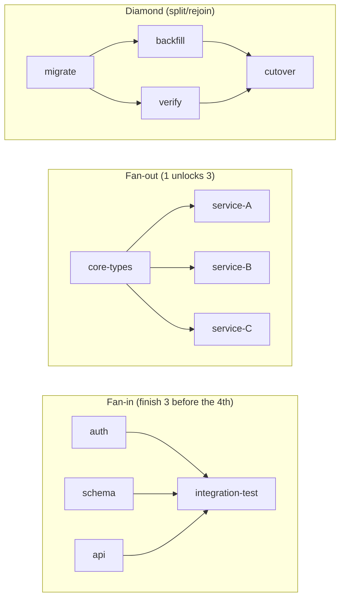
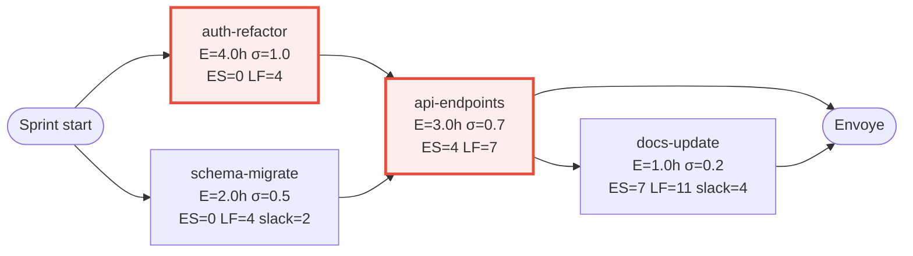

# PERT computation — "aller vite sans s'emmêler les pinceaux"

> **When to read:** Phase 0.5 of the Chef, right after `cli-audit-tangle` has produced the coupling map and before spawning the commis. The Chef MUST compute the PERT before writing `shared-state.md` — the PERT section is the scheduling contract for the whole sprint.

The Chef's job is to deliver the maximum number of plats in the minimum wall-clock time **without two commis stepping on the same file at the same time**. That is exactly the problem PERT + list-scheduling solves: compute the critical path to know where time is actually spent, then dispatch commis to critical tasks first while respecting file-level exclusion.

The reaction-diffusion pool in `simplified-model.md` (§4) is the *execution substrate* — this file is the *scheduling policy* that feeds it priorities.

---

## 1 — Estimate each plat (O, M, P)

For every plat in the menu, the Chef produces three time estimates in commis-hours (a "commis-hour" = 1 commis working 1 hour; actual wall time depends on parallelism).

| Estimate | Meaning | How to derive |
|---|---|---|
| **O** (optimistic) | Everything clicks first try | Smallest plausible diff, no refactor, tests already cover it |
| **M** (realistic) | Normal case with the usual friction | Baseline — what you'd tell a teammate if asked casually |
| **P** (pessimistic) | Hits every rake | Includes one round of DENY from a sous-chef + one CI retry |

**Quick heuristic when the Chef has no historical data** (most first sprints):

| Tier | Signal | O / M / P (commis-hours) |
|---|---|---|
| XS | 1 file, < 30 line diff, no new deps | 0.25 / 0.5 / 1 |
| S | 1-3 files, < 100 line diff | 0.5 / 1 / 2 |
| M | 3-8 files, new function/type, no schema change | 1 / 2 / 4 |
| L | 8-20 files, crosses a module boundary | 2 / 4 / 8 |
| XL | Schema/contract/API change, or touches a sensitive zone | 4 / 8 / 16 |

The tier is picked from `cli-audit-tangle` output: file count, modified LOC estimate, presence in the sensitive-zone list.

**PERT formula:**

```
E  = (O + 4M + P) / 6        expected duration
σ  = (P - O) / 6             standard deviation (task)
σ² = ((P - O) / 6)²          variance (task)
```

**Project-level confidence** (only meaningful on the critical path):

```
E_project = Σ E_i  over critical path
σ²_project = Σ σ²_i  over critical path
σ_project  = √(σ²_project)
```

`E_project ± 1.96·σ_project` is the 95% confidence interval on the critical-path duration (central limit theorem — holds once the critical path has ≥ 4 tasks).

---

## 2 — Build the dependency DAG

### 2.0 — Read the tangle partition artefact first

Before building edges, look for `.claude/tangle-partition.json` at the project root. This file is the exported artefact from `cli-audit-tangle` (schema in that skill's SKILL.md) and gives the Chef three things for free:

- **`clusters[]`** — the Fiedler partition of the codebase into cohesive modules. One cluster = one commis. If the chef assigns plats along cluster boundaries, **two commis can never touch the same cluster at the same time** — the W/W file-exclusion rule becomes "one commis per cluster", enforced by construction instead of checked at dispatch.
- **`boundary_functions[]`** — functions whose Fiedler value is near zero. They bridge two clusters; a plat that touches one of these is itself a synchronization barrier. Mark the plat as a **fan-in join point** (cf. §2.1) with edges from every plat that modifies the adjacent clusters.
- **`god_functions[]` and `cycles[]`** — hints the chef should not try to parallelize. A plat that touches a god function goes on the critical path; a plat inside a cycle must be split before the PERT is built.

**How the chef uses it:**

```
For each plat in the menu:
  target_files = plat.write_set
  matching_cluster = argmax over clusters of |target_files ∩ cluster.files|
  plat.cluster = matching_cluster.id
  plat.boundary = any(f in boundary_functions for f in target_files)

For each cluster:
  plats_in_cluster = [p for p in menu if p.cluster == cluster.id]
  assign_commis_hint = cluster.recommended_commis_hint

Assignment rule (Phase 0.5):
  1. Each cluster gets at most one commis assigned permanently for the sprint.
  2. Plats inside a cluster are sequenced by the PERT within that commis (no parallelism needed — one worker).
  3. Plats in DIFFERENT clusters with no dependency edge run in parallel across commis.
  4. A boundary plat is ALWAYS a fan-in barrier: its predecessors are the last plat of each adjacent cluster.
```

**If `.claude/tangle-partition.json` does not exist**, the chef falls back to file-level coupling detection (step 2.1 below). Clusters become implicit — every write-set is its own cluster of 1 file, and file-exclusion is checked at dispatch instead of prevented at assignment. This is slower and more conflict-prone, but works.

**Rule of thumb:** a sprint without `tangle-partition.json` runs; a sprint WITH it runs faster and with fewer renvois because the Chef never hands two commis files from the same cluster. Run `/cli-audit-tangle` before `/cli-forge-chef` on any project with more than ~5 plats.

### 2.1 — Edge sources

Source of edges, in order of authority:

1. **Fiedler boundaries** (if `tangle-partition.json` is present) — every boundary function is a mandatory fan-in: the plat that touches it depends on every cluster-resident plat it bridges. These edges are non-negotiable — they are the PERT equivalent of W/W conflicts.
2. **File couplings** from `cli-audit-tangle` — if plat B writes a file that plat A creates or renames, B depends on A. Hard constraint.
3. **Semantic dependencies** the Chef knows from the plan — "the auth middleware must exist before the endpoints that use it". Stated explicitly in the menu.
4. **Contract/schema order** — migrations before readers, types before consumers, API spec before client code.

**No edge** between plats that only share *read-only* dependencies (both read the same config, both import the same library). They are parallelizable.

The result is a DAG. **Check for cycles** before proceeding — a cycle in the PERT is a planning bug, not a runtime problem. Use Tarjan (see `conflict-resolution.md` §"Cycle detection"). If a cycle is found, the Chef MUST split one of the plats or merge two plats into one before continuing.

### 2.1 — Precedence and join points (what the PERT gives you that nothing else does)

The real value of the PERT is not the list of tasks — it is the **precedence relation** between them. The DAG captures things no flat todo list, kanban, or gantt can express naturally:

- **Fan-in (join points / merge events):** a plat with multiple predecessors waits for **all** of them to be `Envoye` before becoming `Ready`. This is the "finish N tasks before this one" pattern — expressed as N inbound arrows, not as a priority hack or a manual gate. Example: `integration-test` must wait for `auth`, `schema`, and `api` all three — one arrow each, zero prose needed.
- **Fan-out (broadcast):** a plat with multiple successors unblocks several downstream chains at once. Merging a fan-out source is the highest-leverage event in the sprint — the pool can go from 1 ready plat to 3 in a single merge.
- **Diamonds (split/rejoin):** a task splits the work into parallel branches that reconverge. The critical path automatically picks the longer branch; the shorter branch accumulates slack. This is how the PERT turns "these two tasks are independent" into an actual schedule decision.
- **Transitive precedence:** if A → B → C, the chef does NOT also add A → C. The edge is implied. Adding it would not change scheduling and clutters the diagram. Keep the DAG transitively reduced (minimal set of edges that preserves reachability).

**Mermaid patterns for each precedence shape:**



**Concrete rule for the Chef:** whenever the user says "X must finish before Y" or "we need A, B, C before we can touch D", this maps to **edges in the DAG**, not to priorities, phases, or comments. Add the edges literally and let the forward-pass do the synchronization. If a plat has N inbound arrows, it IS a synchronization barrier by construction — the `Ready = 1 iff all predecessors Envoye` rule in §4.1 handles it automatically.

This is the feature that distinguishes the PERT from every other artefact in the sprint: a kanban shows state, a gantt shows time, a task list shows ownership — only the PERT shows **who has to finish before whom**, and only the PERT can compute a critical path from that.

---

## 3 — Compute the critical path

Standard forward-pass / backward-pass on the DAG:

```
Forward pass (earliest):
  ES(start) = 0
  EF(task)  = ES(task) + E(task)
  ES(task)  = max(EF(pred)) over all predecessors

Backward pass (latest):
  LF(end)   = EF(end)
  LS(task)  = LF(task) - E(task)
  LF(task)  = min(LS(succ)) over all successors

Slack (float):
  slack(task) = LS(task) - ES(task) = LF(task) - EF(task)

Critical path = all tasks with slack = 0
Makespan      = EF(end) = Σ E on critical path
```

Any task with `slack > 0` can be delayed by up to `slack` commis-hours without pushing the total delivery date.

---

## 4 — Schedule with limited commis (the "don't tangle" rule)

Pure PERT assumes infinite parallelism. A real brigade has N commis (usually 2-5) and a **file-level exclusion constraint**: at most one commis writes a given file at a given time. This is the Resource-Constrained Project Scheduling Problem (RCPSP). The Chef uses **list scheduling with critical-path-first priority** — provably near-optimal for this problem class and trivial to implement.

**At every dispatch decision** (a commis becomes free, or the sprint starts):

1. **Build the ready set.** A plat is ready iff all its PERT predecessors are `Envoye` (merged). This is already tracked in `shared-state.md` "Green light".

2. **Compute the priority of each ready plat:**

   ```
   priority(task) = longest_path_from(task, end)   # a.k.a. "rank"
                  = E(task) + max(priority(succ))
                  = 0 if task has no successor
   ```

   This is the length of the longest chain of work that *cannot start until this task is done*. A critical-path task has the highest priority by construction. Ties are broken by smaller slack, then by smaller E (short critical tasks first — frees downstream faster).

3. **Filter by file exclusion.** Drop any ready plat whose write-set intersects the write-set of a plat currently `In progress`. These are NOT assigned this round — they stay in the pool and will be picked up after the conflicting plat merges. This is the "don't tangle the brushes" guarantee.

4. **Assign to free commis in priority order.** Highest priority gets the first free commis. Never assign more than 1 commis per plat.

5. **Write to `shared-state.md` "Task pool":**

   ```markdown
   | Plat | E | σ | ES | LS | slack | Priority | Status | Commis |
   |------|---|---|----|----|-------|----------|--------|--------|
   | auth-refactor | 4.0 | 1.0 | 0 | 0 | 0 | 12.0 | In progress | commis-1 |
   | schema-migrate | 2.0 | 0.5 | 0 | 2 | 2 | 8.0 | In progress | commis-2 |
   | api-endpoints | 3.0 | 0.7 | 4 | 4 | 0 | 8.0 | Waiting (auth) | - |
   | docs-update | 1.0 | 0.2 | 7 | 11 | 4 | 1.0 | Waiting (api) | - |
   ```

   `slack = 0` rows are the critical path. Commis pick them first. `slack > 0` rows are the buffer — they soak up delays.

**Priority updates itself** when a task merges: successors' ES advances, the ready set grows, the pool re-sorts. No Chef intervention needed — the pool is stigmergic (cf. simplified-model.md §4), the Chef just writes the priorities once at Phase 0.5 and lets the commis self-serve.

### Triage quadrant — priority × slack

Two numbers per plat define its risk profile. The Chef emits this quadrant alongside the PERT so a human scanning `shared-state.md` sees where attention belongs in two seconds:

```mermaid
quadrantChart
    title Plat triage — priority vs slack
    x-axis Low slack --> High slack
    y-axis Low priority --> High priority
    quadrant-1 Buffered critical (watch but safe)
    quadrant-2 Critical path (protect: best commis here)
    quadrant-3 Idle (deprioritize, may be cut)
    quadrant-4 Slack tail (fill-in work)
    auth-refactor: [0.05, 0.95]
    api-endpoints: [0.05, 0.80]
    schema-migrate: [0.40, 0.60]
    docs-update: [0.70, 0.15]
```

**Reading the quadrants:**

- **Q2 — Critical path.** Slack ≈ 0, priority high. Assign the most reliable commis. A delay here is a sprint delay.
- **Q1 — Buffered critical.** Priority high, slack > 0. Important but has room to breathe — acceptable to leave on a slower commis.
- **Q4 — Slack tail.** Low priority, plenty of slack. Fill-in work for idle commis.
- **Q3 — Idle.** Low priority, low slack. Usually a sign the plat is mis-estimated or obsolete — candidate to cut.

Normalize `priority` to `[0, 1]` by dividing by the max priority in the sprint; normalize `slack` by dividing by the makespan. This keeps the quadrant stable as the sprint progresses.

---

## 5 — Mandatory Mermaid format for the PERT

The Chef MUST emit this exact shape into `shared-state.md` under the `## PERT` section (and paste it into the Chef prompt where the `{pert_diagram}` placeholder lives in `chef-prompt-template.md`):



**Rules for the Mermaid block:**

- `flowchart LR` — left-right reads like a timeline without being one.
- Nodes = plats. Edges = dependencies. **Never use `gantt`** — a Gantt is a scheduled timeline, not a PERT.
- Each node label: `name<br/>E=Xh σ=Y<br/>ES=Z LF=W [slack=S]`. Omit `slack` on critical-path nodes (redundant — it's 0).
- `classDef critical` — red stroke, light-red fill. Apply to every critical-path node with `:::critical`.
- `start` and `done` are round brackets (`([...])`) — they are milestones, not work.
- Keep the diagram under 15 nodes. If the sprint has more plats, split into two PERTs by phase and link them with a shared milestone.

**Companion text table** (goes right below the Mermaid block in `shared-state.md`):

```markdown
| Plat | O | M | P | E | σ | ES | EF | LS | LF | slack | critical |
|------|---|---|---|---|---|----|----|----|----|-------|----------|
| auth-refactor | 2 | 4 | 8 | 4.0 | 1.0 | 0 | 4 | 0 | 4 | 0 | ✓ |
| schema-migrate | 1 | 2 | 4 | 2.0 | 0.5 | 0 | 2 | 2 | 4 | 2 |   |
| api-endpoints | 1.5 | 3 | 6 | 3.0 | 0.7 | 4 | 7 | 4 | 7 | 0 | ✓ |
| docs-update | 0.5 | 1 | 2 | 1.0 | 0.2 | 7 | 8 | 11 | 11 | 4 |   |

**Makespan:** 7.0 commis-hours on the critical path (auth → api).
**95% CI:** 7.0 ± 2.4 commis-hours.
**Critical path:** auth-refactor → api-endpoints.
```

The table is the source of truth. The Mermaid diagram is the human-readable view.

---

## 6 — When to recompute

The Chef re-runs the PERT (not the tangle — just the forward/backward pass on the existing DAG) **only** when:

- A plat enters **apoptosis** (cf. simplified-model.md §5) → its E jumps (add the already-spent time to P, re-estimate M). Critical path may shift.
- A **DENY round** from a sous-chef pushes a plat past its P estimate → same treatment.
- The user adds a plat mid-sprint → full recompute (rare — usually scheduled for the next sprint).

**Do NOT recompute** on every merge. The ES values advance naturally as successors become ready; the ordering of the pool is stable unless an estimate changes.

---

## 7 — Failure modes this prevents

| Failure | Without PERT | With PERT |
|---|---|---|
| Two commis on the same file | Caught only at merge (W/W conflict) | Prevented at dispatch (file exclusion filter, §4.3) |
| Wasting the best commis on a non-critical task | Common — the most available task is picked | Prevented by priority = longest-remaining-path |
| Sprint slips and nobody knows why | The slip is announced at the end | The critical path is visible from Phase 0.5; delays on it are flagged early |
| Adding commis doesn't speed things up | Amdahl surprise at retro | Predicted: anything beyond `(Σ E) / makespan` commis is wasted |
| Chef micro-manages the ordering | Bottleneck on the Chef | Commis self-serve from a priority-sorted pool |

The last row is the point: **the PERT is a one-shot computation in Phase 0.5, not an ongoing scheduling loop**. Once written to `shared-state.md`, the commis order themselves; the Chef only intervenes on exception (apoptosis, cycle, escalation).
