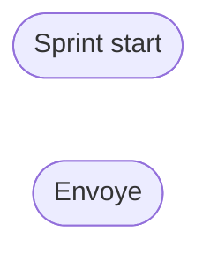
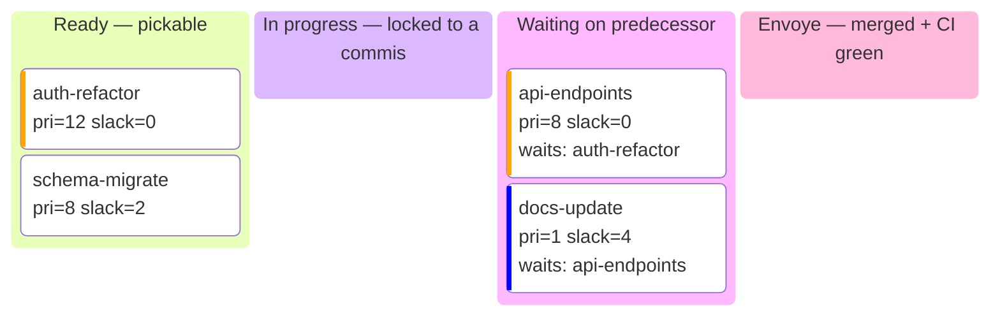

# Template — Shared State

Generate this file at `{project}/.claude/shared-state.md`.
Replace `{variables}` with the project values.

---

```markdown
# {Project Name} Shared State — Session {session_name}

> Shared memory between all parallel Claude Code sessions.
> **CHEF**: only agent allowed to write in "Valid merges" and "Green light".
> **COMMIS**: read this file BEFORE coding. Write in "In progress" and "Done".
> **EVERYONE**: re-read this file after every merge to see what changed.

## Green light — Resolved dependencies

> The Chef writes here when a merge is validated and dependents can continue.
> Commis: if your task depends on another, wait until it appears here.

| Merged branch | Tests | CI | Date | Unblocks |
|---------------|-------|----|------|----------|

## In progress

| Worktree | Branch | Task | Files touched | Started |
|----------|--------|------|----------------|---------|

## Done (awaiting merge)

| Worktree | Branch | Task | Result | Tests | Files modified | Date |
|----------|--------|------|--------|-------|-----------------|------|

## Valid merges

| Branch | Merge commit | CI run | Status | Date |
|--------|-------------|--------|--------|------|

## Potential conflicts

> If you edit a file already listed in another worktree's "In progress", note it here.

| File | Affected worktrees | Risk | Resolution |
|------|--------------------|------|------------|

## Decisions made

> Technical choices made during the sprint that affect other sessions.
> Commis: read this section BEFORE coding, a choice made by another worker may change your approach.

| Decision | Reason | Impacts | By | Date |
|----------|--------|---------|----|------|

## Quality Gates — Metrics (filled by the Chef)

> The Chef fills this section after every audit. Commis: if a gate fails, fix before resubmitting.

| Gate | Scope | Score | Threshold | Status | Date |
|------|-------|-------|-----------|--------|------|
{quality_gates_rows}

### Strong couplings (from /cli-audit-tangle)

> Chef fills this before assigning tasks. Commis: do NOT touch coupled files assigned to another worker.

| Module/Function | Coupling | Assigned to |
|------------------|----------|-------------|

## PERT (computed in Phase 0.5 — see references/pert-computation.md)

> Scheduling contract for the sprint. Chef writes once at Phase 0.5.
> Recomputed only on apoptosis, DENY past P, or user-added plat — never on every merge.
> **Format is a Mermaid `flowchart LR` — never a `gantt`**. A PERT is a dependency DAG, not a timeline.



| Plat | O | M | P | E | σ | ES | EF | LS | LF | slack | critical |
|------|---|---|---|---|---|----|----|----|----|-------|----------|

**Makespan:** {makespan} commis-hours on the critical path.
**95% CI:** {makespan} ± {ci} commis-hours.
**Critical path:** {critical_path}.

### Scheduled view (derived from PERT — wall-clock projection)

> Post-scheduling `gantt` derived from ES/EF of the PERT. NOT the PERT itself.
> The PERT above is the dependency contract; this gantt answers "when will it be done?".
> Regenerated only when the PERT is recomputed (apoptosis / DENY past P / new plat).

```mermaid
gantt
    title Sprint schedule (post-PERT projection)
    dateFormat X
    axisFormat %Hh
    section Critical path
    auth-refactor   :crit, 0, 4h
    api-endpoints   :crit, after auth-refactor, 3h
    section Buffer
    schema-migrate  :2h, 0, 2h
    docs-update     :1h, after api-endpoints, 1h
```



Critical-path tasks use `crit`. The section split makes the slack-free chain visually separable from the buffered tasks.

## Task pool (dispatch queue — consumed by free commis)

> Two views of the same state: a `kanban` for one-glance status, a table for machine parsing.
> Derived from the PERT. `Ready = 1` iff all predecessors are Envoye.
> Dispatch rule: highest Priority (longest path to done) wins, ties broken by smaller slack,
> then smaller E. File-exclusion: never dispatch two rows whose Write-sets intersect.



**Columns:** `Ready` (pickable now) / `InProgress` (a commis is on it) / `Blocked` (waiting on a predecessor) / `Envoye` (merged). A plat moves Ready → InProgress on dispatch, InProgress → Envoye on merge. A Blocked plat jumps to Ready when its last predecessor becomes Envoye.

**Priority label** (`High` / `Medium` / `Low`) is derived from the PERT priority and maps directly to dispatch order. Critical-path plats (`slack = 0`) are always `High`.

| Plat | Ready | Priority | Slack | Write-set | Commis |
|------|-------|----------|-------|-----------|--------|

## Sensitive zones (3/3 unanimity quorum)

> Reviewed at the end of every sprint. If a file causes problems, move it here.
> If a file stays here for 3 sprints with no incident, demote it back to the normal zone.
>
> **Machine-parseable format**: the authoritative list is the `BOSS_SENSITIVE_PATHS`
> block below. The human table is generated from that block and serves as documentation.
> The Sous-Chef `/loop` parses only the block — always keep it up to date.

<!-- BOSS_SENSITIVE_PATHS:START -->
```sensitive-paths
# One glob pattern per line. Lines starting with # are comments.
# Parsed by /loop Sous-Chef and the Chef shutdown protocol.
# Format: <glob>    # <reason>
.github/workflows/**          # CI = global impact
**/Cargo.toml                 # Supply chain risk (Rust deps)
**/package.json               # Supply chain risk (npm deps)
**/go.mod                     # Supply chain risk (Go deps)
**/pyproject.toml             # Supply chain risk (Python deps)
**/requirements*.txt          # Supply chain risk (Python deps)
.env                          # Secrets
**/*.secret                   # Secrets
**/credentials*               # Secrets
src/auth/**                   # Critical authentication
src/security/**               # Critical security
CONTRACTS.md                  # Project rules
CONTRIBUTING.md               # Project instructions
```
<!-- BOSS_SENSITIVE_PATHS:END -->

### Human table (generated from the block above)

| Pattern | Reason | Since | Incidents |
|---------|--------|-------|-----------|
| .github/workflows/** | CI = global impact | initial | - |
| **/Cargo.toml | Supply chain risk (Rust) | initial | - |
| **/package.json | Supply chain risk (npm) | initial | - |
| .env, **/*.secret, **/credentials* | Secrets | initial | - |
| src/auth/** | Critical authentication module | initial | - |
| src/security/** | Critical security module | initial | - |
| CONTRACTS.md, CONTRIBUTING.md | Project rules | initial | - |

### How to parse the block (for /loop or scripts)

```bash
# Extract pure patterns (no comments, no markers)
sed -n '/<!-- BOSS_SENSITIVE_PATHS:START -->/,/<!-- BOSS_SENSITIVE_PATHS:END -->/p' \
  {project}/.claude/shared-state.md \
  | sed -n '/```sensitive-paths/,/```/p' \
  | grep -v '^```' \
  | grep -v '^#' \
  | grep -v '^$' \
  | awk '{print $1}'
```

### Hallucination history

> If a Sous-Chef APPROVEd a diff that caused a problem, record it here.
> Used to improve the Sous-Chefs' rules in the next sprint.

| Sprint | Sous-Chef | File | What happened | Fix applied |
|--------|-----------|------|----------------|-------------|

## Shared context

> Information every worker must know.

{context_items}
```
