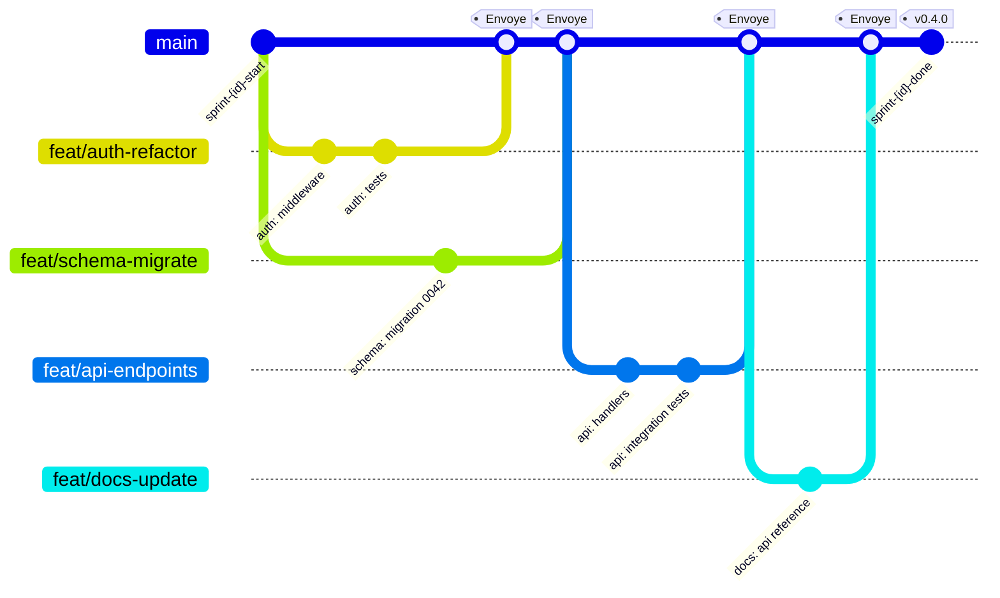
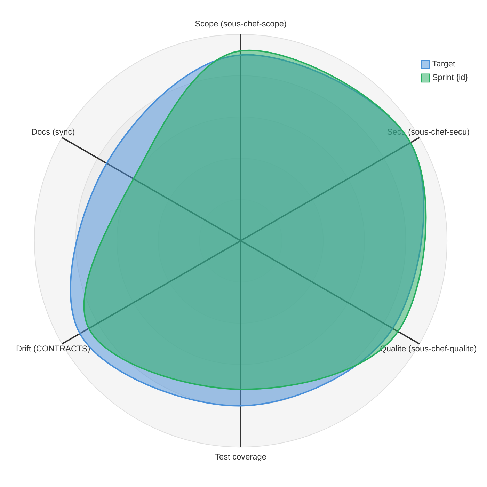
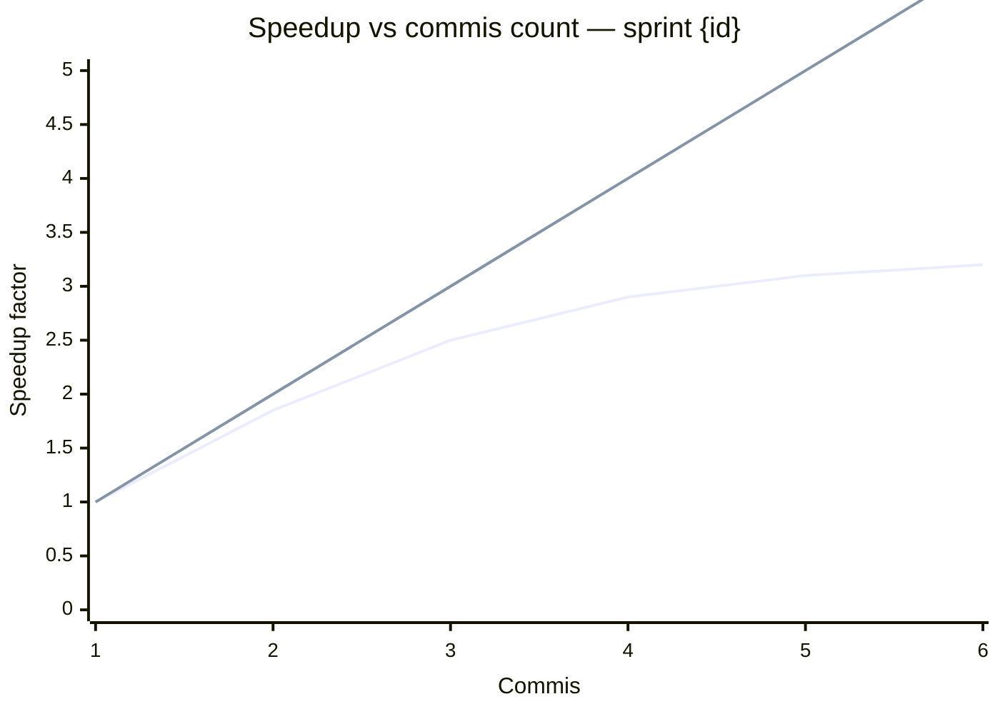

# Template — Sprint report

Generate this file at `{project}/.claude/reports/sprint-{id}.md` (or `docs/sprints/` if the project prefers). The Chef writes it in the shutdown protocol after every plat is `Envoye` or explicitly cut, and **after** the roadmap/features docs have been updated (cf. gotchas G17).

The report has one job: let a human retro the sprint in under 5 minutes without re-reading `shared-state.md`. Four diagrams, each answering one question a human actually asks.

---

```markdown
# Sprint {id} — {project}

**Dates:** {start} → {end}
**Commis:** {n_commis}
**Plats planned:** {n_planned}
**Plats delivered:** {n_delivered}
**Plats cut (apoptosis + human abort):** {n_cut}

## 1 — What shipped (branch topology)

> Question: "What parallel streams did we actually run, and where did they merge?"



**Reading:** each branch is one commis-worktree; each merge is a successful `Envoi` through the quorum. Fan-out at `sprint-start` = the `Ready` set in Phase 1. Sequential merges on `main` show where the critical path forced serialization.

## 2 — Where did the commis-hours actually go (flow analysis)

> Question: "Did we spend our time on what mattered?"

```mermaid
sankey-beta

commis-1,auth-refactor,4
commis-1,api-endpoints,3
commis-2,schema-migrate,2
commis-2,docs-update,1
commis-2,idle,2
auth-refactor,Envoye,4
schema-migrate,Envoye,2
api-endpoints,Envoye,3
docs-update,Envoye,1
auth-refactor,Renvoi,1
Renvoi,auth-refactor,1
```

**Reading:** the left column is the resource (commis), the middle is the plat, the right is the outcome (`Envoye` / `Renvoi` / `Apoptosis` / `idle`). Thick `Renvoi` or `Apoptosis` flows mean the sprint leaked time to rework — a signal to revisit the estimate tier for those plats next sprint. Thick `idle` flows mean the critical path was too narrow for the number of commis (Amdahl wall — see §4).

## 3 — Brigade health scorecard (multi-dim quality)

> Question: "Beyond 'it shipped', how healthy is what we shipped?"



**Reading:** each axis is a quality gate score normalized to 0-100. `planned` is the target set at sprint start (from `shared-state.md` "Quality Gates"); `actual` is the end-of-sprint measurement. Axes where `actual` is inside `planned` are regressions that must be addressed next sprint. The doc axis dipping is the classic G17 symptom — roadmap/features forgotten until the shutdown protocol caught it.

## 4 — Parallelism efficiency (Amdahl curve)

> Question: "Would another commis have helped, or was the sprint already serial-bound?"



**Reading:** lower line = measured (or simulated) speedup with N commis on this sprint's PERT. Upper line = ideal linear speedup (`y = x`). The gap is the parallelism loss. The knee of the curve is the number of commis beyond which the critical path dominates — anything past the knee is a waste of agent budget. For most sprints the knee sits between 3 and 5 commis, which matches the "> 5 commis triggers the warning" rule in SKILL.md Phase 3.

**Rule of thumb from this sprint:**

```
measured_speedup    = Σ(E planned) / actual_makespan
ideal_speedup       = min(n_commis, Σ(E planned) / max_critical_path)
parallelism_loss    = ideal_speedup - measured_speedup
```

Parallelism loss > 30% means the PERT had too many serial chains for the number of commis — next sprint, either reduce n_commis or split the critical-path plats into smaller ones.

## 5 — Planned vs actual (one-line verdict)

| Metric | Planned | Actual | Delta |
|---|---|---|---|
| Makespan (critical path) | {planned_makespan}h | {actual_makespan}h | {delta_makespan} |
| Plats delivered | {n_planned} | {n_delivered} | {delta_plats} |
| Quorum escalations to patron | < 2% | {escalation_rate}% | {delta_escalation} |
| Apoptosis events | 0 | {n_apoptosis} | - |

## 6 — Carry-over to next sprint

> Plats cut, plats re-estimated, sensitive-zone changes. Feeds directly into the next sprint's Phase 0.5.

- **Cut plats (re-add to backlog):** {cut_list}
- **Re-estimated (actual > P):** {reestimated_list}
- **Sensitive-zone changes:** {sensitive_changes}
- **Gotchas tripped this sprint:** {gotchas_tripped}
```

---

## Rules for filling the template

1. **The gitGraph is derived from `git log --graph --oneline {sprint-start-tag}..HEAD`** — do not hand-author it. The chef runs the git command, parses branches that start with `feat/` or match the commis name, and emits one `branch` per commis-worktree plus the `main` merges in chronological order. Tag `Envoye` on every successful merge.
2. **The sankey values are commis-hours, not tasks.** Pull `actual_time_spent` from `shared-state.md` "In progress" entries (start timestamp → merge timestamp of the linked plat). `Renvoi` flows are counted separately from `Envoye` — a plat that DENY'd once contributes to both. `idle` is `total_elapsed - Σ(time spent on plats)` per commis.
3. **The radar targets come from sprint start.** If `shared-state.md` did not record targets, use the tier defaults (S=80, M=85, L=90, XL=95 across all axes). Do not retcon targets — the point is to see what we said we wanted.
4. **The Amdahl curve needs simulation, not just measurement.** The actual sprint ran with exactly `n_commis` and gives you one data point. Extrapolate the rest with the formula:
   ```
   speedup(n) = T(1) / max(max_critical_path, T(1) / n)
   ```
   where `T(1) = Σ E` over all plats and `max_critical_path` comes from the PERT. This gives the full curve without re-running the sprint.
5. **Never fabricate the "Carry-over" section.** If nothing was cut, write `(none)`. A report full of invented action items is worse than a short one.
6. **No gantt in the report.** The live `shared-state.md` already carries the scheduled view during the sprint; in the post-mortem report the gitGraph shows what actually happened, which is what the retro needs.

## Companion prose section

Right below §6, the Chef writes 3-5 sentences of plain prose answering: **what was surprising about this sprint?** This is the only part that cannot be computed from the data — it captures the ghostwriter's judgement. Examples:

- "The schema-migrate plat was supposed to be buffered but DENY'd twice on secu, consuming its whole slack — critical path shifted to it mid-sprint."
- "Adding commis-3 halfway through had no effect because the remaining ready set was already serial — the Amdahl wall was at 2."
- "The integration-test fan-in (3 predecessors) held up commis-1 for 40 minutes waiting for api-endpoints — worth considering splitting integration-test into a stub-based version that runs earlier."

Those sentences are the only part a human actually reads twice. Write them last, once the diagrams tell you what the story is.
