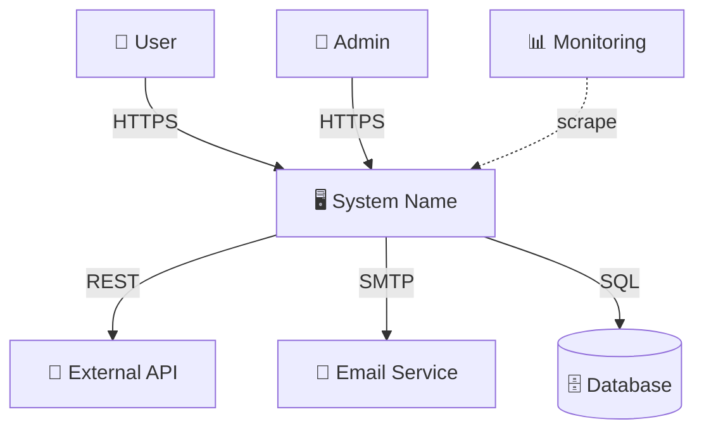
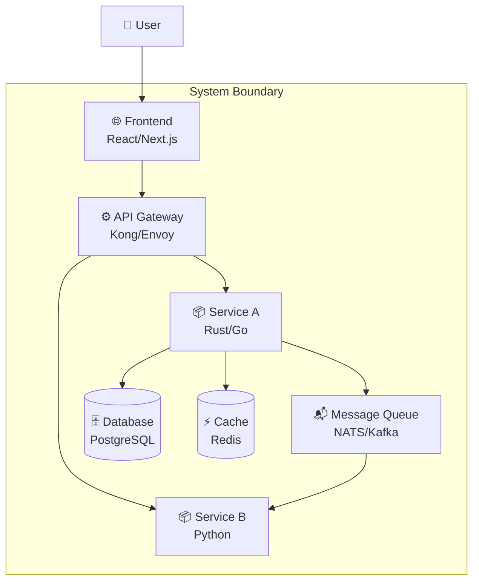
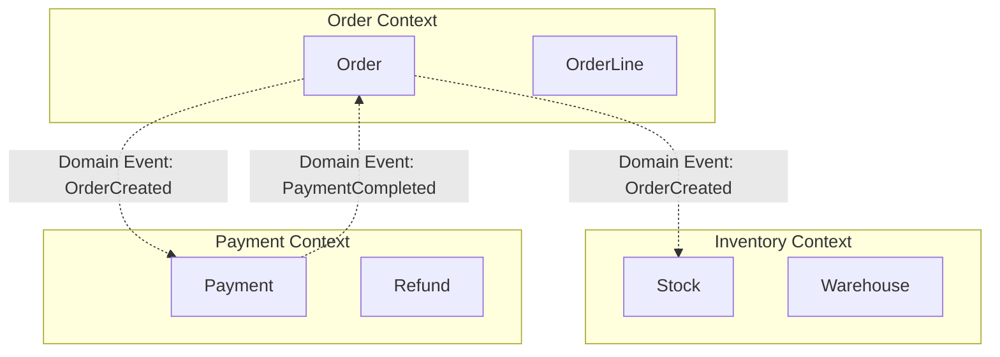
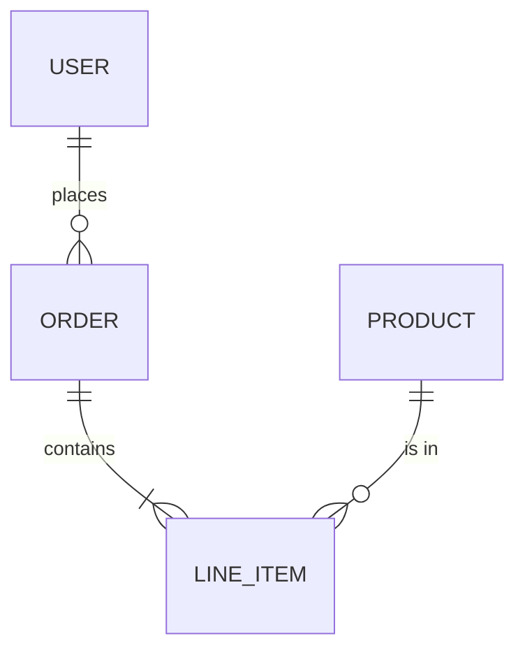
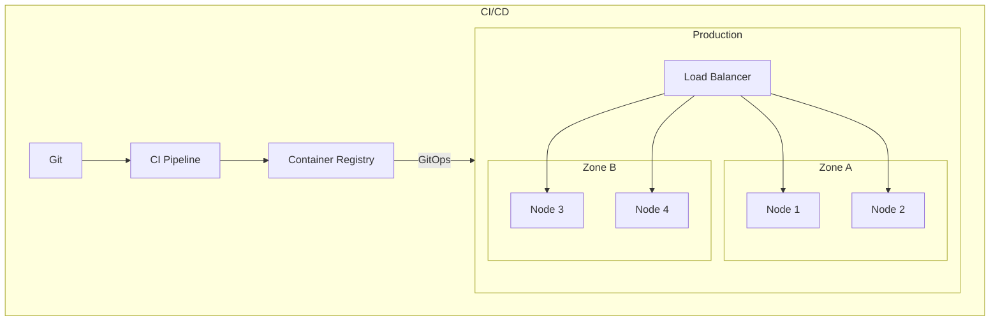

# HLD Section Templates

> **When to read:** During Step 5 of the workflow — when writing the HLD. Only include sections selected by the mitosis matrix in Step 3.

---

### Section 1 — Executive Summary

2-3 paragraphs max. Cover:
- What problem does this system solve?
- What is the proposed approach?
- What are the key tradeoffs?

**Write this LAST**, after completing all other sections.

### Section 2 — Goals and Non-Goals

**Source:** Google Design Docs tradition

```markdown
**Goals:**
- G1: [Specific, measurable goal]
- G2: ...

**Non-Goals (explicitly out of scope):**
- NG1: [What this design intentionally does NOT address, and why]
- NG2: ...
```

Non-goals prevent scope creep. Every "non-goal" should be something that *could reasonably be a goal* but is explicitly excluded.

### Section 3 — Stakeholders & Constraints

**Source:** arc42 §1-2, French DAT model

**Stakeholders:**

| Stakeholder | Role | Key Concern |
|-------------|------|-------------|
| End users | Use the product | Latency, UX |
| Ops team | Run the system | Observability, deployment ease |
| Security team | Audit compliance | ANSSI/RGPD conformity |
| Product owner | Define features | Time-to-market |

**Constraints:**

| Type | Constraint | Impact |
|------|-----------|--------|
| Technical | Must run on Kubernetes 1.28+ | Limits deployment options |
| Regulatory | RGPD / data sovereignty | Data must stay in EU |
| Organizational | Team of 4 devs | Limits complexity |
| Budget | AWS budget < $5K/month | Limits scaling options |

### Section 4 — System Context (C4 Level 1)

**Source:** Simon Brown, C4 Model



Describe:
- Who uses the system (actors)
- What external systems it integrates with
- What the system boundary is (in scope vs out)
- Communication protocols on every arrow

### Section 5 — Solution Strategy

**Source:** arc42 §4

High-level approach in 3-5 bullet points:
- Architecture style choice (monolith, modular monolith, microservices, serverless) with rationale
- Key technology decisions (language, framework, database type)
- Fundamental patterns (event-driven, CQRS, request-response, batch)
- Integration strategy (sync REST, async messaging, hybrid)

This section is the "elevator pitch" of the architecture.

### Section 6 — Container Architecture (C4 Level 2)

**Source:** Simon Brown, C4 Model



For each container:

| Container | Technology | Responsibility | Scaling Strategy |
|-----------|-----------|---------------|-----------------|
| API Gateway | Kong | Routing, rate limiting, auth | Horizontal, stateless |
| Service A | Rust | Core business logic | Horizontal behind LB |
| Database | PostgreSQL | Persistent storage | Primary-replica |
| Cache | Redis | Hot data, sessions | Redis Cluster |

**Label every arrow** with protocol (HTTPS, gRPC, AMQP, SQL) and data format (JSON, Protobuf).

### Section 7 — Capacity Estimations

Present results from Step 4:

| Metric | Value | Formula / Assumption |
|--------|-------|---------------------|
| DAU | X | Given/estimated |
| Avg QPS | X | DAU × req/user/day ÷ 86400 |
| Peak QPS | X | Avg QPS × 3 |
| Storage/year | X TB | objects/day × avg size × 365 |
| Bandwidth | X Gbps | Peak QPS × avg response size |
| Cache size | X GB | 20% × total hot data |
| Min servers | X | Peak QPS ÷ QPS/server × 1.3 |

**Scaling decision points:**

| Load Level | Strategy |
|-----------|----------|
| < 1K QPS | Single server, vertical scaling |
| 1K-10K QPS | Read replicas, caching |
| 10K-100K QPS | Horizontal scaling, sharding, CDN |
| 100K+ QPS | Microservices, multi-region, event-driven |

### Section 8 — Domain Boundaries (Strategic DDD)

**Source:** Eric Evans (DDD), Vaughn Vernon, context mapping

> This section is optional for simple systems. It becomes essential for multi-team / multi-service systems.

**Bounded contexts:**

Identify the major domain boundaries in the system:



**Context map (relationships between bounded contexts):**

| Upstream | Downstream | Relationship | Integration |
|----------|-----------|-------------|-------------|
| Order | Inventory | Customer-Supplier | Domain events via MQ |
| Payment (external) | Order | Conformist | REST API, adapt to their model |
| Order | Notification | Published Language | Domain events |

**Relationship types:** Shared Kernel, Customer-Supplier, Conformist, Anti-Corruption Layer, Open Host Service, Published Language, Separate Ways.

Each bounded context typically maps to one container in the C4 L2 diagram. If two contexts are in the same container, document why (e.g., too small to justify a separate service).

> **Note:** Tactical DDD (aggregates, entities, value objects, invariants) belongs in the LLD for each component.

### Section 9 — Data Architecture

Cover:
- **Data model** (high-level ER diagram — entities and relationships only, no column detail)
- **Storage strategy**: which data in SQL vs NoSQL vs object store vs cache, with rationale
- **Data flow**: write path and read path through the system
- **Partitioning/sharding** strategy (if needed based on capacity estimation)
- **Retention and lifecycle**: how long is data kept, archival strategy
- **Backup and recovery**: RPO/RTO targets



### Section 10 — API Design (High-Level)

List the main API surfaces (not full specs — that's LLD territory):

| Endpoint | Method | Purpose | Auth |
|----------|--------|---------|------|
| /api/v1/users | GET | List users | JWT |
| /api/v1/orders | POST | Create order | JWT |
| /api/v1/health | GET | Health check | None |

Specify:
- Versioning strategy (URL path `/v1/`, header, or content negotiation)
- Rate limiting policy (global, per-user, per-tenant)
- Pagination convention (cursor-based recommended)
- Error format convention (RFC 7807 problem details recommended)

### Section 11 — Security Architecture & Trust Boundaries

**Source:** ANSSI, OWASP, ISO 27001, Microsoft STRIDE (system level)

**Security policies:**

| Aspect | Approach |
|--------|----------|
| Authentication | JWT via OIDC provider / mTLS between services |
| Authorization | RBAC/ABAC with policy engine (OPA, Cedar) |
| Encryption at rest | AES-256 via provider KMS |
| Encryption in transit | TLS 1.3, mTLS for service-to-service |
| Network security | Zero-trust, network policies, no public endpoints |
| Secrets management | Vault/OpenBao, automatic rotation |
| Supply chain | Image signing, SBOM, vulnerability scanning |
| Compliance | [ANSSI / RGPD / PCI-DSS / relevant standard] |

**Trust boundaries (STRIDE at system level):**

Identify trust boundaries on the C4 L2 container diagram:

```
Internet ──[TLS]──► API Gateway ──[mTLS]──► Internal Services ──[TLS]──► Database
   ▲                    ▲                         ▲
   │                    │                         │
 Untrusted          DMZ / edge               Trusted zone
```

| Boundary | STRIDE threats at this level | Mitigation |
|----------|----------------------------|-----------|
| Internet → API Gateway | Spoofing (forged identity), DoS | JWT validation, rate limiting, WAF |
| API Gateway → Services | Tampering (modified requests), Elevation | mTLS, input validation, RBAC |
| Services → Database | Info Disclosure, Tampering | Encryption at rest, network isolation, least-privilege DB users |
| Services → External APIs | Info Disclosure (credential leak) | Secrets in vault, no keys in logs/errors |

> **Note:** Component-level STRIDE (SQL injection in repository, IDOR in controller) belongs in the LLD. HLD covers system-level trust boundaries only.

### Section 12 — Deployment Architecture



Cover:
- **Infrastructure**: bare metal, VMs, K8s, cloud provider
- **IaC/GitOps**: Terraform, ArgoCD, FluxCD
- **CI/CD pipeline**: stages, quality gates, rollback strategy
- **Environments**: dev → staging → prod, environment parity
- **Scaling**: horizontal/vertical, autoscaling triggers

### Section 13 — Observability & SLOs

**The three pillars:**
- **Metrics**: what's collected, where (Prometheus, VictoriaMetrics), key dashboards
- **Logs**: centralized (Loki, ELK), structured format, retention
- **Traces**: distributed tracing (Jaeger, Tempo), critical paths instrumented

**SLIs and SLOs:**

| SLI | SLO | Error Budget |
|-----|-----|-------------|
| Request latency p99 | < 500ms | 0.1% can exceed |
| Availability | 99.9% | 8.76h downtime/year |
| Error rate | < 0.1% | — |

### Section 14 — Failure Modes and Mitigation

| Failure Mode | Impact | Probability | Mitigation | Detection |
|-------------|--------|-------------|-----------|-----------|
| DB primary down | Write unavailable | Low | Auto-failover to replica | Health check + alert |
| Cache failure | Increased latency | Medium | Fallback to DB, circuit breaker | Latency spike alert |
| Network partition | Partial outage | Low | Multi-AZ, retry with backoff | Connectivity monitoring |
| Provider API down | Feature degraded | Medium | Circuit breaker + fallback | Error rate alert |

### Section 15 — Architecture Decision Records (ADRs)

**Source:** MADR (Markdown Any Decision Record), Michael Nygard

For each major decision:

```markdown
### ADR-NNN: [Title]

**Status:** Proposed | Accepted | Deprecated | Superseded by ADR-XXX

**Context:**
What is the problem or situation that requires a decision?

**Decision Drivers:**
- [driver 1]
- [driver 2]

**Considered Options:**

| Option | Pros | Cons |
|--------|------|------|
| Option A (chosen) | ... | ... |
| Option B | ... | ... |
| Option C | ... | ... |

**Decision:** [Chosen option and why]

**Consequences:**
- Good: ...
- Bad: ...
- Risks: ...

**Quality Attributes Affected:** Performance | Security | Scalability | Maintainability | Cost
```

**Typical ADRs in an HLD:**
- ADR-001: Architecture style (monolith vs microservices vs modular monolith)
- ADR-002: Primary database engine
- ADR-003: Communication pattern (sync REST vs async messaging)
- ADR-004: Deployment platform
- ADR-005: Authentication mechanism

### Section 16 — Tradeoff Analysis

**Source:** ATAM (Architecture Tradeoff Analysis Method), Bass/Clements/Kazman (CMU/SEI TR-2000-004), *Software Architecture in Practice* (3rd ed.).

ATAM is a 5-phase method that produces a structured list of risks, sensitivity points, and tradeoffs from a set of stakeholder-elicited scenarios. The HLD uses ATAM *in miniature*: the author plays stakeholder-and-evaluator in one head, but still walks the 5 phases so the output has the same shape (and survives external review).

> **When to run the full 5 phases:** tier L or XL, or any HLD contested between teams. Tier S/M skip to Phase 4 and fill a light utility tree + tradeoff table only.

#### Phase 1 — Scenario elicitation

Write 6-12 scenarios across the project's quality attributes. A scenario has a fixed 6-part shape (SEI template):

| Part | Example |
|---|---|
| **Source of stimulus** | A user of the web app |
| **Stimulus** | Submits a search query |
| **Environment** | Normal load, 10k concurrent users |
| **Artifact** | The search service |
| **Response** | Returns top 20 results |
| **Response measure** | p95 latency < 200 ms, p99 < 500 ms |

Collect scenarios from **at least 4 of these buckets** so no class of concern is skipped:

| Bucket | Typical scenario seed |
|---|---|
| Performance | "Under peak load, X returns within Y ms" |
| Availability | "When Z fails, the system degrades to ... within T seconds" |
| Security | "An attacker with capability X cannot achieve Y" |
| Scalability | "When load multiplies by N, the system ..." |
| Modifiability | "A new feature of type X can be added in ≤ N files" |
| Testability | "A regression in X can be caught by a test running in < T seconds" |
| Usability | "A novice user completes task X in ≤ T seconds / N clicks" |
| Deployability | "A rollback to version N-1 completes in < T minutes" |

#### Phase 2 — Scenario prioritization

Score each scenario on two axes — the `[B, T]` pair used in the utility tree.

| Axis | H | M | L |
|---|---|---|---|
| **B — Business importance** | Contract breaker, revenue impact | Customer notices, reputation impact | Nice to have, internal only |
| **T — Technical difficulty** | Unsolved in the proposed architecture | Needs explicit effort to achieve | Achieved by default / cheap |

Only `[H, H]` and `[H, M]` scenarios go forward into Phase 3. The rest stay in the utility tree for traceability but are not analyzed deeply — they are not load-bearing on the architecture.

**Quality Attribute Utility Tree** (Phase 1 + Phase 2 output):

```
Utility
├── Performance
│   ├── [H,H] API response < 200ms p95 under normal load
│   └── [M,H] Batch processing < 1h for 1M records
├── Availability
│   ├── [H,H] 99.9% uptime
│   └── [M,M] Graceful degradation under partial failure
├── Security
│   ├── [H,H] No credential leakage in responses/logs
│   └── [H,M] All data encrypted at rest
└── Scalability
    ├── [M,H] Handle 10x current load within 15min
    └── [L,M] Multi-region deployment ready
```

Format: `[Business importance, Technical difficulty]` — H/M/L

#### Phase 3 — Architectural approach analysis (per selected scenario)

For each `[H,H]` or `[H,M]` scenario, answer four questions. This is where the work actually happens — the earlier phases just told you which scenarios are worth the walk.

**Per-scenario analysis table:**

| # | Scenario | Approach / Tactic | Sensitivity point | Tradeoff point | Risk | Non-risk |
|---|----------|-------------------|--------------------|-----------------|------|----------|
| 1 | API p95 < 200ms | Read-through cache + connection pool + circuit breaker | Cache TTL: too short → DB thrashing; too long → stale reads | Cache size vs freshness | **R1** — cold-start penalty > 1s when cache is empty | **NR1** — warm-path is bounded by pool size, sized for peak |
| 2 | 99.9% uptime | Active-passive failover, health checks every 5s | Health check interval ↔ failover latency | Faster failover = more false positives from network blips | **R2** — split-brain if network partition > health check interval | **NR2** — control plane uses external arbiter |

**The four questions:**

1. **Which tactic / approach addresses it?** Name the mechanism: cache, retry, leader election, partition, etc.
2. **What is the sensitivity point?** A decision or parameter whose value strongly affects this scenario's response measure. Tag it — you will revisit it when tuning.
3. **Is there a tradeoff point?** A decision that affects *this* scenario in one direction but another scenario in the opposite direction. This is ATAM's core output — make these explicit so they don't turn into surprises.
4. **Risks vs non-risks?** Document both. A non-risk (NR) is a worry you investigated and *ruled out*; writing it down prevents someone from re-raising it in a later review.

#### Phase 4 — Risk themes and tradeoff synthesis

Cluster the risks and tradeoffs from Phase 3 into **themes** — architectural decisions that recur across scenarios.

**Example risk themes:**

- **Theme: cold-start behaviour** (R1). The system performs well under steady state but degrades at startup and after cache flushes. Mitigation: warm-up task on deployment, graceful degradation for the first 60 s.
- **Theme: split-brain under partition** (R2). Any decision that improves failover latency makes this worse. Mitigation: accept slower failover, use external arbiter.

**Tradeoff points** (decisions that hit multiple attributes in opposite directions) — promote these to first-class:

| # | Tradeoff | Attributes traded | Current decision | Rationale |
|---|----------|-------------------|------------------|-----------|
| 1 | Microservices vs modular monolith | Scalability ↑ vs Operational simplicity ↓ | Modular monolith for v1 | Team size 6, not enough ops headcount for N services |
| 2 | Strong consistency vs availability under partition | Correctness ↑ vs Availability ↓ | Strong consistency | Legal requirement on financial records |

**Sensitivity points** (one decision affects one attribute) — list them so tuning is explicit:

- Cache TTL affects p95 latency
- Connection pool size affects concurrent request capacity
- Health check interval affects failover latency

#### Phase 5 — Presentation and decision matrix

For decisions contested between options, use a weighted matrix. The weights come from the `B` column of the utility tree — a scenario with `B=H` has weight 5, `B=M` weight 3, `B=L` weight 1.

**Weighted decision matrix:**

| Criterion (from utility tree) | Weight | Option A | Score | Option B | Score |
|-----------|--------|----------|-------|----------|-------|
| API p95 < 200ms | 5 | Good (4) | 20 | Excellent (5) | 25 |
| 99.9% uptime | 5 | Good (4) | 20 | Average (3) | 15 |
| Operational cost | 3 | Low (5) | 15 | High (2) | 6 |
| Team familiarity | 3 | High (5) | 15 | Low (2) | 6 |
| **Total** | | | **70** | | **52** |

**Rules for the matrix:**

- **Never hide a low score** — if Option B is worse on a criterion, write the low score. The point is to show the tradeoff, not to advocate one option.
- **Include the decisive criterion in the ADR** — the row that made the difference goes into ADR §Consequences so a future reader knows why the contest was settled.
- **If the totals are within 10% of each other**, the matrix is not telling you anything. Pick on strategic grounds and note that explicitly — don't pretend the matrix decided.

#### Light version for tier S/M

Tier S and M HLDs compress Phases 1-5 into a single short section:

- **2-4 scenarios** instead of 6-12, skip the `[M, ·]` and `[L, ·]` tiers.
- **No separate sensitivity / non-risk columns** — just Approach + Risk.
- **Tradeoff table** is still mandatory — even a tier-S system has two or three cross-cutting decisions and naming them is cheap.

### Section 17 — Risks and Open Questions

| # | Risk/Question | Owner | Deadline | Status | Mitigation |
|---|--------------|-------|----------|--------|-----------|
| R1 | Data migration from legacy | @architect | Sprint 3 | Open | Dual-write phase |
| R2 | Performance under load not validated | @lead | Before Gate | Open | Load test in staging |
| Q1 | Which OIDC provider? | @security | Week 2 | Open | — |

### Section 18 — Glossary

**Source:** DDD ubiquitous language, arc42 §12

| Term | Definition |
|------|-----------|
| [Domain term] | [What it means in this system's context] |
