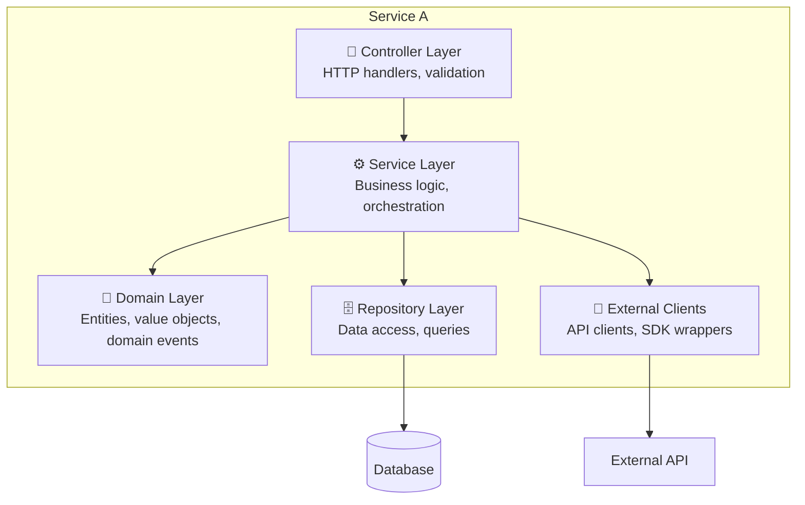
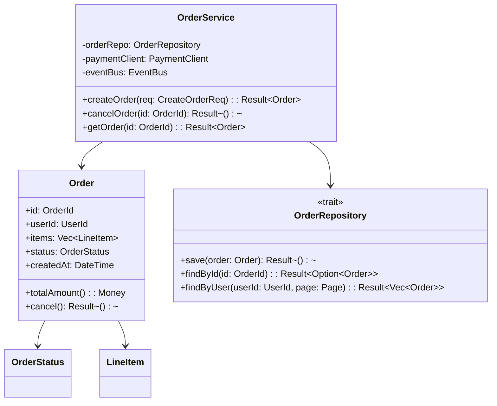
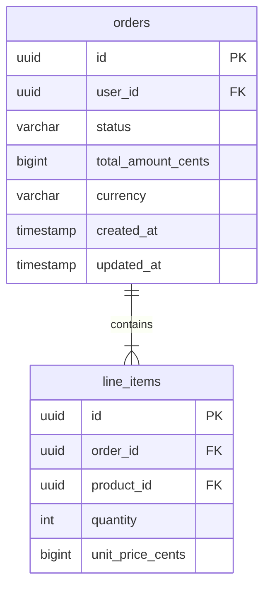
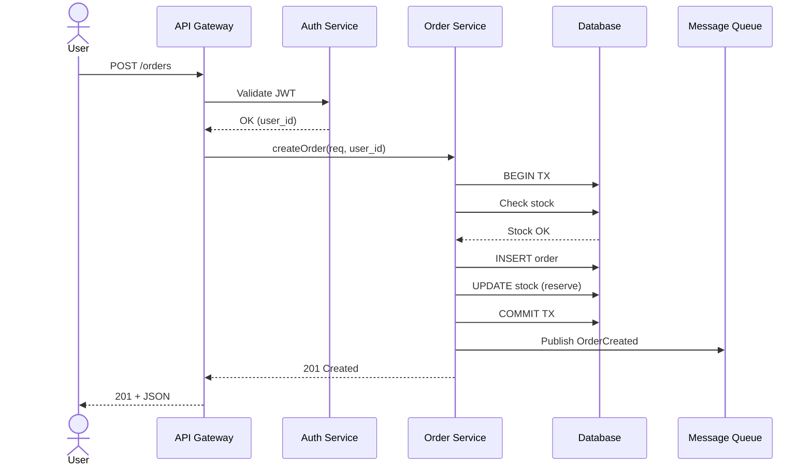
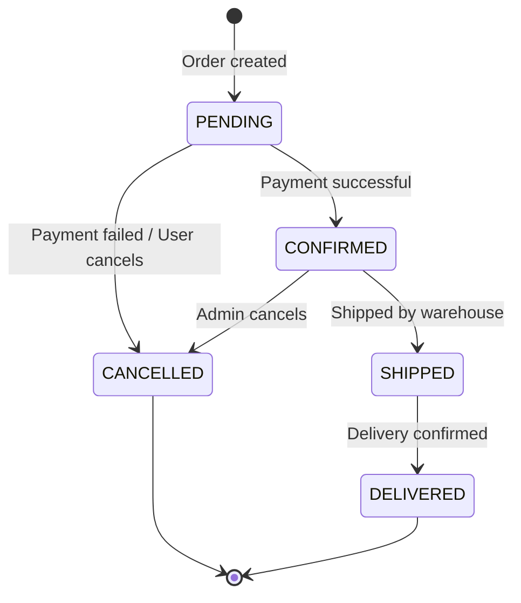

# LLD Section Templates

> **When to read:** Load this file when writing LLD sections (Step 5 of the workflow). Contains full templates with Mermaid examples for all 16 sections.

---

### Section 1 — Overview & HLD Anchor

- Reference the parent HLD document (if exists)
- Identify which HLD container(s) this LLD covers
- List the specific functional requirements this component implements
- Specify the architectural style of this component (hexagonal, clean, layered, etc.)

```markdown
**Parent HLD:** `docs/hld-system-name.md`
**Container(s):** Service A (from C4 L2)
**Architecture:** Hexagonal (ports & adapters)
**Requirements covered:** FR-001, FR-003, FR-007
```

### Section 2 — Component Architecture (C4 Level 3)

**Source:** Simon Brown, C4 Model

Break the container into its internal components:



For each component:

| Component | Responsibility | Dependencies | Interface |
|-----------|---------------|-------------|-----------|
| Controller | HTTP routing, input validation, response mapping | Service | REST endpoints |
| Service | Business rules, orchestration, transactions | Repository, Client, Domain | Internal trait/interface |
| Domain | Entities, value objects, domain events | None (pure) | Types and methods |
| Repository | CRUD, queries, data mapping | Database driver | Repository trait/interface |
| Client | External API calls, retries, circuit breaker | HTTP client | Client trait/interface |

**Dependency direction rule:** Dependencies flow inward (Controller → Service → Domain). Domain depends on nothing. This is the Dependency Inversion Principle made visible.

### Section 3 — Tactical Domain Model

**Source:** Eric Evans (DDD tactical patterns), Vaughn Vernon (IDDD)

> **Scope:** This is tactical DDD — aggregates, entities, value objects, invariants within this component. Strategic DDD (bounded contexts, context maps) belongs in the HLD.

Identify and classify domain types:

| Type | Classification | Equality | Immutable? |
|------|---------------|----------|-----------|
| `UserId` | Value Object | By value | Yes |
| `Order` | Entity / Aggregate Root | By ID | No (has lifecycle) |
| `Money` | Value Object | By value | Yes |
| `OrderStatus` | Enum / Value Object | By variant | Yes |
| `OrderCreated` | Domain Event | — | Yes |

**Aggregates and invariants:**
- Define aggregate boundaries (transaction scope)
- List invariants each aggregate protects
- Define domain events emitted on state transitions

### Section 4 — Class/Module Design

**Source:** GoF, SOLID, Martin Fowler (PEAA)

Use Mermaid class diagrams:



**Design patterns to document when used:**

| Pattern | When to document | Example signal |
|---------|-----------------|---------------|
| Repository | Data access abstraction | Different DB in test vs prod |
| Strategy | Swappable algorithms | Pricing, routing, notification channel |
| Factory / Builder | Complex object creation | >5 fields, validation on construction |
| Observer / Event | Decoupled side effects | Post-action notifications, audit |
| Circuit Breaker | External dependency resilience | Unstable third-party API |
| Decorator | Layered cross-cutting concerns | Logging, metrics, caching wrappers |
| State | Entity lifecycle | Order, session, connection states |

**SOLID visibility in the class diagram:**
- **SRP**: Each class has one reason to change (check responsibility column)
- **OCP**: Extension points visible as traits/interfaces
- **LSP**: Inheritance hierarchies validated (prefer composition)
- **ISP**: Traits are client-specific, not monolithic
- **DIP**: Concrete classes depend on abstractions, not vice versa

### Section 5 — API Contracts

**Source:** OpenAPI, RFC 7807, Contract-first design

For each endpoint, provide full detail:

```markdown
### POST /api/v1/orders

**Purpose:** Create a new order
**Authentication:** Bearer JWT (role: user)
**Rate limit:** 10 req/min per user
**Idempotency:** Support `Idempotency-Key` header

**Request:**
```json
{
  "items": [
    {
      "product_id": "string (UUID)",
      "quantity": "integer (min: 1, max: 100)"
    }
  ],
  "shipping_address_id": "string (UUID)"
}
```

**Response 201:**
```json
{
  "id": "string (UUID)",
  "status": "PENDING",
  "total_amount": { "value": 4999, "currency": "EUR" },
  "created_at": "2025-01-15T10:30:00Z"
}
```

**Error responses (RFC 7807):**

| Code | Condition | Error Type |
|------|-----------|-----------|
| 400 | Invalid input | `INVALID_INPUT` |
| 401 | Missing/invalid token | `UNAUTHORIZED` |
| 404 | Resource not found | `NOT_FOUND` |
| 409 | Conflict (insufficient stock) | `CONFLICT` |
| 429 | Rate limited | `RATE_LIMITED` (include `Retry-After`) |
| 500 | Internal error | `INTERNAL_ERROR` (include `trace_id`) |
```

**Conventions to specify:**
- Pagination: cursor-based (`?cursor=X&limit=20`)
- Versioning: URL path (`/v1/`)
- Naming: `snake_case` for JSON fields
- Date format: ISO 8601 with timezone
- Money: integer cents + currency code (never float)

### Section 6 — Database Schema



For each table:

| Column | Type | Constraints | Index | Notes |
|--------|------|------------|-------|-------|
| id | UUID | PK, NOT NULL | btree (PK) | Generated by app |
| user_id | UUID | FK → users.id, NOT NULL | btree | Frequent query filter |
| status | VARCHAR(20) | NOT NULL, CHECK IN (...) | btree | State machine values |
| created_at | TIMESTAMPTZ | NOT NULL, DEFAULT now() | btree | Cursor pagination |

**Index strategy with rationale:**

```sql
-- Lookup by user + status (most common query)
CREATE INDEX idx_orders_user_status ON orders(user_id, status);

-- Cursor pagination
CREATE INDEX idx_orders_created ON orders(created_at DESC);

-- Admin: active orders only (partial index)
CREATE INDEX idx_orders_active ON orders(status)
  WHERE status IN ('PENDING', 'CONFIRMED');
```

**Normalization:**
- Target: 3NF unless documented exception
- Denormalization allowed only with ADR justifying the performance tradeoff

**Migration strategy:**
- Versioned migrations (Flyway, sqlx-migrate, golang-migrate)
- Backward-compatible changes only (additive columns, new tables)
- Breaking changes: multi-phase (add new → backfill → switch → drop old)

### Section 7 — Sequence Diagrams

For each critical flow:



**Provide sequence diagrams for:**
- Happy path (main flow)
- Key error paths (payment failure, timeout, conflict)
- Async flows (background jobs, event processing)
- Authentication/authorization flow

### Section 8 — State Machines

For entities with lifecycle states:



**Transition table:**

| From | To | Trigger | Guard | Side Effects |
|------|----|---------|-------|-------------|
| PENDING | CONFIRMED | PaymentCompleted event | Amount matches | Send confirmation email |
| PENDING | CANCELLED | PaymentFailed event | — | Release stock, refund |
| CONFIRMED | SHIPPED | Warehouse scan | Tracking number present | Send tracking email |

**Guards** are preconditions that must be true for the transition to happen.

### Section 9 — Error Handling & Resilience

**Source:** Resilience4j patterns, Michael Nygard (Release It!)

**Error taxonomy:**

| Category | Examples | Strategy |
|----------|----------|----------|
| Transient | Network timeout, 503 | Retry with exponential backoff (100ms base, 10s max, ±50% jitter) |
| Client error | 400, 404, 422 | Return immediately, no retry |
| Dependency down | External API unavailable | Circuit breaker (5 failures/30s → open, 60s recovery) |
| Data inconsistency | Partial write | Saga with compensating transactions |
| Rate limited | 429 | Respect `Retry-After`, queue and replay |

**Circuit breaker config:**

```
failure_threshold: 5
success_threshold: 3 (half-open probes)
timeout: 30s
half_open_max_calls: 3
```

**Retry policy:**

```
max_retries: 3
initial_interval: 100ms
multiplier: 2
max_interval: 10s
jitter: 0.5
retryable_codes: [408, 429, 500, 502, 503, 504]
```

**Dead letter queue:** Messages failing N times → DLQ for manual inspection. Alert on depth > 0.

**Error response format** (consistent across all endpoints):

```json
{
  "type": "https://api.example.com/errors/insufficient-stock",
  "title": "Insufficient Stock",
  "status": 409,
  "detail": "Product X has 2 items in stock, 5 requested",
  "instance": "/orders/abc123",
  "trace_id": "tr-xyz789"
}
```

### Section 10 — Concurrency Design

**Document when the component has:**
- Multiple threads/tasks accessing shared state
- Producer-consumer patterns
- Read-write locks
- Async task orchestration

| Shared Resource | Access Pattern | Mechanism | Rationale |
|----------------|---------------|-----------|-----------|
| In-memory cache | Many readers, rare writer | RwLock | High read concurrency |
| Request counter | Atomic increment | AtomicU64 | Lock-free, hot path |
| DB connection pool | Bounded checkout | Semaphore (pool size) | Prevent exhaustion |
| Background task queue | MPSC | Channel (tokio::mpsc) | Backpressure via bounded channel |

**Race condition mitigations:**
- Optimistic locking for DB updates (version column)
- Idempotency keys for API mutations
- Saga pattern for distributed transactions

### Section 11 — Caching Strategy

| Data | Cache | TTL | Invalidation | Justification |
|------|-------|-----|-------------|---------------|
| User profile | Redis | 15min | Write-through on update | High read:write ratio |
| Product catalog | Redis | 5min | TTL expiry | Eventual consistency OK |
| Session | Redis | 30min (sliding) | On logout | Must be fast |
| Static assets | CDN | 1 year | Cache-bust via content hash | Immutable |

**Cache patterns:**
- **Cache-aside** (default): app checks cache → miss → read DB → populate cache
- **Write-through**: for data that must always be fresh
- **Write-behind**: for high-write, eventual-consistency-OK scenarios

### Section 12 — Component-Level Security (STRIDE)

**Source:** OWASP, Microsoft STRIDE (Adam Shostack — *Threat Modeling: Designing for Security*), DREAD risk scoring.

> **Scope:** STRIDE at the component/code level — SQL injection in repositories, IDOR in controllers, input validation. System-level trust boundaries (network zones, mTLS, encryption at rest) belong in the HLD.

#### Step 1 — Per-category threat elicitation (the 6 STRIDE properties)

For **every component** in the class/module diagram, walk the 6 STRIDE categories and ask the elicitation question. Do NOT skip a category because "it doesn't apply" — write "N/A — reason" explicitly. A category without a written reason is an oversight.

| Code | Threat category | Violated property | Elicitation question | Typical component-level threats |
|------|-----------------|-------------------|----------------------|---------------------------------|
| **S** | **Spoofing** | Authenticity | "Can an attacker impersonate a legitimate actor calling this component?" | Forged JWT, session fixation, replay, weak auth, `alg: none`, public keys served by same origin |
| **T** | **Tampering** | Integrity | "Can an attacker modify data in flight or at rest that this component trusts?" | SQL injection, path traversal, deserialization, unsigned config, checksum bypass, mutation of immutable fields |
| **R** | **Repudiation** | Non-repudiation | "Can an actor deny performing an action this component handles?" | Missing audit log, mutable log file, shared service account, no user id in log line, clock drift |
| **I** | **Information Disclosure** | Confidentiality | "Can an attacker read data they shouldn't through this component?" | Excessive error details, debug endpoints in prod, PII in logs, side-channel (timing, error-message), IDOR, verbose 500 |
| **D** | **Denial of Service** | Availability | "Can an attacker exhaust a resource this component depends on?" | Missing rate limit, unbounded regex (ReDoS), unbounded allocation, recursive payload, zip bomb, connection pool exhaustion |
| **E** | **Elevation of Privilege** | Authorization | "Can an attacker gain privileges this component was not supposed to grant?" | Missing authz check, role confusion, TOCTOU, direct DB access, SSRF reaching internal services, insecure direct object reference |

#### Step 2 — Per-component threat table

For each component × each STRIDE category that applies, write one row. Empty rows allowed when `N/A` has a reason.

| # | Component | STRIDE | Threat | Attack scenario | Mitigation | DREAD |
|---|-----------|--------|--------|-----------------|------------|-------|
| 1 | Auth middleware | S | Forged JWT | Attacker crafts token with `alg: none` and omits signature | Reject `alg: none` outright, pin JWKS URL, verify `iss`/`aud` claims | 8.4 |
| 2 | Order repository | T | SQL injection | Unsanitized `order_id` parameter from controller | Parameterized queries only, reject non-UUID input at boundary | 9.0 |
| 3 | Audit logger | R | Log tampering | Attacker with FS access edits `audit.log` to cover tracks | Append-only log, off-box shipping, HMAC per line | 6.2 |
| 4 | Error handler | I | Stack trace leak | 500 responses return Rust panic with file paths and DB URL | Custom formatter strips internals in prod, keep details in structured logs only | 7.6 |
| 5 | Search endpoint | D | ReDoS | User-supplied regex executed with catastrophic backtracking | Use RE2 (no backtracking) or pre-validate regex complexity | 5.8 |
| 6 | File download | E | Path traversal → SSRF | `filename=../../etc/passwd` resolved inside downloader | Canonicalize path, reject `..`, allow-list roots, network egress policy | 8.8 |

#### Step 3 — DREAD risk scoring

For each threat in the table, compute a DREAD score so the team can triage. Use the 1-10 scale (Microsoft DREAD, as reframed by Shostack):

```
DREAD = (Damage + Reproducibility + Exploitability + Affected users + Discoverability) / 5
```

| Letter | Meaning | 1 | 5 | 10 |
|---|---|---|---|---|
| **D** — Damage | Impact if the attack succeeds | Nothing sensitive | One user's data | Root / full data breach |
| **R** — Reproducibility | How reliably the attack works | Only under rare race condition | Works most of the time | Works every time |
| **E** — Exploitability | Effort and skill required | Novel research attack | Skilled attacker + tooling | Script kiddie, single curl |
| **A** — Affected users | Blast radius | One user | A tenant / team | Every user |
| **D** — Discoverability | How easy to find | Source access required | Published OWASP pattern | Visible in Burp at page load |

**Severity bands** (apply to the final DREAD average):

| DREAD score | Severity | Action before shipping |
|---|---|---|
| ≥ 8.0 | **Critical** | Must fix before merge. Block the gate. |
| 6.0 – 7.9 | **High** | Fix before release. Open a ticket with sprint deadline. |
| 4.0 – 5.9 | **Medium** | Fix next sprint. Add a mitigation comment in code. |
| < 4.0 | **Low** | Document in the LLD, accept with owner's sign-off. |

#### Step 4 — Input validation rules (boundary contract)

These are the universal defences that apply independently of the STRIDE walk. Every boundary-facing component MUST implement them:

- **Validate at the boundary, trust internally** — canonicalize → parse into a domain type at controller ingress. Nothing downstream accepts a `String` where it could be a `UserId`.
- **Max body size enforced** (e.g., 10 MB) — rejected before deserialization, not after.
- **Regex engine without backtracking** (RE2 / re2j / Hyperscan) wherever user input reaches a regex.
- **Allow-list over deny-list** for everything that can be enumerated: filenames, commands, column names, hostnames.
- **CRLF injection prevention** in every header setter. Reject `\r` and `\n` in any value headed for an HTTP header.
- **Path traversal prevention** — canonicalize, then check the prefix belongs to the allowed root. Never trust a normalized path from the OS.
- **Deserialization** — reject polymorphic class inputs (`$type` in JSON), pin allowed types.
- **Rate limits** on every mutation and every auth-adjacent read. Per-user, per-IP, per-tenant.

#### Step 5 — Threat-to-test traceability

Every Critical or High DREAD row in §Step 2 MUST have a corresponding negative test in the testability design (§13). Create the traceability table:

| Threat # | Test | Test type | Location |
|---|---|---|---|
| 1 | `rejects_alg_none_jwt` | Unit | `auth/tests/jwt.rs` |
| 2 | `rejects_sql_injection_order_id` | Integration | `orders/tests/repo_injection.rs` |
| 4 | `error_response_does_not_leak_stacktrace_in_release` | Integration | `errors/tests/format.rs` |
| 6 | `rejects_path_traversal_in_filename` | Integration | `files/tests/download.rs` |

The traceability table is the **bridge between §12 (threat) and §13 (testability)** — without it, STRIDE is just a wishlist. If a threat has no test, it isn't mitigated; it is merely *claimed* to be mitigated.

### Section 13 — Testability Design

**Source:** Clean Architecture (DIP), Michael Feathers (Working Effectively with Legacy Code)

**Dependency injection points:**

| Interface | Production Impl | Test Impl | Purpose |
|-----------|----------------|-----------|---------|
| `OrderRepository` | `PostgresOrderRepo` | `InMemoryOrderRepo` | Isolate DB in unit tests |
| `PaymentClient` | `StripeClient` | `MockPaymentClient` | Isolate external API |
| `Clock` | `SystemClock` | `FakeClock` | Deterministic time in tests |
| `EventBus` | `NatsEventBus` | `InMemoryEventBus` | Capture events in tests |

**Test strategy per level:**

| Level | Scope | Tools | What's real | What's mocked |
|-------|-------|-------|------------|--------------|
| Unit | Domain + Service | cargo test | Domain, Service logic | Repository, Client, Clock |
| Integration | Service + DB | Testcontainers | DB (PostgreSQL in Docker) | External APIs |
| Contract | API surface | Schemathesis / Pact | HTTP layer | Service (mock) |
| E2E | Full stack | Hurl / Playwright | Everything | Nothing (or external APIs) |

**Mock boundaries = architecture boundaries.** If you can't easily mock a dependency, your architecture has a coupling problem.

### Section 14 — Configuration & Feature Flags

```yaml
service:
  port: 8080
  read_timeout: 30s
  write_timeout: 30s

database:
  host: ${DB_HOST}
  port: 5432
  max_connections: 20
  idle_timeout: 5m

cache:
  host: ${REDIS_HOST}
  pool_size: 10

feature_flags:
  new_pricing_engine: false
  async_notifications: true
```

**Hierarchy:** env vars > config file > defaults
**Secrets:** always via vault/env, never in config files
**Validation:** fail fast on startup if required config is missing

### Section 15 — Micro-ADRs

**Source:** Michael Nygard, adapted for component-level decisions

For non-obvious implementation decisions:

```markdown
### µADR-01: Use cursor pagination over offset pagination

**Context:** List endpoints need pagination
**Decision:** Cursor-based (created_at + id)
**Reason:** Offset pagination degrades at scale (OFFSET 10000 scans 10000 rows)
**Consequence:** Clients can't jump to arbitrary page numbers
```

Micro-ADRs are lighter than full ADRs. Use when the decision affects this component only.

### Section 16 — Migration Plan

If this LLD modifies an existing system:

| Phase | Action | Rollback | Duration |
|-------|--------|----------|----------|
| 1 | Deploy new schema (additive) | Drop new columns | 1 sprint |
| 2 | Deploy dual-write code | Revert to old code | 1 sprint |
| 3 | Backfill historical data | Re-run from backup | 1-2 days |
| 4 | Switch reads to new schema | Revert read path | 1 sprint |
| 5 | Drop old columns/tables | Restore from backup | After validation |
