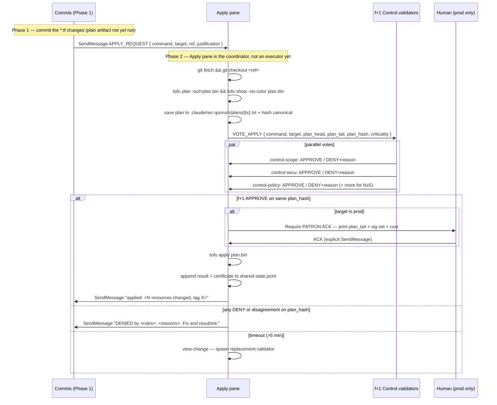

# Apply Quorum in REC-Q — Phase 2 gating of infrastructure mutations

REC-Q's Phase 2 is designed for validating commit artifacts. Infrastructure
mutations (`tofu apply`, `helm upgrade`, `kubectl apply`, `gh release create`,
feature-branch force-push) fit natively as a specialised Phase 2 workflow: the
**plan output** is the artifact, the validators check it, and the apply pane
executes only after 3-of-3 APPROVE.

This replaces / extends Brigade's `apply-quorum.md` (see
`cli-forge-chef/references/apply-quorum.md`) when operating in REC-Q mode.

## Why Phase 2 and not Phase 1

Phase 1 (Execute) is for **producing** artifacts — commis edit `*.tf`, write
manifests, draft Helm values. Running `tofu apply` in Phase 1 would fuse
producer and validator: the committing agent would also be mutating infra, with
no independent check. That is precisely what REC-Q's phase separation forbids
(see `anti-patterns.md#3 reflect-and-execute-fused` and Q5 in `gotchas-quorum.md`).

Phase 2 (Control) is where independent validators re-verify artifacts against
invariants. An apply plan is an artifact. The apply pane is the executor that
acts **after** validation, not during.

## Gated commands (reference list)

| Command | Gated? | Why |
|---|---|---|
| `tofu plan` / `terraform plan` / `tofu validate` | No | Read-only, safe during Phase 1 |
| `helm template` / `helm lint` / `helm diff` | No | Read-only |
| `kubectl diff` / `kubectl get` / `kubectl describe` | No | Read-only |
| `ansible-playbook --check --diff` | No | Dry run, read-only |
| **`tofu apply`** / **`terraform apply`** | **Yes** | Mutates cloud state |
| **`tofu destroy`** / **`terraform destroy`** | **Yes** | Deletes resources |
| **`helm upgrade --install`** / **`helm install`** | **Yes** | Deploys / reconfigures |
| **`helm uninstall`** / **`helm rollback`** | **Yes** | Removes / reverts |
| **`kubectl apply`** (prod or shared cluster) | **Yes** | Cluster-state mutation |
| **`kubectl delete`** | **Yes** | Destroys resources |
| **`ansible-playbook`** (mutating plays) | **Yes** | System-level mutation |
| **`gh release create`** | **Yes** | Public release, hard to unpublish |
| **`git push --force`** / **`--force-with-lease`** on feature branches | **Yes** | History rewrite (maître d'hôtel only, base branches NEVER) |

## Criticality class and quorum size

Apply commands are **always sensitive minimum**. Specific upgrades:

| Target pattern | Criticality | Quorum N |
|---|---|---|
| dev cluster, local k3s/kind | routine | 3 |
| staging | sensitive | 5 |
| prod | critical | 7 |
| any resource tagged `data-stateful: true` (DB, bucket) | critical | 7 |
| CRD install/upgrade (cluster-wide effect) | critical | 7 |

Criticality is determined by matching the target (cluster context, cloud
account, namespace) against the classifier. The criticality classifier from
`quorum-sizing.md` already handles this for code; extend it for infra targets.

## The flow



## Per-validator checklists (extended from chef)

These extend `cli-forge-chef/references/apply-quorum.md` voter checklists with
REC-Q's stricter signing + logging.

### control-scope
- Does the command match a plan entry in the Phase 0 Reflect certificate?
- If the plan was issued for dev/staging, is the command targeting dev/staging?
  (Cross-env drift = DENY)
- If the target (cluster/account/namespace) differs from the plan's declared
  scope → DENY + SUGGESTION: "Re-enter Phase 0 with the new target in the plan".

### control-secu
- New public ingress, open security group, widened IAM policy → DENY.
- Secret materialised in plan output (unredacted) → DENY + SUGGESTION: "Re-plan
  with sensitive-value masking (e.g., `terraform plan -var-file=secrets.tfvars`
  with those vars marked sensitive)".
- Destroy / replace of stateful resource (DB, volume, bucket) without a backup
  reference in the justification → DENY.
- IAM role with `*:*` / `Administrator` → DENY.
- For `git push --force*`: is the target a base branch (main/master/develop)?
  → DENY always, even with `--force-with-lease`.

### control-policy
- OPA / Conftest policies applied against the plan output → must all pass.
- Compliance tags / labels present on every mutated resource.
- Tenant isolation: resources touched stay within one tenant/account.

### control-contracts (if applicable)
- Any resource referenced by an external contract (ArgoCD app, another
  Terraform workspace, a service mesh policy) is preserved.

### control-tests (if applicable)
- The plan passes `tofu validate` and `terraform fmt -check`.
- Helm template output passes `kubeval` / `kubeconform`.
- Ansible playbook passes `ansible-lint`.

## Production safeguard (PATRON ACK)

For targets classified **critical** (prod, stateful resources, CRDs), the
`f+1/f+1` quorum is necessary but **not sufficient**. An additional human ACK
is mandatory. The apply pane:

1. Prints the plan `head` (200 lines) + `tail` (100 lines) + full plan hash.
2. Prints the signer set with timestamps.
3. Prints the estimated cost delta (if the plan-size cost model is wired).
4. Waits for a SendMessage from a human actor containing the exact token
   `PATRON ACK <plan_hash>`.

Without the matching plan_hash, the ACK is rejected (prevents
copy-paste-the-last-ACK attacks).

The ACK is logged in `shared-state.jsonl` with the human's identity
(from Claude's authenticated actor).

## Rollback — Phase 3 (Post-apply recovery)

A REC-Q-specific extension: if Phase 2 approved but the apply fails partway
(partial apply), the apply pane does NOT retry blindly. It:

1. Captures the error + the partial state.
2. Appends a `phase_2_rollback` entry to `shared-state.jsonl`.
3. SendMessages the requesting commis with the failure + partial-state summary.
4. Escalates to human ONLY if the error suggests an inconsistent cloud state
   (e.g., `Error: resource X was created but not registered in state`).

`tofu state` surgery (import/rm) is **always** human. No agent should run
`tofu state rm` or `tofu import` without explicit ACK — it's more dangerous
than the apply itself.

## Audit artefacts

Per apply, the apply pane produces under `{project}/.claude/rec-quorum/apply/`:

```
{timestamp}-request.json       # the APPLY_REQUEST
{timestamp}-plan.txt            # full plan output
{timestamp}-plan_hash.txt       # canonical hash of the plan
{timestamp}-votes.jsonl         # one signed vote per validator
{timestamp}-certificate.json    # if f+1 APPROVE: the Phase 2 certificate
{timestamp}-result.txt          # stdout/stderr of the executed command
{timestamp}-meta.json           # { command, target, ref, duration, resources_changed }
```

All files are signed (Ed25519) and referenced in `shared-state.jsonl`. The
set is what auditors read post-sprint.

## When apply-quorum is SKIPPED

- Dry runs — `tofu plan`, `helm diff`, `kubectl diff`, `ansible-playbook --check`.
  These never mutate, no vote needed. Phase 1 commis run them freely.
- Local dev loops targeting kind/k3d/Minikube — the apply pane's prompt checks
  `kubectl config current-context` against a declared `LOCAL_ALLOWLIST` and
  bypasses the vote for that allowlist only (logged as "local-dev bypass").
- Rollback under a declared INCIDENT — the Orchestrator emits an
  `INCIDENT_ROLLBACK` certificate with its own signature; the apply pane accepts
  a 1/f+1 fast path (one validator + requester) for the specific rollback
  command. Log loudly. Review post-incident.

Everything else goes through the full f+1/f+1 Phase 2 quorum.

## Relationship with Brigade's apply-quorum

| Concern | Brigade (`cli-forge-chef/references/apply-quorum.md`) | REC-Q (this file) |
|---|---|---|
| Quorum source | 3 Sous-Chefs (scope/secu/qualité), 3/3 | f+1 Control-Validators, f+1/f+1 |
| Plan hashing | optional (plan text compared informally) | mandatory canonical hash |
| Certificates | informal logs | signed JSON with append-only log |
| Prod human ACK | "extra PATRON ACK" text line | mandatory `PATRON ACK <plan_hash>` token |
| Rollback | not specified | Phase 3 rollback flow |
| Audit trail | per-sprint history directory | every apply certified + logged |

For dev sprints, Brigade's lighter protocol is fine. Upgrade to this file's
heavier protocol when compliance/SLA/regulated workloads demand it.
