# Petri / CWN Templates — Visualizing REC-Quorum

## Why Petri nets (not PERT, not BPMN alone)

REC-Quorum workflow has loops (retry), concurrency (fan-out quorum), gated transitions (k-of-n threshold), and typed tokens (certificates with signatures). PERT handles none of these. BPMN handles most via gateways but tokens are anemic (no payload type).

Coloured Workflow Nets (CWN, van der Aalst) natively support all four.

## Minimal REC-Quorum Petri net (Mermaid-friendly)

```mermaid
flowchart LR
    subgraph phase0[Phase 0 — Reflect]
        p0_start((⬤ task in)) --> t_draft[Draft plan]
        t_draft --> p_draft((plan drafted))
        p_draft --> t_hash[Canonicalize + Hash]
        t_hash --> p_hash((plan hash))
        p_hash --> t_vote1[Plan-scope vote]
        p_hash --> t_vote2[Plan-secu vote]
        t_vote1 --> p_sig1((sig scope))
        t_vote2 --> p_sig2((sig secu))
        p_sig1 & p_sig2 --> t_cert0[[AND-join: 2-of-2]]
        t_cert0 --> p_cert0((cert Phase 0 + tickets))
    end

    subgraph phase1[Phase 1 — Execute]
        p_cert0 --> t_dispatch[Dispatch tickets]
        t_dispatch --> p_tickets((N tickets))
        p_tickets --> t_commis[Commis executes]
        t_commis --> p_edits((pending edits))
        p_edits --> t_verify[Contre-chef-inter<br/>ticket verify]
        t_verify -->|in scope| p_approved((edit approved))
        t_verify -->|out of scope| p_escalate((escalated))
        p_approved --> t_commit[Commit + sign]
        t_commit --> p_pr((PR pushed))
        p_escalate --> t_mini[Phase 2 mini-quorum]
        t_mini -->|2-of-2| p_approved
        t_mini -->|DENY| p_reject((edit rejected))
    end

    subgraph phase2[Phase 2 — Control]
        p_pr --> t_val_tests[control-tests]
        p_pr --> t_val_secu[control-security]
        p_pr --> t_val_contract[control-contracts]
        t_val_tests --> p_vt((sig tests))
        t_val_secu --> p_vs((sig secu))
        t_val_contract --> p_vc((sig contract))
        p_vt & p_vs & p_vc --> t_agg[[Aggregator: 2-of-3]]
        t_agg -->|pass| p_land((PR lands))
        t_agg -->|fail| p_rollback((rollback + escalation))
    end

    p_reject --> t_commis
    p_rollback --> t_commis
```



This is the high-level diagram. For formal analysis, export to CPN Tools or Renew.

## Token typing (CWN color set)

```
color CERT        = record(phase: {R, E, C}, hash: STRING, sigs: list[SIGNATURE])
color TICKET      = record(commis_id: STRING, scope: SCOPE, budget: BUDGET, sigs: list[SIGNATURE])
color EDIT        = record(commis_id: STRING, file: PATH, diff_hash: STRING)
color VERDICT     = enum(APPROVE, DENY, ESCALATE)
color SIGNATURE   = record(signer: STRING, sig_bytes: BYTES, timestamp: TIMESTAMP)
```

Tokens of type `CERT` flow between phases; tokens of type `TICKET` are consumed during Execute; tokens of type `EDIT` are produced and verified in parallel.

## Guarded transitions

- `t_cert0` fires only if both `p_sig1` AND `p_sig2` have a token AND the signers differ AND both signatures verify against their public key.
- `t_verify` fires with different outputs based on the edit's file path against the ticket scope.
- `t_agg` fires "pass" if at least 2 of the 3 incoming sigs are APPROVE; "fail" otherwise.

In CPN Tools notation:

```
guard: validate_sigs(sig1, sig2) andalso
       signer(sig1) <> signer(sig2) andalso
       canonical_hash(plan) = referenced_hash(sig1)
```

## Dynamic animation — bpmn-js token simulator

For a live dashboard, export the diagram to BPMN 2.0 (approximation — BPMN lacks CWN token types but handles the flow):

```xml
<?xml version="1.0" encoding="UTF-8"?>
<bpmn:definitions xmlns:bpmn="http://www.omg.org/spec/BPMN/20100524/MODEL">
  <bpmn:process id="rec-quorum" isExecutable="true">
    <bpmn:startEvent id="task_in" name="task in"/>
    <bpmn:task id="draft" name="Draft plan"/>
    <bpmn:parallelGateway id="fanout_vote"/>
    <bpmn:task id="vote_scope" name="Plan-scope vote"/>
    <bpmn:task id="vote_secu" name="Plan-secu vote"/>
    <bpmn:parallelGateway id="join_cert" name="2-of-2"/>
    <bpmn:task id="dispatch" name="Dispatch tickets"/>
    <!-- ... -->
    <bpmn:endEvent id="pr_lands" name="PR lands"/>
  </bpmn:process>
</bpmn:definitions>
```

Render with [bpmn-js](https://github.com/bpmn-io/bpmn-js) + [bpmn-js-token-simulation](https://github.com/bpmn-io/bpmn-js-token-simulation). Event stream from shared-state.jsonl can push token moves via WebSocket to an SVG view.

## Soundness checks (hard gate before launch)

Before running `tmuxinator start {session}`, verify the Petri net is **sound**:

1. **Proper completion**: from `task_in` there is always a path to `pr_lands` OR `escalation` (no dead end).
2. **No deadlock**: no reachable marking has zero enabled transitions while tokens remain.
3. **No dead transitions**: every transition is firable in at least one reachable marking.
4. **Option to complete**: the final state is reachable from any intermediate state via some firing sequence.

Tools:
- **Renew** (Windows/Linux, CPN with Java) — interactive simulation + soundness
- **WoPeD** (web + desktop) — workflow-net analysis, LTL/CTL checks
- **CPN Tools** (Windows legacy) — the reference tool for CPN
- **PIPE** (Java) — lighter Petri net simulator

For REC-Quorum, WoPeD is the quickest path: load the `.pnml` export, click "Analyze", fix any reported anomaly.

If any soundness check fails, **stop**. Fix the generated diagram before launching. A sound net is invariant-safe; an unsound net will hang or double-fire in production.

## Petri cheat sheet

| REC-Q concept | Petri element |
|---|---|
| State, queue | place (circle) |
| Action, transition | transition (rectangle) |
| Message, certificate | token (colored disk) |
| Fan-out | AND-split (pattern: one transition → N places) |
| Quorum join | AND-join (N places → transition with guard) |
| Conditional branch | OR-split + guard on transitions |
| Timeout | timed transition (Renew/CPN only) |
| View-change | alternative transition in competition with timeout |

## Minimal example — one task through all three phases

```
place "task_pending"         [token ×1: req]
transition "t_reflect"       pre: {req}  post: {cert_0, tickets×N}
place "cert_0"               [token after: cert_0]
place "tickets"              [N tokens: one per commis]
transition "t_execute" (×N)  pre: {ticket_i}  post: {edit_i}
place "edits"                [N tokens: one per commis]
transition "t_verify" (×N)   pre: {edit_i, ticket_i}  post: {approved_i | escalated_i}
...
transition "t_control"       pre: {approved_1 ... approved_N}  post: {cert_2}
place "done"                 [token after: cert_2]
```

Even this skeletal view makes the parallelism obvious: Execute transitions fire in parallel (N independent commis), join back only at Control.

## Not covered here (future work)

- Stochastic Petri nets with firing rates for latency modeling
- Hierarchical CPN for nested sub-processes (e.g., each Phase 2 validator as its own sub-net)
- Automated generation of Petri models from REC-Q orchestrator prompts (parser + emitter)

For initial use, the flowchart diagram at the top is sufficient. Formal CPN comes in when compliance demands it.
