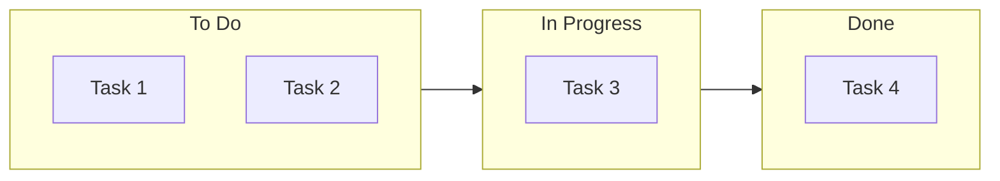
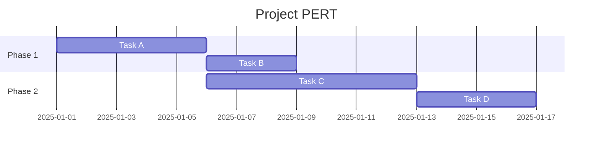
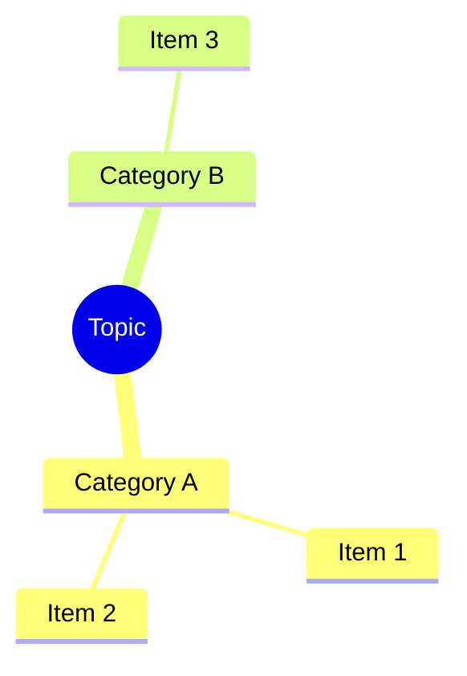
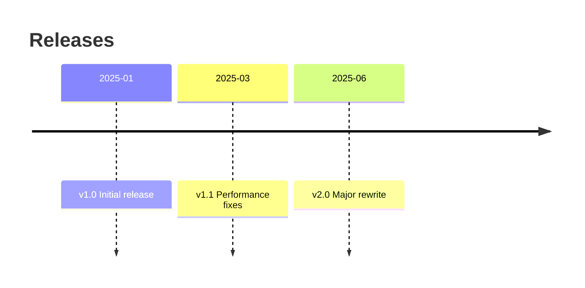
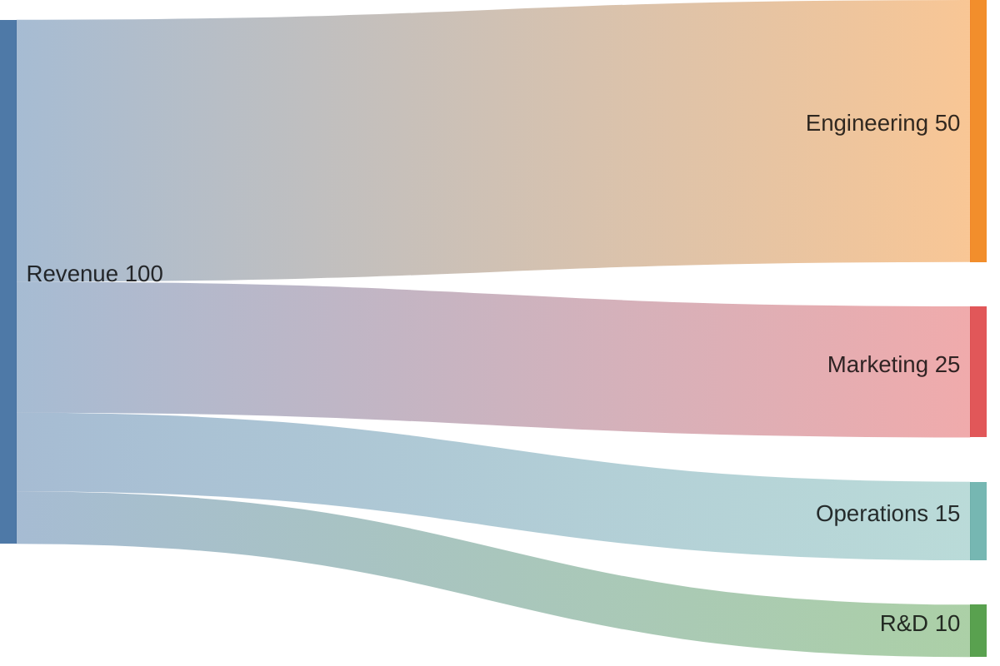

# Conversion Patterns

> **When to read:** Step 5 of Mode A, or when converting existing content (tables, kanban, PERT, etc.) to Mermaid.

---

## Table → Diagram

| Table type | Convert to |
|-----------|-----------|
| Comparison table | `quadrantChart` or styled `flowchart` with columns |
| Status/phase table | `stateDiagram-v2` or `gantt` |
| Relationship table | `erDiagram` |
| Timeline/date table | `timeline` or `gantt` |
| Hierarchy table | `mindmap` or `flowchart TB` |
| Metrics/proportions | `pie` |

## Kanban → Mermaid

Convert kanban columns to a flowchart with styled subgraphs:

## PERT → Mermaid

Convert PERT charts to `gantt` with dependencies or `flowchart` with durations on edges:

## Bullet lists / nested hierarchies → Mindmap

## Numbered steps → Flowchart

Convert step-by-step instructions (1. do X, 2. do Y) into a linear flowchart with decision points where alternatives exist.

## Changelog / release notes → Timeline

## Roadmap → Gantt

Convert roadmap items with dates/quarters into `gantt` sections. Use `crit` for critical milestones.

## Pros/cons or comparison lists → Quadrant Chart

Map items on effort/impact, cost/value, or risk/reward axes using `quadrantChart`.

## SQL CREATE TABLE → ER Diagram

Parse `CREATE TABLE` statements and convert columns, types, PKs, FKs into `erDiagram` entities with relationships inferred from foreign keys.

## JSON / YAML structures → Class Diagram or Mindmap

- Flat config → `mindmap` (keys as branches, values as leaves)
- Nested objects with types → `classDiagram` (objects as classes, fields as attributes)

## API endpoint lists → Sequence Diagram

Convert a list of endpoints (method, path, description) into `sequenceDiagram` showing the actor, API, and downstream services interactions.

## Budget / resource allocation → Sankey

## Git branching strategy → Git Graph

Convert branch descriptions into `gitGraph` with commits, branches, and merges.

## RACI / responsibility matrix → Flowchart with subgraphs

Group tasks by responsible party using subgraphs, color-code by RACI role (R=primary, A=warning, C=neutral, I=grey).

## Cron / schedules → Gantt

Convert recurring schedules into `gantt` with repeating task blocks to visualize time allocation.
