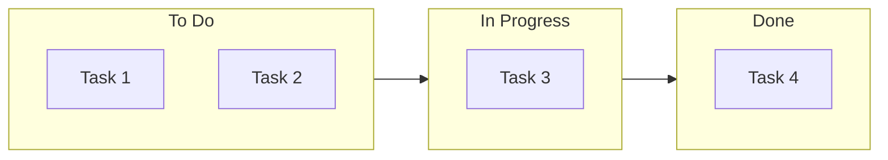
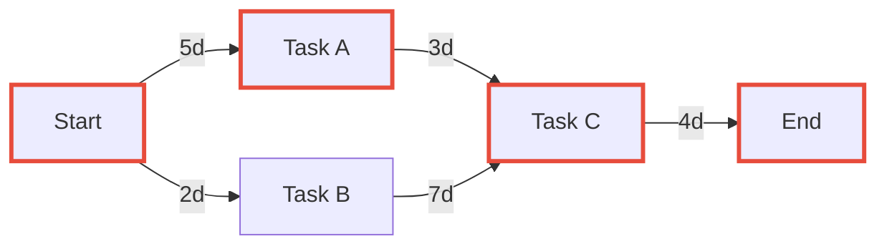
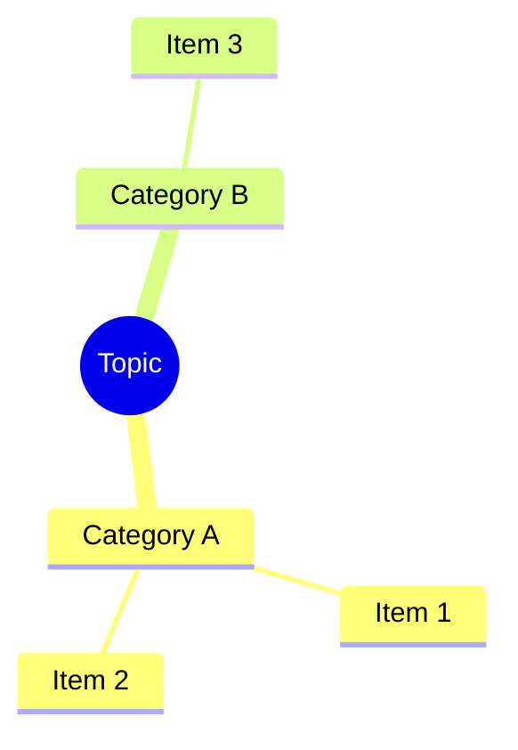
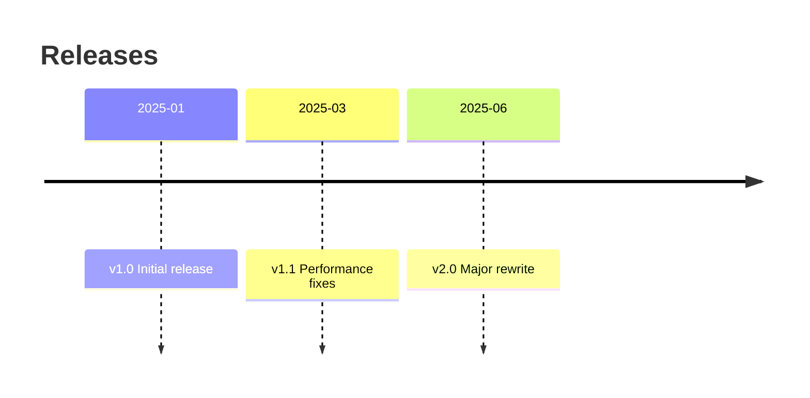
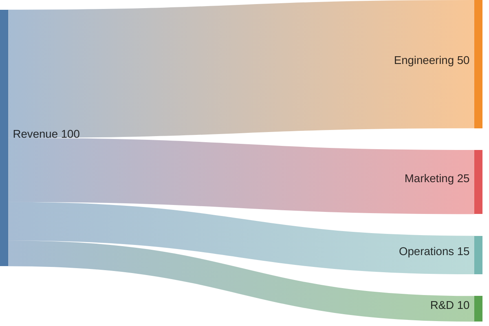
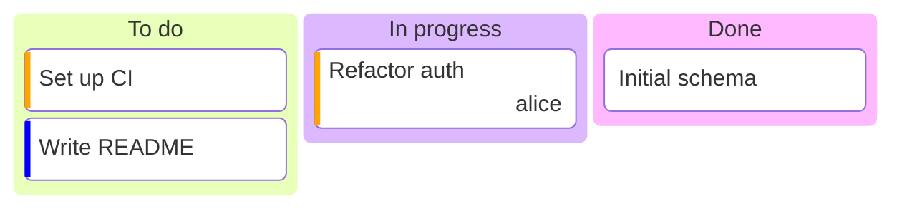

# Conversion Patterns

> **When to read:** Step 5 of Mode A, or when converting existing content (tables, kanban, PERT, etc.) to Mermaid.

---

## Table → Diagram

| Table type | Convert to |
|-----------|-----------|
| Comparison table | `quadrantChart` or styled `flowchart` with columns |
| Status/phase table | `stateDiagram-v2` or `gantt` |
| Relationship table | `erDiagram` |
| Timeline/date table | `timeline` or `gantt` |
| Hierarchy table | `mindmap` or `flowchart TB` |
| Metrics/proportions | `pie` |

## Kanban → Mermaid

Convert kanban columns to a flowchart with styled subgraphs:

## PERT → Mermaid

A PERT chart is a **dependency network (DAG)** with durations on edges, not a timeline. The natural target is `flowchart` with the duration annotated on each edge (or in the node label). Highlight the critical path with a `classDef`.

Only convert to `gantt` if the user explicitly wants a **scheduled timeline view** (after PERT analysis has fixed start dates). `gantt` with `after` dependencies is a post-PERT scheduling artifact, not the PERT itself — switching loses the dependency-first reading.

## Bullet lists / nested hierarchies → Mindmap

## Numbered steps → Flowchart

Convert step-by-step instructions (1. do X, 2. do Y) into a linear flowchart with decision points where alternatives exist.

## Changelog / release notes → Timeline

## Roadmap → Gantt

Convert roadmap items with dates/quarters into `gantt` sections. Use `crit` for critical milestones.

## Pros/cons or comparison lists → Quadrant Chart

Map items on effort/impact, cost/value, or risk/reward axes using `quadrantChart`.

## SQL CREATE TABLE → ER Diagram

Parse `CREATE TABLE` statements and convert columns, types, PKs, FKs into `erDiagram` entities with relationships inferred from foreign keys.

## JSON / YAML structures → Class Diagram or Mindmap

- Flat config → `mindmap` (keys as branches, values as leaves)
- Nested objects with types → `classDiagram` (objects as classes, fields as attributes)

## API endpoint lists → Sequence Diagram

Convert a list of endpoints (method, path, description) into `sequenceDiagram` showing the actor, API, and downstream services interactions.

## Budget / resource allocation → Sankey

## Git branching strategy → Git Graph

Convert branch descriptions into `gitGraph` with commits, branches, and merges.

## RACI / responsibility matrix → Flowchart with subgraphs

Group tasks by responsible party using subgraphs, color-code by RACI role (R=primary, A=warning, C=neutral, I=grey).

## Cron / schedules → Gantt

Convert recurring schedules into `gantt` with repeating task blocks to visualize time allocation.

## Todo list / sprint backlog → Kanban

Convert a list of tasks with status (todo/in-progress/done) into a `kanban` block. Priority and owner become card metadata.

**Trigger:** tables with a "Status" column, bullet lists grouped by `### Todo / ### Doing / ### Done`, or pool-like data where status + priority + owner matter more than arrows.

## Scorecard / multi-dim quality → Radar

Convert a multi-dimensional scorecard (4-8 dimensions, numeric) into a `radar-beta`. Use two curves if you have target vs actual.

**Trigger:** tables where each row is a dimension and columns are numeric scores (e.g. audit outputs, benchmark results, skill matrices).

## Time-series / curves → XY Chart

Convert any "X vs Y" numeric series (speedup vs workers, latency vs load, cost vs scale) into `xychart-beta`. One line per series.

**Trigger:** paired numeric arrays, especially when the user asks to visualize a scaling curve or a trend.

## Chronological events → Timeline

Convert release histories, project phases, incident timelines into `timeline`. Group with `section`.

**Trigger:** lists of `{date, event}` tuples where durations are irrelevant. If durations matter, use `gantt` instead.

## Proportional breakdown (hierarchical) → Treemap

Convert a hierarchical budget, disk usage, or ownership split into `treemap-beta` — better than `pie` when you have > 7 items or two levels.

**Trigger:** nested tables of numeric values, or pie charts with too many slices.

## Post-mortem / root cause → Ishikawa (via flowchart LR)

Convert a root-cause analysis (the "5 whys" or a post-mortem causal chain) into a `flowchart LR` with subgraphs for each bone (People, Process, Tools, Environment — the Ishikawa 6M subset that fits the incident).

**Trigger:** any text whose structure is "effect X happened because of {causes}", especially post-mortem docs, apoptosis reports in the chef's sprint report.

## Cloud topology / service map → Architecture

Convert a list of cloud services with groupings (VPC, subnet, region) into `architecture-beta` with `group` and `service` blocks and port-labelled arrows.

**Trigger:** Terraform resource lists, Helm chart structure, AWS/GCP architecture descriptions. Fall back to `flowchart` with subgraphs if the target renderer lacks architecture-beta.

## System overview / dashboard → Block

Convert a system overview that is more about containment and grouping than flow into `block-beta` with explicit column counts.

**Trigger:** markdown tables laid out as a "grid of things", or diagrams where the user wants "boxes arranged like a dashboard" rather than a DAG.

## Set overlap → Quadrant (not Venn)

Mermaid has no native Venn. When the input looks like "things in A vs B vs A∩B", convert to a `quadrantChart` with the two set memberships as the axes. Only use a Venn-shaped emulation (`block-beta` with overlapping regions) if the user specifically needs the visual metaphor.

**Trigger:** set-difference language ("what's only in A", "what's shared"). Default to 2×2 quadrant; only build a Venn emulation if the user pushes back.
