# Mermaid Diagram Types — GitHub-Tested Reference

Every example below has been validated for GitHub rendering. Copy-paste safe.

---

## 1. Flowchart

Best for: processes, algorithms, decision trees.


```mermaid
flowchart TB
    A([Start]) --> B{Decision?}
    B -->|Yes| C[Action 1]
    B -->|No| D[Action 2]
    C --> E([End])
    D --> E
```

**Node shapes:**
| Shape | Syntax | Use for |
|-------|--------|---------|
| Rectangle | `[text]` | Process / action |
| Rounded | `(text)` | Generic step |
| Stadium | `([text])` | Start / end |
| Diamond | `{text}` | Decision |
| Cylinder | `[(text)]` | Database |
| Subroutine | `[[text]]` | External call |
| Parallelogram | `[/text/]` | Input / output |
| Hexagon | `{{text}}` | Preparation |
| Trapezoid | `[/text\]` | Manual operation |

**Edge styles:**
| Syntax | Meaning |
|--------|---------|
| `-->` | Solid arrow |
| `-.->` | Dotted arrow |
| `==>` | Thick arrow |
| `--text-->` | Labeled arrow |
| `~~~` | Invisible link (layout only) |

**Subgraphs:**
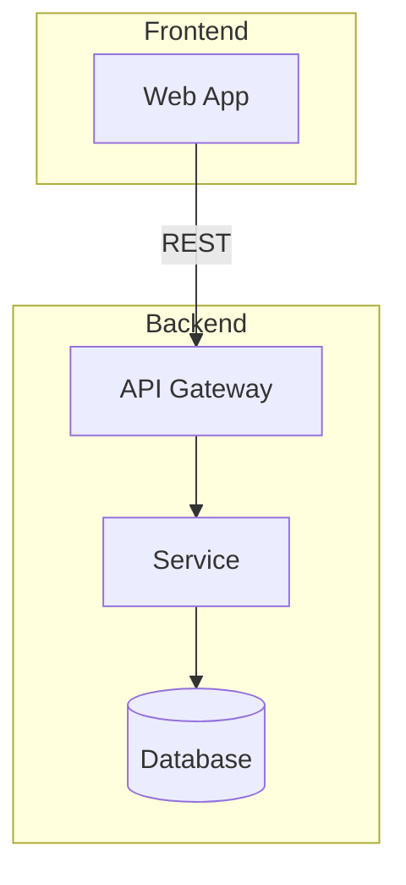
```mermaid
flowchart TB
    subgraph backend["Backend"]
        api[API Gateway]
        svc[Service]
        db[(Database)]
        api --> svc --> db
    end
    subgraph frontend["Frontend"]
        app[Web App]
    end
    app -->|REST| api
```

---

## 2. Sequence Diagram

Best for: interactions between actors/systems, API flows, message passing.

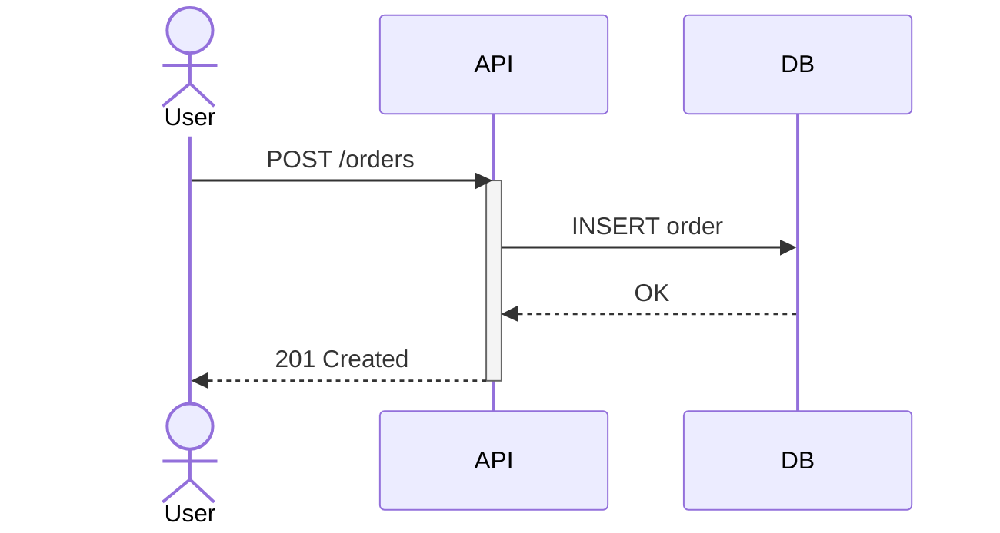
```mermaid
sequenceDiagram
    actor User
    participant API
    participant DB

    User->>API: POST /orders
    activate API
    API->>DB: INSERT order
    DB-->>API: OK
    API-->>User: 201 Created
    deactivate API
```

**Message types:**
| Syntax | Style |
|--------|-------|
| `->>` | Solid with arrowhead |
| `-->>` | Dashed with arrowhead |
| `--)` | Solid with open arrowhead (async) |
| `--)` | Dashed with open arrowhead (async) |
| `-x` | Solid with cross (lost message) |

**Features that work on GitHub:**
- `activate` / `deactivate` — lifeline activation
- `Note over A,B: text` — notes
- `loop`, `alt`, `opt`, `par`, `critical` — combined fragments
- `rect rgb(240,240,240)` — background highlight
- `autonumber` — message numbering

---

## 3. Class Diagram

Best for: object structures, interfaces, relationships.

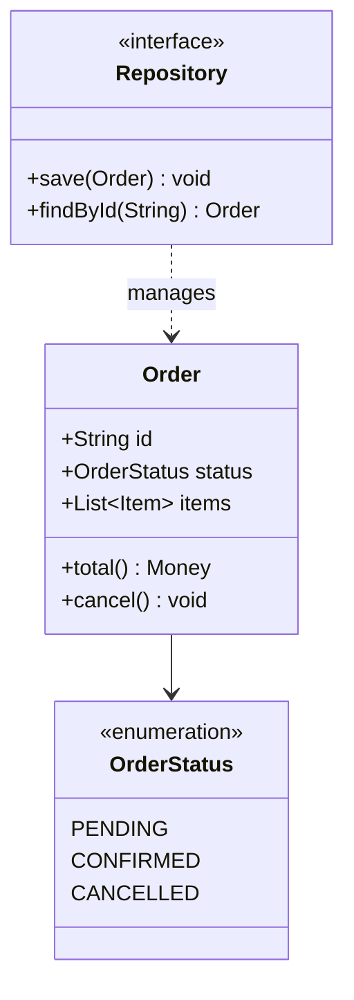
```mermaid
classDiagram
    class Order {
        +String id
        +OrderStatus status
        +List~Item~ items
        +total() Money
        +cancel() void
    }

    class OrderStatus {
        <<enumeration>>
        PENDING
        CONFIRMED
        CANCELLED
    }

    class Repository {
        <<interface>>
        +save(Order) void
        +findById(String) Order
    }

    Order --> OrderStatus
    Repository ..> Order : manages
```

**Relationships:**
| Syntax | Meaning |
|--------|---------|
| `-->` | Association |
| `..>` | Dependency |
| `--|>` | Inheritance |
| `..|>` | Implementation |
| `--*` | Composition |
| `--o` | Aggregation |

---

## 4. State Diagram

Best for: lifecycles, state machines, workflows with conditions.

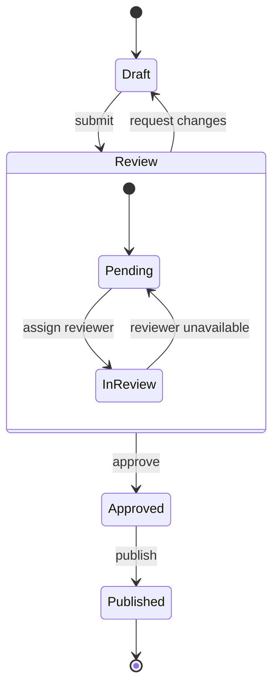
```mermaid
stateDiagram-v2
    [*] --> Draft
    Draft --> Review : submit
    Review --> Approved : approve
    Review --> Draft : request changes
    Approved --> Published : publish
    Published --> [*]

    state Review {
        [*] --> Pending
        Pending --> InReview : assign reviewer
        InReview --> Pending : reviewer unavailable
    }
```

**Tips:**
- Use `stateDiagram-v2` (not v1)
- Composite states for complex sub-flows
- `[*]` for start and end pseudo-states

---

## 5. ER Diagram

Best for: data models, database schemas, entity relationships.

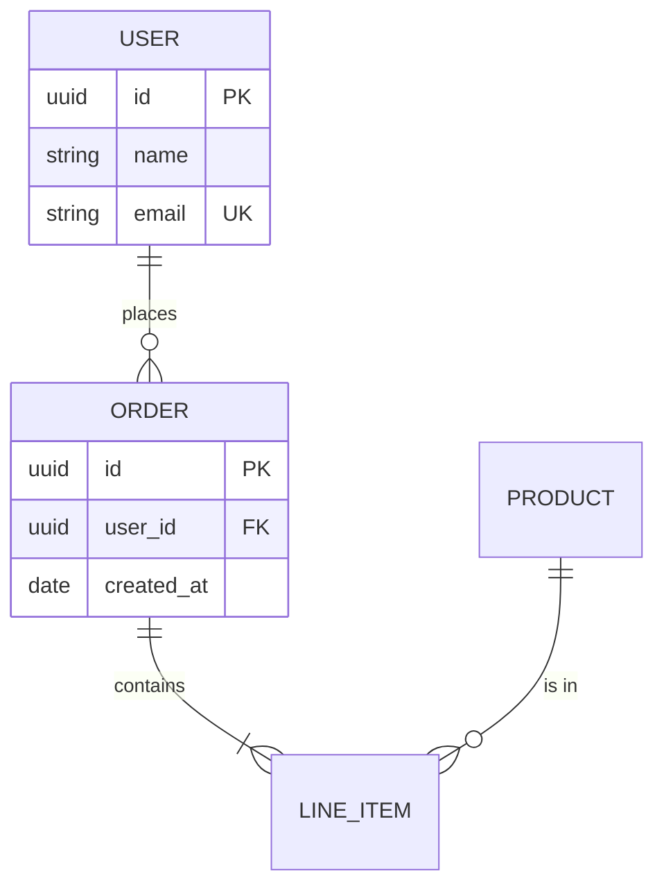
```mermaid
erDiagram
    USER ||--o{ ORDER : places
    ORDER ||--|{ LINE_ITEM : contains
    PRODUCT ||--o{ LINE_ITEM : "is in"
    USER {
        uuid id PK
        string name
        string email UK
    }
    ORDER {
        uuid id PK
        uuid user_id FK
        date created_at
    }
```

**Cardinality:**
| Syntax | Meaning |
|--------|---------|
| `\|\|--\|\|` | One to one |
| `\|\|--o{` | One to many |
| `o{--o{` | Many to many |
| `\|\|--o\|` | One to zero or one |

---

## 6. Gantt Chart

Best for: project timelines, milestones, task dependencies.

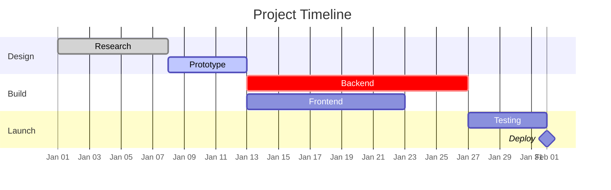
```mermaid
gantt
    title Project Timeline
    dateFormat YYYY-MM-DD
    axisFormat %b %d

    section Design
    Research       :done, des1, 2025-01-01, 7d
    Prototype      :active, des2, after des1, 5d

    section Build
    Backend        :crit, dev1, after des2, 14d
    Frontend       :dev2, after des2, 10d

    section Launch
    Testing        :test, after dev1 dev2, 5d
    Deploy         :milestone, after test, 0d
```

**Status keywords:** `done`, `active`, `crit` (critical path)

---

## 7. Pie Chart

Best for: proportions, distributions. Max 7 slices.

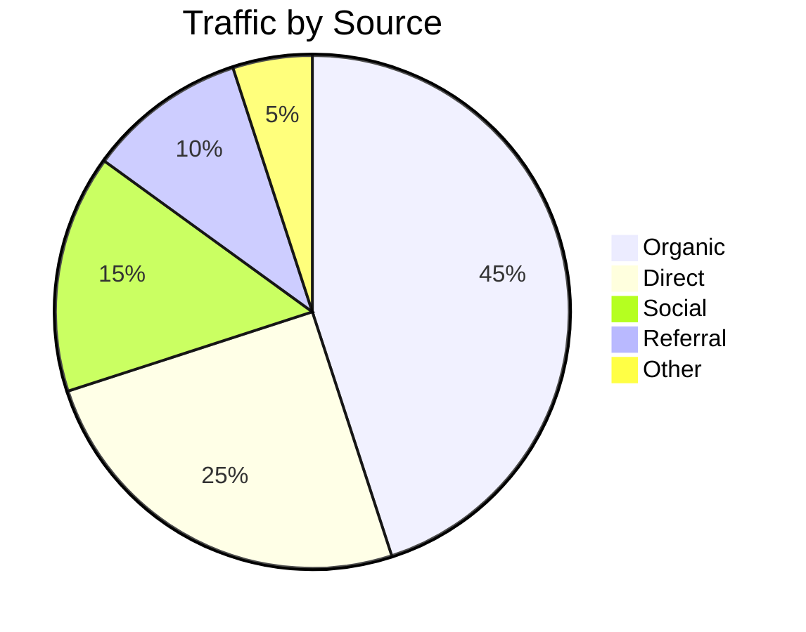
```mermaid
pie title Traffic by Source
    "Organic" : 45
    "Direct" : 25
    "Social" : 15
    "Referral" : 10
    "Other" : 5
```

---

## 8. Mind Map

Best for: brainstorming, hierarchies, concept organization.

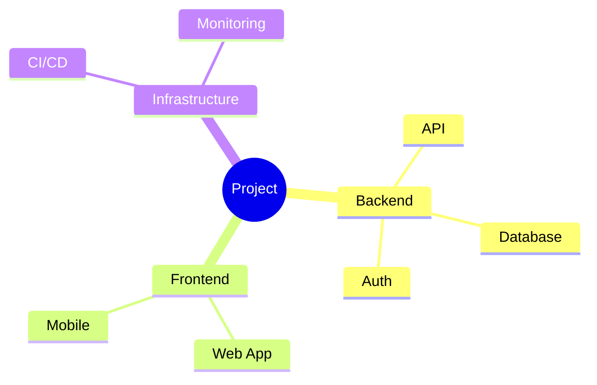
```mermaid
mindmap
    root((Project))
        Backend
            API
            Database
            Auth
        Frontend
            Web App
            Mobile
        Infrastructure
            CI/CD
            Monitoring
```

**Tips:**
- Max 4 levels deep
- Keep branch labels short (2-3 words)
- Use `(( ))` for root, plain text for branches

---

## 9. Timeline

Best for: chronological events, release history, project phases.

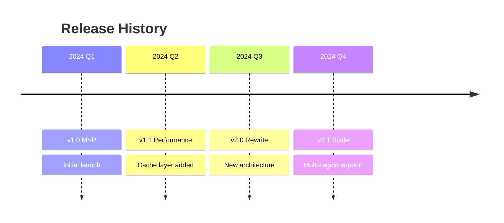
```mermaid
timeline
    title Release History
    2024 Q1 : v1.0 MVP
             : Initial launch
    2024 Q2 : v1.1 Performance
             : Cache layer added
    2024 Q3 : v2.0 Rewrite
             : New architecture
    2024 Q4 : v2.1 Scale
             : Multi-region support
```

---

## 10. Quadrant Chart

Best for: priority matrices, comparison, positioning.

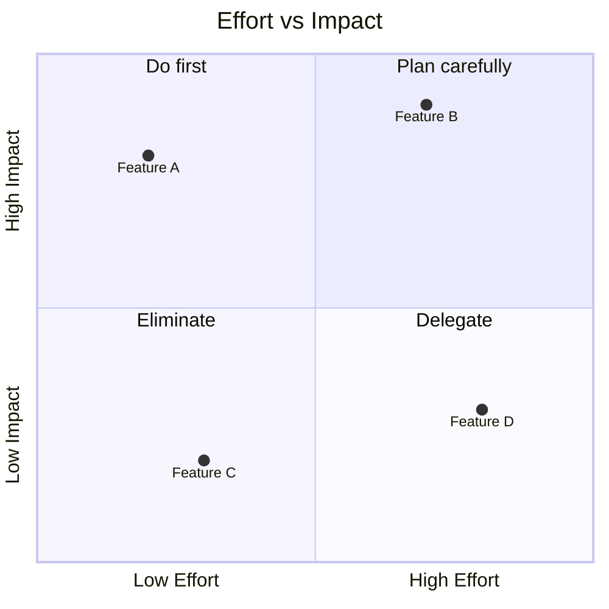
```mermaid
quadrantChart
    title Effort vs Impact
    x-axis Low Effort --> High Effort
    y-axis Low Impact --> High Impact
    quadrant-1 Plan carefully
    quadrant-2 Do first
    quadrant-3 Eliminate
    quadrant-4 Delegate
    Feature A: [0.2, 0.8]
    Feature B: [0.7, 0.9]
    Feature C: [0.3, 0.2]
    Feature D: [0.8, 0.3]
```

---

## 11. Git Graph

Best for: branching strategies, merge workflows.

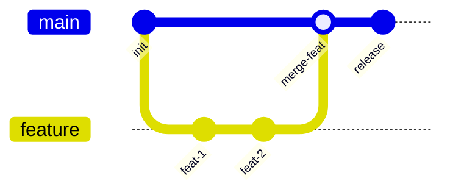
```mermaid
gitGraph
    commit id: "init"
    branch feature
    checkout feature
    commit id: "feat-1"
    commit id: "feat-2"
    checkout main
    merge feature id: "merge-feat"
    commit id: "release"
```

---

## 12. Sankey Diagram

Best for: flow volumes, budget allocation, traffic distribution.

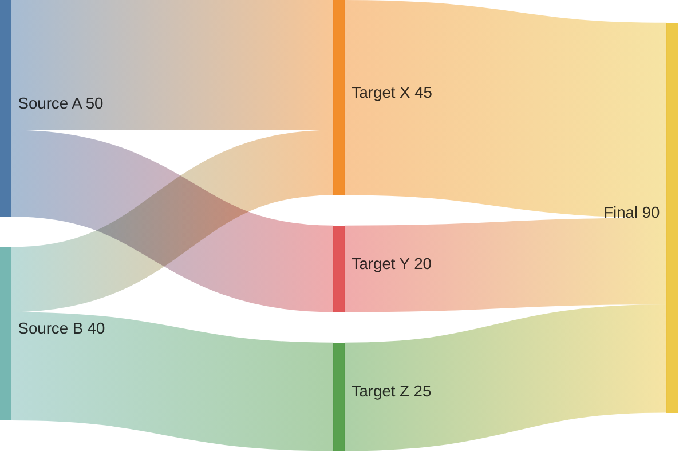
```mermaid
sankey-beta
    Source A,Target X,30
    Source A,Target Y,20
    Source B,Target X,15
    Source B,Target Z,25
    Target X,Final,45
    Target Y,Final,20
    Target Z,Final,25
```

---

## 13. Kanban

Best for: workflow state boards (todo/doing/done), task pools with priority, sprint backlogs. Unlike a flowchart-with-subgraphs, `kanban` renders columns natively and supports per-card metadata.

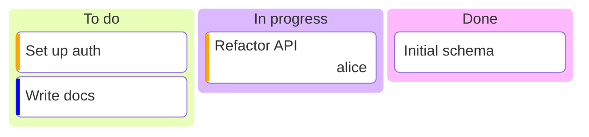
```mermaid
kanban
    Todo[To do]
        task1[Set up auth]@{ priority: 'High' }
        task2[Write docs]@{ priority: 'Low' }
    Doing[In progress]
        task3[Refactor API]@{ priority: 'High', assigned: 'alice' }
    Done[Done]
        task4[Initial schema]
```

**Tips:**
- Columns are the top-level items. Cards go underneath with 4-space indent.
- Per-card metadata via `@{ key: 'value' }` — known keys: `priority` (High/Medium/Low), `assigned`, `ticket`.
- Use when a flowchart would force you to fake columns with `subgraph` — kanban is clearer.

---

## 14. Radar Chart

Best for: multi-dimensional scorecards (quality gates, skill matrices, benchmark comparisons). One polygon per subject, one axis per dimension.

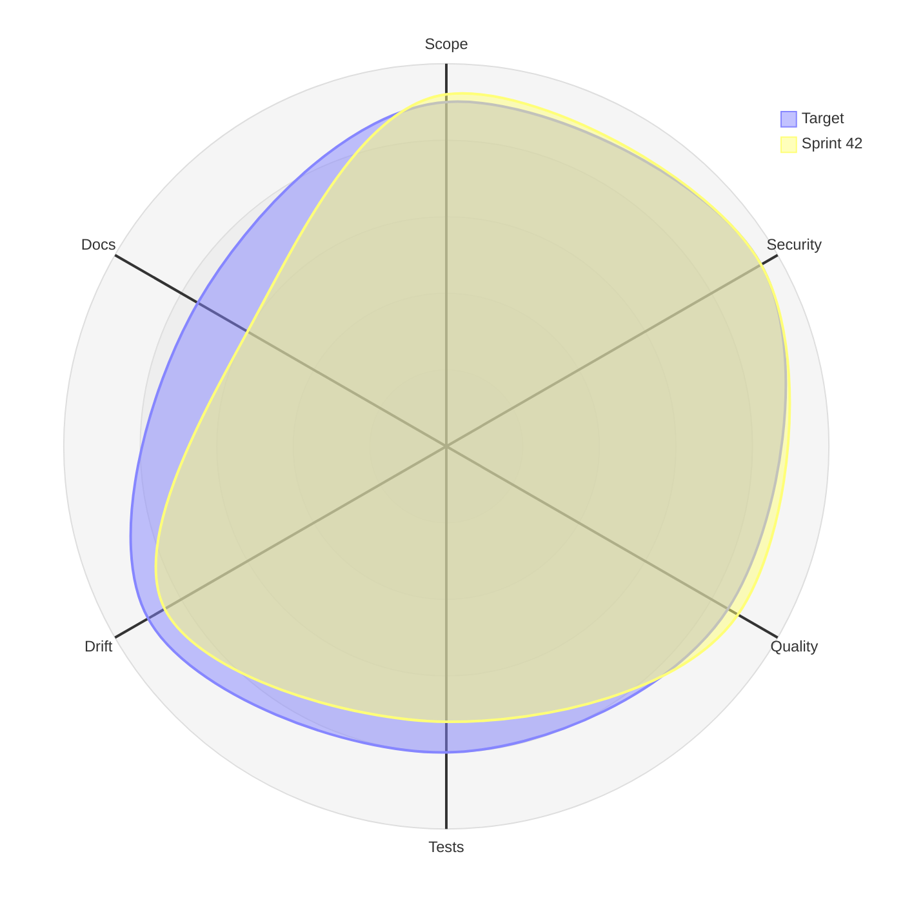
```mermaid
radar-beta
    axis scope["Scope"], secu["Security"], qualite["Quality"]
    axis test["Tests"], drift["Drift"], docs["Docs"]
    curve target["Target"]{90, 95, 85, 80, 90, 75}
    curve actual["Sprint 42"]{92, 95, 88, 72, 85, 60}
    max 100
    min 0
```

**Tips:**
- Keep under 8 axes — beyond that the polygon is unreadable.
- At most 3 curves per chart, otherwise polygons overlap and nothing is distinguishable.
- Axes must stay in the same order across curves (the shape is only meaningful when aligned).

---

## 15. XY Chart

Best for: quantitative 2D plots — curves over time, Amdahl speedups, scaling curves, cost/benefit tradeoffs.

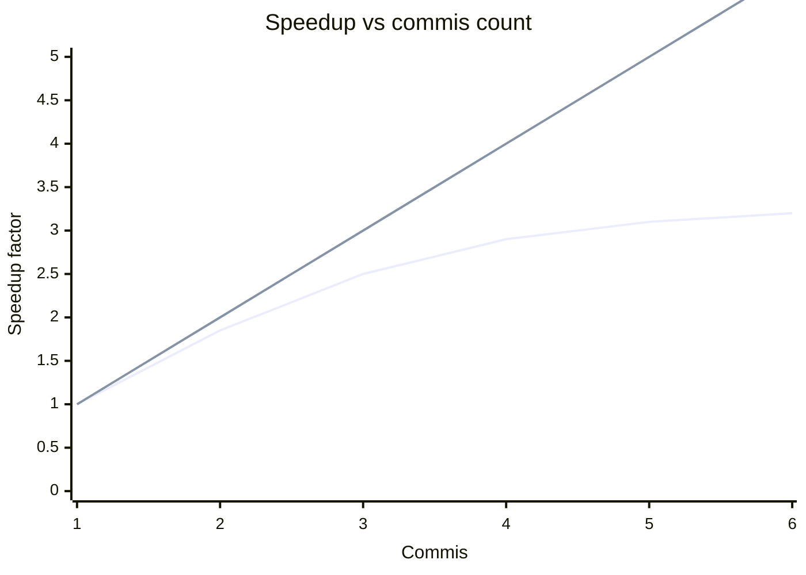
```mermaid
xychart-beta
    title "Speedup vs commis count"
    x-axis "Commis" [1, 2, 3, 4, 5, 6]
    y-axis "Speedup factor" 0 --> 5
    line [1.0, 1.85, 2.5, 2.9, 3.1, 3.2]
    line [1.0, 2.0, 3.0, 4.0, 5.0, 6.0]
```

**Tips:**
- Use `line` for a continuous series, `bar` for discrete samples.
- Two lines are the max before legends get confusing — use paired charts if you need more.
- Provide both axes with units in the title or axis label (viewers can't guess scale from data).

---

## 16. Block Diagram

Best for: high-level system topology where grouping/containment matters more than arrows. More flexible than `flowchart` for dashboards and data-flow boards.

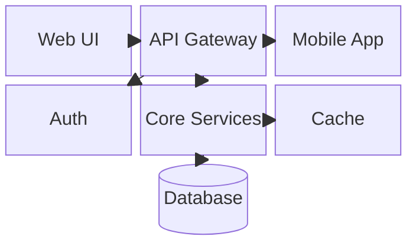
```mermaid
block-beta
    columns 3
    frontend["Web UI"]:1 api["API Gateway"]:1 mobile["Mobile App"]:1
    auth["Auth"]:1 core["Core Services"]:1 cache["Cache"]:1
    db[("Database")]:3
    frontend --> api
    mobile --> api
    api --> auth
    api --> core
    core --> cache
    core --> db
```

**Tips:**
- `columns N` sets the grid width. Blocks span with `:K` where K is the number of columns occupied.
- Use when `flowchart` would force you into awkward ranks; `block-beta` gives you grid control.
- Arrows still work — the layout is what changes.

---

## 17. Architecture Diagram

Best for: cloud topology with service icons (AWS/GCP/Azure-style deployment maps). Supports a curated icon set via `icon:` and logical groupings with `group`.

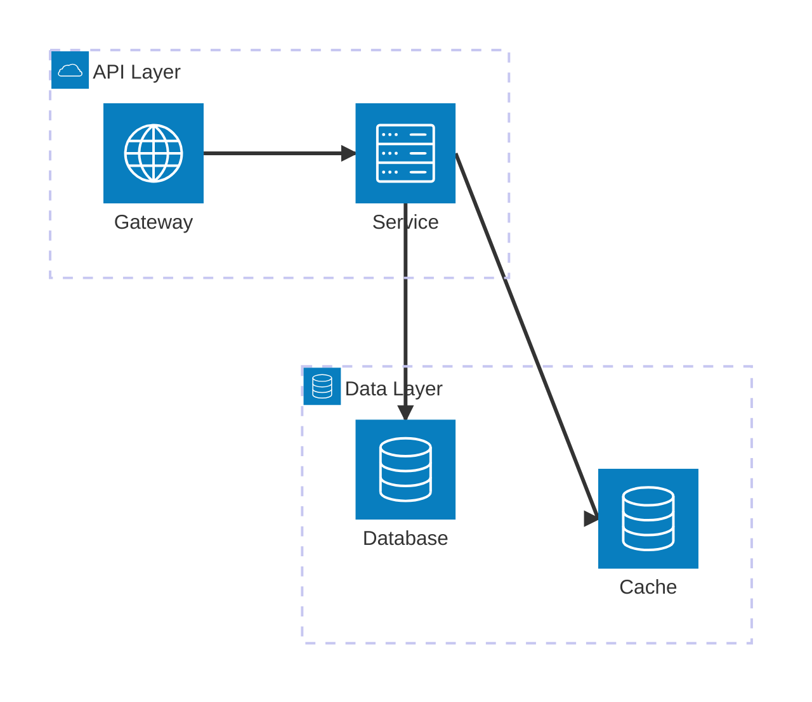
```mermaid
architecture-beta
    group api(cloud)[API Layer]
    group data(database)[Data Layer]

    service gw(internet)[Gateway] in api
    service svc(server)[Service] in api
    service cache(database)[Cache] in data
    service db(database)[Database] in data

    gw:R --> L:svc
    svc:R --> L:cache
    svc:B --> T:db
```

**Tips:**
- `group name(icon)[Label]` creates a named container with an icon.
- `service name(icon)[Label] in groupname` places the service in the group.
- Arrows use port suffixes `:L/:R/:T/:B` (left/right/top/bottom) — this is what makes the layout stable.
- Requires a Mermaid version with architecture-beta support. If the target renderer is unknown, fall back to `flowchart` with subgraphs.

---

## 18. Timeline

Best for: chronological events with titled eras — release history, project phases, sprint retro history. Differs from `gantt` because timeline has no durations, only dated points.

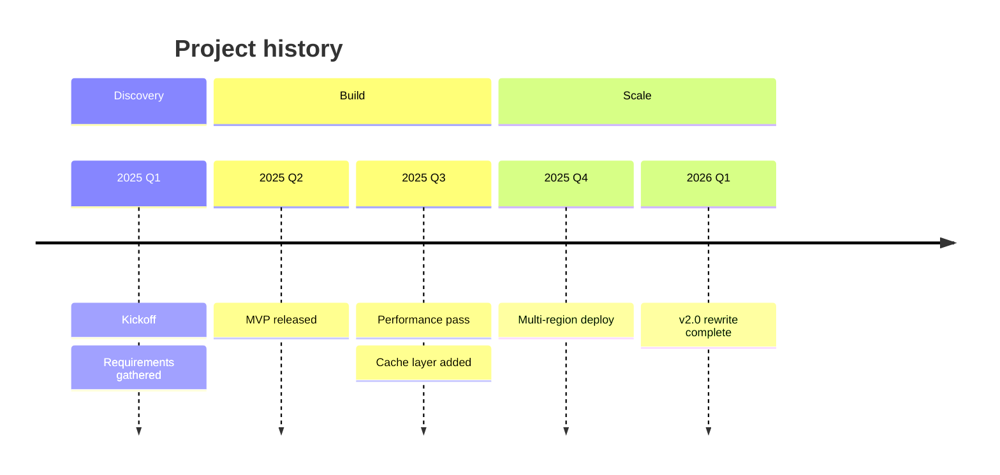
```mermaid
timeline
    title Project history
    section Discovery
        2025 Q1 : Kickoff
                : Requirements gathered
    section Build
        2025 Q2 : MVP released
        2025 Q3 : Performance pass
                : Cache layer added
    section Scale
        2025 Q4 : Multi-region deploy
        2026 Q1 : v2.0 rewrite complete
```

**Tips:**
- Use `section` to group periods — the renderer puts a bracket around each.
- Points within a section share an x-coordinate; sub-points use `:`.
- **Not a gantt.** Use `timeline` when durations don't matter (what happened when), `gantt` when they do (how long each piece takes).

---

## 19. Treemap

Best for: proportional area maps — code ownership by module, commis-hours per plat, disk usage, budget breakdown. Packs all categories into one rectangle so area is immediately comparable.

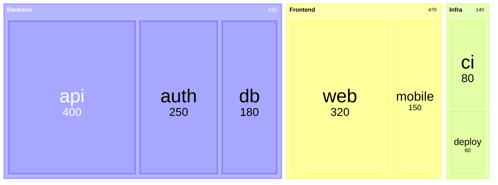
```mermaid
treemap-beta
"Backend"
    "auth": 250
    "api": 400
    "db": 180
"Frontend"
    "web": 320
    "mobile": 150
"Infra"
    "ci": 80
    "deploy": 60
```

**Tips:**
- Indentation is meaningful: children are indented under their parent category.
- Values must be numeric and additive — leaves are summed into parents.
- Use when a pie chart has > 7 slices or when you need two levels of hierarchy.

---

## 20. Ishikawa (Fishbone)

Best for: cause-effect analysis — post-mortems, 5-why root-cause trees, brainstorming failure modes. The standard quality-engineering diagram for mapping contributing factors to an outcome.

```mermaid
flowchart LR
    effect[Sprint slipped 3 days]
    subgraph people[People]
        p1[Commis-3 new]
        p2[Sous-chef secu absent]
    end
    subgraph process[Process]
        pr1[No PERT recomputation]
        pr2[DENY round ignored]
    end
    subgraph tools[Tools]
        t1[CI flaky]
        t2[Outdated lint]
    end
    subgraph environment[Environment]
        e1[Merge freeze mid-sprint]
    end
    people --> effect
    process --> effect
    tools --> effect
    environment --> effect
```

**Tips:**
- Mermaid has no native `ishikawa` diagram — emulate with `flowchart LR`, the effect on the right, and 4-6 subgraphs on the left acting as bones.
- Standard bone categories (Ishikawa 6M): Methods, Machines (tools), Materials, Measurements, Mother Nature (environment), Manpower (people). Pick the 4 that fit.
- Keep to 2 levels of causes per bone — more and the diagram becomes a wall.

---

## 21. Venn Diagram

Best for: set overlaps — 2 or 3 sets showing common vs exclusive elements. Use sparingly: beyond 3 sets a Venn is unreadable; switch to a `quadrantChart` or a table.

Mermaid has no native Venn diagram — emulate with a `block-beta` grid or a table. If a Venn is actually the right shape, the user probably needs a `quadrantChart` with 2 axes instead.

```mermaid
quadrantChart
    title "Overlap — Backend vs Frontend skills"
    x-axis Frontend --> Backend
    y-axis Junior --> Senior
    quadrant-1 Backend senior
    quadrant-2 Fullstack senior
    quadrant-3 Fullstack junior
    quadrant-4 Backend junior
    Alice: [0.3, 0.9]
    Bob: [0.8, 0.4]
    Carol: [0.5, 0.7]
```

**Tip:** if a user asks for a Venn, ask first what they actually want to show. It is almost always a 2×2 quadrant, a hierarchy (`treemap`), or a set difference (table with checkmarks).

---

## Color Palette (GitHub-safe)

### Functional palette (5 colors max per diagram)

```
classDef primary fill:#4A90D9,stroke:#2C6CB0,color:#fff
classDef success fill:#27AE60,stroke:#1E8449,color:#fff
classDef warning fill:#F39C12,stroke:#D68910,color:#fff
classDef danger fill:#E74C3C,stroke:#C0392B,color:#fff
classDef neutral fill:#ECF0F1,stroke:#BDC3C7,color:#2C3E50
```

### Pastel palette (softer, for dense diagrams)

```
classDef blue fill:#D6EAF8,stroke:#85C1E9,color:#1B4F72
classDef green fill:#D5F5E3,stroke:#82E0AA,color:#186A3B
classDef yellow fill:#FEF9E7,stroke:#F9E79F,color:#7D6608
classDef red fill:#FADBD8,stroke:#F1948A,color:#922B21
classDef grey fill:#F2F3F4,stroke:#D5D8DC,color:#2C3E50
```

### Dark-mode friendly palette

```
classDef dm_blue fill:#2980B9,stroke:#1A5276,color:#fff
classDef dm_green fill:#1ABC9C,stroke:#117A65,color:#fff
classDef dm_orange fill:#E67E22,stroke:#A04000,color:#fff
classDef dm_red fill:#C0392B,stroke:#78281F,color:#fff
classDef dm_grey fill:#34495E,stroke:#1C2833,color:#ECF0F1
```

---

## GitHub Rendering Limits

| Constraint | Limit |
|-----------|-------|
| Max edges | 280 |
| Max characters per block | ~2000 for reliable rendering |
| Max practical nodes | 50 per diagram |
| Nesting depth (subgraphs) | 3 levels max |
| FontAwesome icons | Not supported |
| Click events | Not supported |
| Tooltips | Not supported |
| Custom fonts | Ignored |
| Themes via init | Only `default`, `dark`, `forest`, `neutral`, `base` |
