# Mermaid Diagram Types — GitHub-Tested Reference

Every example below has been validated for GitHub rendering. Copy-paste safe.

---

## 1. Flowchart

Best for: processes, algorithms, decision trees.

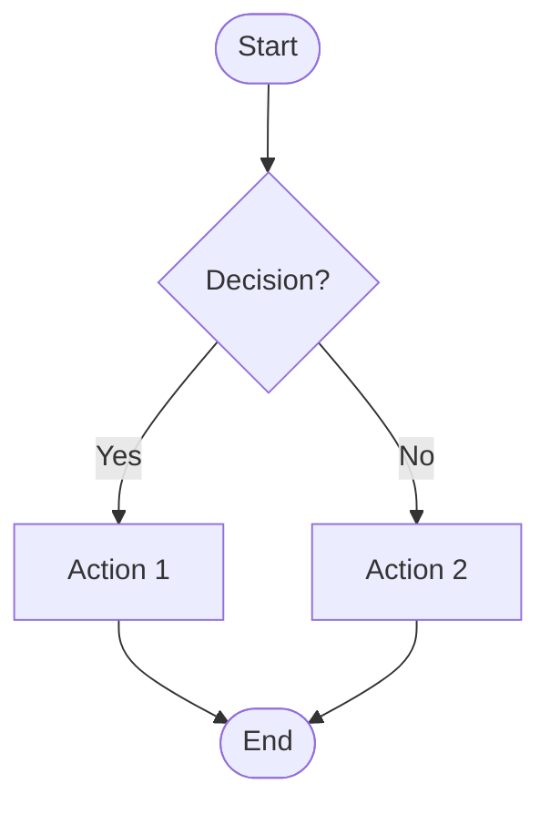

**Node shapes:**
| Shape | Syntax | Use for |
|-------|--------|---------|
| Rectangle | `[text]` | Process / action |
| Rounded | `(text)` | Generic step |
| Stadium | `([text])` | Start / end |
| Diamond | `{text}` | Decision |
| Cylinder | `[(text)]` | Database |
| Subroutine | `[[text]]` | External call |
| Parallelogram | `[/text/]` | Input / output |
| Hexagon | `{{text}}` | Preparation |
| Trapezoid | `[/text\]` | Manual operation |

**Edge styles:**
| Syntax | Meaning |
|--------|---------|
| `-->` | Solid arrow |
| `-.->` | Dotted arrow |
| `==>` | Thick arrow |
| `--text-->` | Labeled arrow |
| `~~~` | Invisible link (layout only) |

**Subgraphs:**
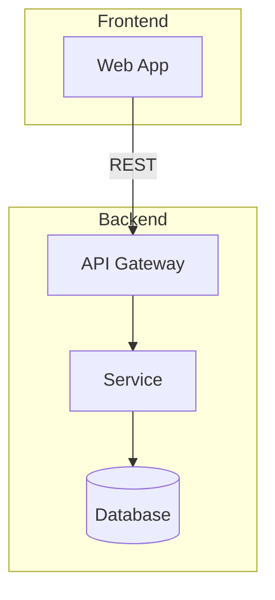

---

## 2. Sequence Diagram

Best for: interactions between actors/systems, API flows, message passing.

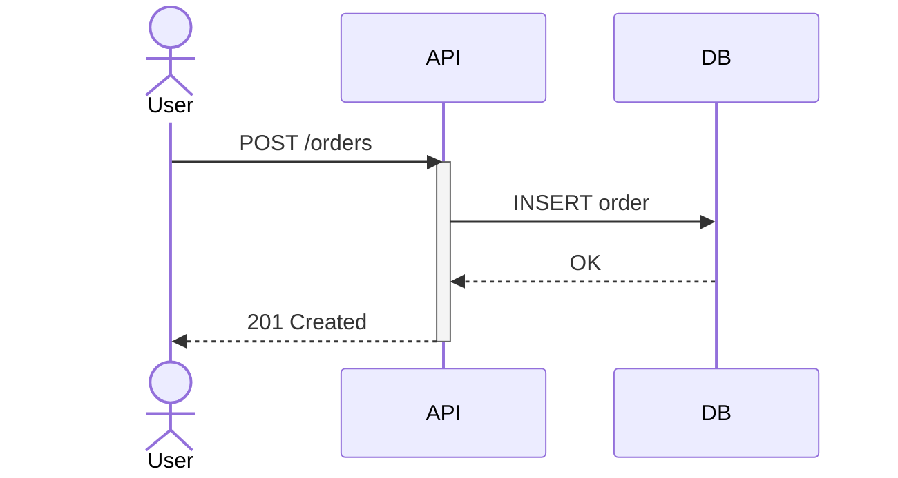

**Message types:**
| Syntax | Style |
|--------|-------|
| `->>` | Solid with arrowhead |
| `-->>` | Dashed with arrowhead |
| `--)` | Solid with open arrowhead (async) |
| `--)` | Dashed with open arrowhead (async) |
| `-x` | Solid with cross (lost message) |

**Features that work on GitHub:**
- `activate` / `deactivate` — lifeline activation
- `Note over A,B: text` — notes
- `loop`, `alt`, `opt`, `par`, `critical` — combined fragments
- `rect rgb(240,240,240)` — background highlight
- `autonumber` — message numbering

---

## 3. Class Diagram

Best for: object structures, interfaces, relationships.

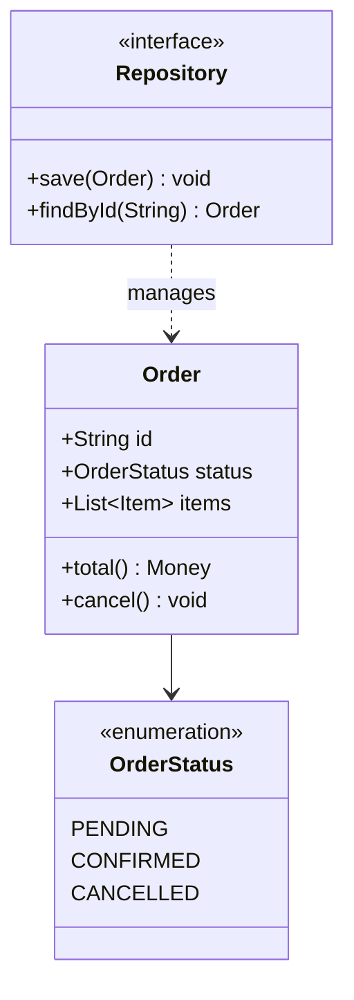

**Relationships:**
| Syntax | Meaning |
|--------|---------|
| `-->` | Association |
| `..>` | Dependency |
| `--|>` | Inheritance |
| `..|>` | Implementation |
| `--*` | Composition |
| `--o` | Aggregation |

---

## 4. State Diagram

Best for: lifecycles, state machines, workflows with conditions.

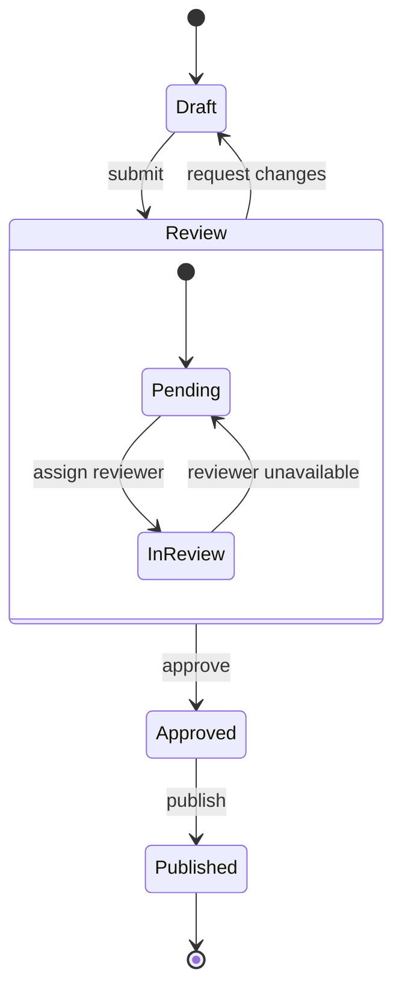

**Tips:**
- Use `stateDiagram-v2` (not v1)
- Composite states for complex sub-flows
- `[*]` for start and end pseudo-states

---

## 5. ER Diagram

Best for: data models, database schemas, entity relationships.

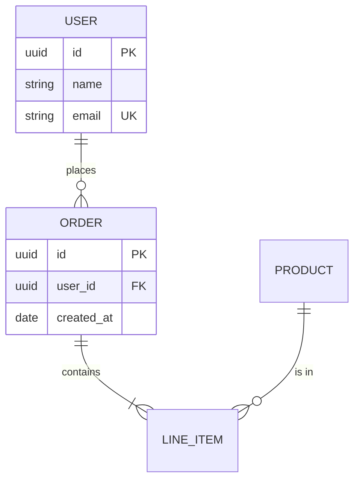

**Cardinality:**
| Syntax | Meaning |
|--------|---------|
| `\|\|--\|\|` | One to one |
| `\|\|--o{` | One to many |
| `o{--o{` | Many to many |
| `\|\|--o\|` | One to zero or one |

---

## 6. Gantt Chart

Best for: project timelines, milestones, task dependencies.

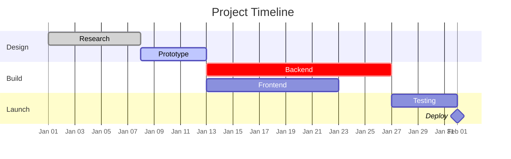

**Status keywords:** `done`, `active`, `crit` (critical path)

---

## 7. Pie Chart

Best for: proportions, distributions. Max 7 slices.

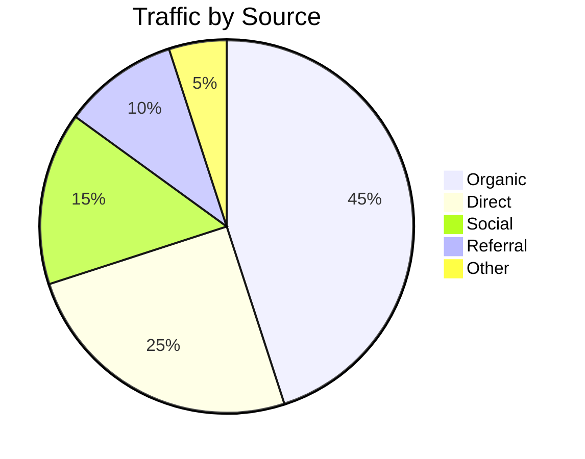

---

## 8. Mind Map

Best for: brainstorming, hierarchies, concept organization.

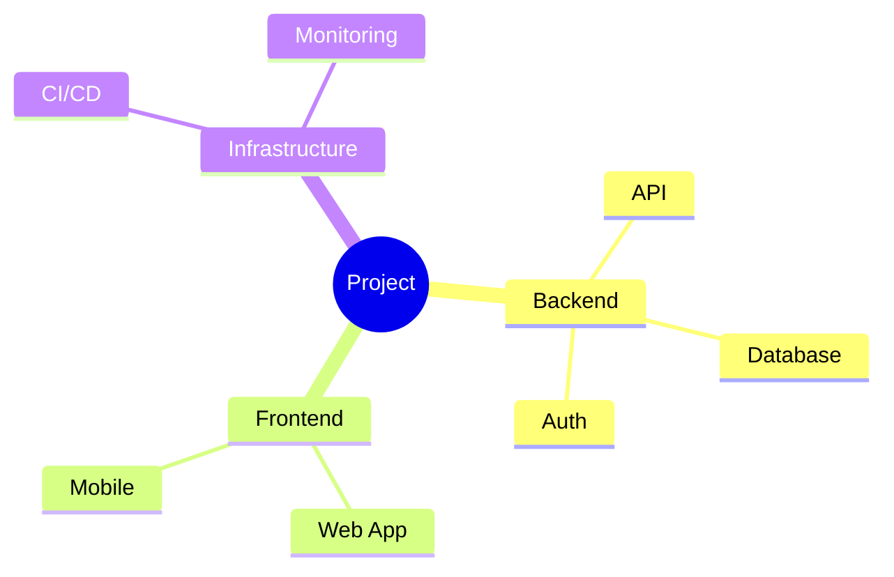

**Tips:**
- Max 4 levels deep
- Keep branch labels short (2-3 words)
- Use `(( ))` for root, plain text for branches

---

## 9. Timeline

Best for: chronological events, release history, project phases.

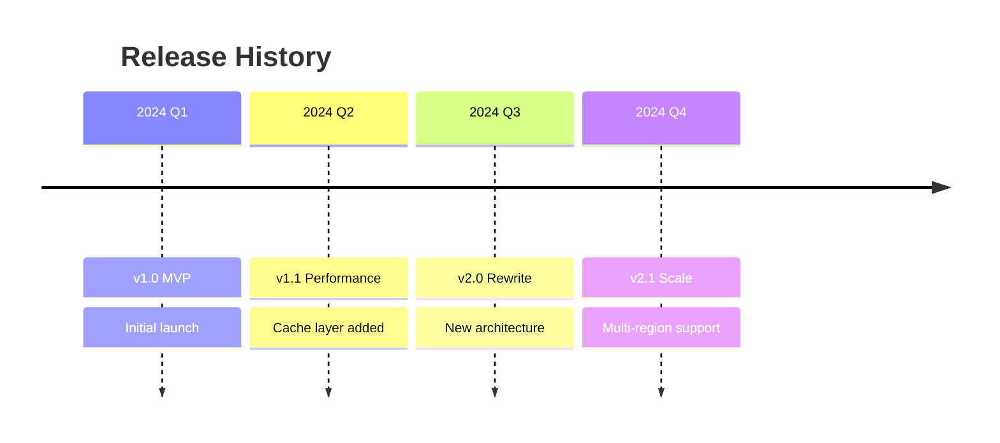

---

## 10. Quadrant Chart

Best for: priority matrices, comparison, positioning.

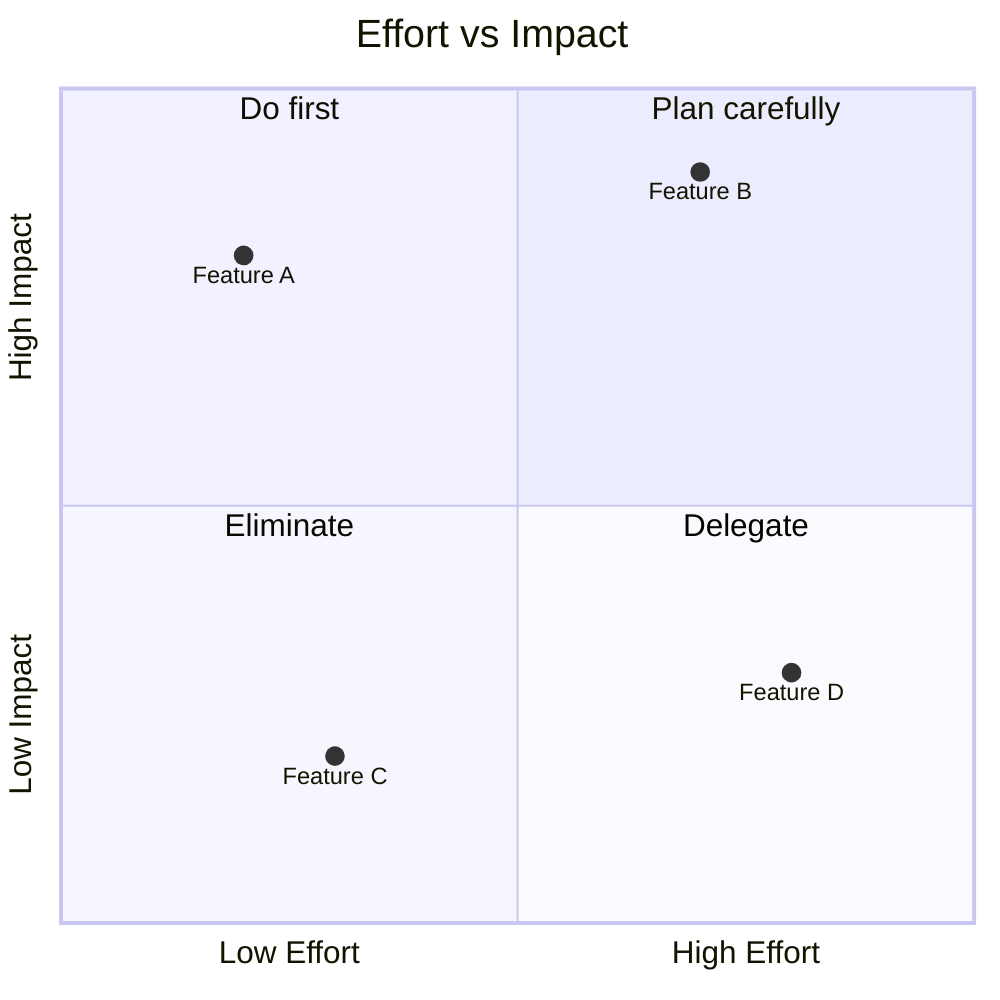

---

## 11. Git Graph

Best for: branching strategies, merge workflows.

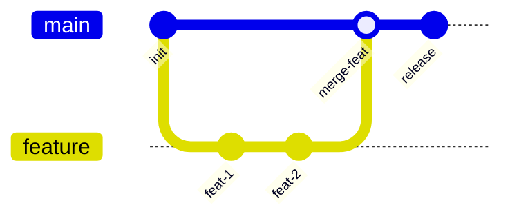

---

## 12. Sankey Diagram

Best for: flow volumes, budget allocation, traffic distribution.

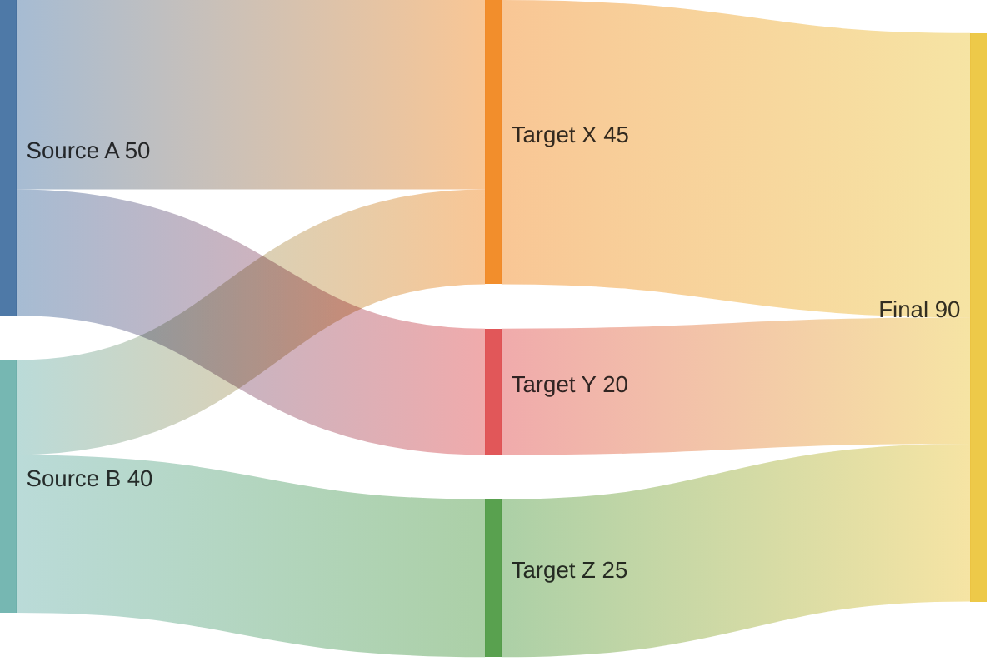

---

## Color Palette (GitHub-safe)

### Functional palette (5 colors max per diagram)

```
classDef primary fill:#4A90D9,stroke:#2C6CB0,color:#fff
classDef success fill:#27AE60,stroke:#1E8449,color:#fff
classDef warning fill:#F39C12,stroke:#D68910,color:#fff
classDef danger fill:#E74C3C,stroke:#C0392B,color:#fff
classDef neutral fill:#ECF0F1,stroke:#BDC3C7,color:#2C3E50
```

### Pastel palette (softer, for dense diagrams)

```
classDef blue fill:#D6EAF8,stroke:#85C1E9,color:#1B4F72
classDef green fill:#D5F5E3,stroke:#82E0AA,color:#186A3B
classDef yellow fill:#FEF9E7,stroke:#F9E79F,color:#7D6608
classDef red fill:#FADBD8,stroke:#F1948A,color:#922B21
classDef grey fill:#F2F3F4,stroke:#D5D8DC,color:#2C3E50
```

### Dark-mode friendly palette

```
classDef dm_blue fill:#2980B9,stroke:#1A5276,color:#fff
classDef dm_green fill:#1ABC9C,stroke:#117A65,color:#fff
classDef dm_orange fill:#E67E22,stroke:#A04000,color:#fff
classDef dm_red fill:#C0392B,stroke:#78281F,color:#fff
classDef dm_grey fill:#34495E,stroke:#1C2833,color:#ECF0F1
```

---

## GitHub Rendering Limits

| Constraint | Limit |
|-----------|-------|
| Max edges | 280 |
| Max characters per block | ~2000 for reliable rendering |
| Max practical nodes | 50 per diagram |
| Nesting depth (subgraphs) | 3 levels max |
| FontAwesome icons | Not supported |
| Click events | Not supported |
| Tooltips | Not supported |
| Custom fonts | Ignored |
| Themes via init | Only `default`, `dark`, `forest`, `neutral`, `base` |
